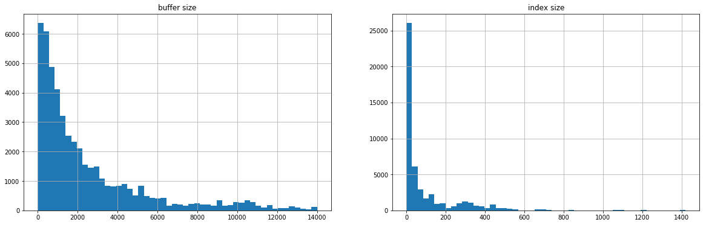
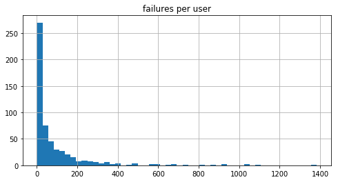

# Setup


```python
import pandas as pd
import matplotlib.pyplot as plt
import urllib
import numpy as np
import json

REPORT_FILENAME = "/Users/damian/report/report.json"

# don't truncate cell contents when displaying
pd.set_option('display.max_colwidth', -1)

def inspect_url(message_id):
  uri, mid = message_id.split("::")
  return "http://test-6.kite.com:3031/event?uri=%s&message_id=%s" % \
      (urllib.parse.quote(uri), urllib.parse.quote(mid))

def preprocess(obj):
    # If a sub-object is not seen in every object, panda's json_normalize() won't flatten it
    if not obj.get('category', None):
        if obj['failure'] == 'unresolved_value':
            obj['category'] = {'other': True}
        else:
            obj['category'] = {'not_applicable': True}
    
    # If the unresolved function was an attribute, and some prefix of this was resolved
    # to a global symbol, prefix_dist holds the name of the distribution
    prefix_dist = None
    resolves_to = obj['category'].get('prefix_resolves', {}).get('to', None)
    if resolves_to and '@' in resolves_to:
        prefix_dist = resolves_to.split('@')[0]
    obj['prefix_dist'] = prefix_dist
    
    # If the function was resolved but the signature still failed (e.g. no signatures
    # were returned), resolved_dist holds the name of the distribution
    resolved_dist = None
    resolved_symbol = obj['resolved_symbol']
    if resolved_symbol and '@' in resolved_symbol:
        resolved_dist = resolved_symbol.split('@')[0]
    obj['resolved_dist'] = resolved_dist
    
    # If the top-level prefix of the function wasn't resolved, but could have been if a
    # module with that name was imported
    importable_prefix = None
    up = obj['category'].get('unresolved_name', {})
    if up.get('importable', False):
        importable_prefix = up['name']
    obj['importable_prefix'] = importable_prefix
    
    # Bring out the category name as a column
    obj['unresolved'] = obj['category']
    obj['unresolved_category'] = list(obj['unresolved'].keys())[0]
    del obj['category']
    
    # Inspector URL for each event
    obj['inspect'] = inspect_url(obj['message_id'])
    
    return obj
        
def get_signature_data(filename):
    events = [preprocess(json.loads(line))
              for line in open(filename, 'r').readlines()]
    return pd.io.json.json_normalize(events)
    
def render(df):
    def make_clickable(val):
        return '<a href="{}">{}</a>'.format(val, "inspect")
    return df.style.format({'inspect': make_clickable})
    
   
df = get_signature_data(REPORT_FILENAME)
N = len(df.index)

def with_percent(series):
    """Given a series of counts, return a dataframe with a column containing percentages of global count."""
    return pd.DataFrame({'count': series, 'percent': series / len(df.index) * 100})
    
unresolved = df[df['failure'] == 'unresolved_value']
df.info()
```

    <class 'pandas.core.frame.DataFrame'>
    RangeIndex: 49182 entries, 0 to 49181
    Data columns (total 27 columns):
    buffer_size                              49182 non-null int64
    failure                                  49182 non-null object
    func_type                                49182 non-null object
    function                                 49182 non-null object
    importable_prefix                        1669 non-null object
    index_file_count                         49182 non-null int64
    index_value_count                        49182 non-null int64
    inspect                                  49182 non-null object
    message_id                               49182 non-null object
    offset                                   49182 non-null int64
    outside_parens                           49182 non-null bool
    platform                                 49182 non-null object
    prefix_dist                              2441 non-null object
    region                                   49182 non-null object
    resolved_dist                            7152 non-null object
    resolved_symbol                          49182 non-null object
    unresolved.in_bad_node                   6 non-null object
    unresolved.not_applicable                24361 non-null object
    unresolved.other                         1370 non-null object
    unresolved.prefix_resolves.global        4008 non-null object
    unresolved.prefix_resolves.prefix        4008 non-null object
    unresolved.prefix_resolves.to            4008 non-null object
    unresolved.resolves                      63 non-null object
    unresolved.unresolved_name.importable    19374 non-null object
    unresolved.unresolved_name.name          19374 non-null object
    unresolved_category                      49182 non-null object
    user_id                                  49182 non-null int64
    dtypes: bool(1), int64(5), object(21)
    memory usage: 9.8+ MB


# Types of failures


```python
(df['failure'].value_counts(normalize=True) * 100).to_frame()
```


<div>
<style scoped>
    .dataframe tbody tr th:only-of-type {
        vertical-align: middle;
    }

    .dataframe tbody tr th {
        vertical-align: top;
    }

    .dataframe thead th {
        text-align: right;
    }
</style>
<table border="1" class="dataframe">
  <thead>
    <tr style="text-align: right;">
      <th></th>
      <th>failure</th>
    </tr>
  </thead>
  <tbody>
    <tr>
      <th>unresolved_value</th>
      <td>50.467651</td>
    </tr>
    <tr>
      <th>no_signatures</th>
      <td>20.283844</td>
    </tr>
    <tr>
      <th>call_expr_outside_parens</th>
      <td>12.488309</td>
    </tr>
    <tr>
      <th>call_expr_not_found</th>
      <td>12.160953</td>
    </tr>
    <tr>
      <th>invalid_callee_kind</th>
      <td>4.471148</td>
    </tr>
    <tr>
      <th>no_context</th>
      <td>0.065064</td>
    </tr>
    <tr>
      <th>nil_reference</th>
      <td>0.063031</td>
    </tr>
  </tbody>
</table>
</div>


## no_signatures

In this case, the symbol was resolved, but not signatures were returned.


```python
render(df[df['failure'] == 'no_signatures'][['function', 'resolved_symbol', 'inspect']].sample(n=30))
```


<style  type="text/css" >
</style>  
<table id="T_095676be_3c2c_11e8_9f3d_c60018e1c101" > 
<thead>    <tr> 
        <th class="blank level0" ></th> 
        <th class="col_heading level0 col0" >function</th> 
        <th class="col_heading level0 col1" >resolved_symbol</th> 
        <th class="col_heading level0 col2" >inspect</th> 
    </tr></thead> 
<tbody>    <tr> 
        <th id="T_095676be_3c2c_11e8_9f3d_c60018e1c101level0_row0" class="row_heading level0 row0" >26429</th> 
        <td id="T_095676be_3c2c_11e8_9f3d_c60018e1c101row0_col0" class="data row0 col0" >len</td> 
        <td id="T_095676be_3c2c_11e8_9f3d_c60018e1c101row0_col1" class="data row0 col1" >builtin-stdlib@2.7:__builtin__.int</td> 
        <td id="T_095676be_3c2c_11e8_9f3d_c60018e1c101row0_col2" class="data row0 col2" ><a href="http://test-6.kite.com:3031/event?uri=s3%3A//kite-segment-callee-tracking/segment-logs/zts0PA8B3o/1522281600000/1522306870852.bc8cf629b628.1.11.1.cf6c1649-6074-4e17-93e8-52ad2ad20721.gz&message_id=65d3afef-b0b8-4c06-966e-04344faf0c16">inspect</a></td> 
    </tr>    <tr> 
        <th id="T_095676be_3c2c_11e8_9f3d_c60018e1c101level0_row1" class="row_heading level0 row1" >26391</th> 
        <td id="T_095676be_3c2c_11e8_9f3d_c60018e1c101row1_col0" class="data row1 col0" >pygame.display.set_mode</td> 
        <td id="T_095676be_3c2c_11e8_9f3d_c60018e1c101row1_col1" class="data row1 col1" ></td> 
        <td id="T_095676be_3c2c_11e8_9f3d_c60018e1c101row1_col2" class="data row1 col2" ><a href="http://test-6.kite.com:3031/event?uri=s3%3A//kite-segment-callee-tracking/segment-logs/zts0PA8B3o/1522281600000/1522306869710.296b47a2866f.1.11.1.75337604-30d7-411b-bc7c-9c2acf96339b.gz&message_id=0280bd4f-597d-4862-9fe7-56a18943a8f2">inspect</a></td> 
    </tr>    <tr> 
        <th id="T_095676be_3c2c_11e8_9f3d_c60018e1c101level0_row2" class="row_heading level0 row2" >8823</th> 
        <td id="T_095676be_3c2c_11e8_9f3d_c60018e1c101row2_col0" class="data row2 col0" >MockSubscription</td> 
        <td id="T_095676be_3c2c_11e8_9f3d_c60018e1c101row2_col1" class="data row2 col1" ></td> 
        <td id="T_095676be_3c2c_11e8_9f3d_c60018e1c101row2_col2" class="data row2 col2" ><a href="http://test-6.kite.com:3031/event?uri=s3%3A//kite-segment-callee-tracking/segment-logs/zts0PA8B3o/1522108800000/1522177271824.14d35d46040f.1.11.1.2993fea1-5700-4043-8d5a-10462ee22c35.gz&message_id=0951a071-1634-45e1-98bd-ab6555d50347">inspect</a></td> 
    </tr>    <tr> 
        <th id="T_095676be_3c2c_11e8_9f3d_c60018e1c101level0_row3" class="row_heading level0 row3" >22063</th> 
        <td id="T_095676be_3c2c_11e8_9f3d_c60018e1c101row3_col0" class="data row3 col0" >json.loads</td> 
        <td id="T_095676be_3c2c_11e8_9f3d_c60018e1c101row3_col1" class="data row3 col1" >builtin-stdlib@2.7:__builtin__.list</td> 
        <td id="T_095676be_3c2c_11e8_9f3d_c60018e1c101row3_col2" class="data row3 col2" ><a href="http://test-6.kite.com:3031/event?uri=s3%3A//kite-segment-callee-tracking/segment-logs/zts0PA8B3o/1522195200000/1522281668668.b43add82f57d.1.11.1.e3cd9c18-c9fd-4803-bf55-1c70255d5876.gz&message_id=dfa1c7fd-0acc-4414-a124-c6d278edf210">inspect</a></td> 
    </tr>    <tr> 
        <th id="T_095676be_3c2c_11e8_9f3d_c60018e1c101level0_row4" class="row_heading level0 row4" >10212</th> 
        <td id="T_095676be_3c2c_11e8_9f3d_c60018e1c101row4_col0" class="data row4 col0" >subset.add</td> 
        <td id="T_095676be_3c2c_11e8_9f3d_c60018e1c101row4_col1" class="data row4 col1" ></td> 
        <td id="T_095676be_3c2c_11e8_9f3d_c60018e1c101row4_col2" class="data row4 col2" ><a href="http://test-6.kite.com:3031/event?uri=s3%3A//kite-segment-callee-tracking/segment-logs/zts0PA8B3o/1522108800000/1522184488249.3279912ecc2a.1.11.1.092b1319-f538-46a2-ab01-d31b0c585fcd.gz&message_id=7b07db33-1ce5-492a-8b1f-e092e5e3efed">inspect</a></td> 
    </tr>    <tr> 
        <th id="T_095676be_3c2c_11e8_9f3d_c60018e1c101level0_row5" class="row_heading level0 row5" >1739</th> 
        <td id="T_095676be_3c2c_11e8_9f3d_c60018e1c101row5_col0" class="data row5 col0" >type</td> 
        <td id="T_095676be_3c2c_11e8_9f3d_c60018e1c101row5_col1" class="data row5 col1" ></td> 
        <td id="T_095676be_3c2c_11e8_9f3d_c60018e1c101row5_col2" class="data row5 col2" ><a href="http://test-6.kite.com:3031/event?uri=s3%3A//kite-segment-callee-tracking/segment-logs/zts0PA8B3o/1522108800000/1522116074531.efa9ce6076c4.1.11.1.d7a6766d-2dbf-403a-a115-5deacdc18610.gz&message_id=67e8badb-a6e5-417c-a522-8fb8afe9d442">inspect</a></td> 
    </tr>    <tr> 
        <th id="T_095676be_3c2c_11e8_9f3d_c60018e1c101level0_row6" class="row_heading level0 row6" >41136</th> 
        <td id="T_095676be_3c2c_11e8_9f3d_c60018e1c101row6_col0" class="data row6 col0" >e_path.grid</td> 
        <td id="T_095676be_3c2c_11e8_9f3d_c60018e1c101row6_col1" class="data row6 col1" ></td> 
        <td id="T_095676be_3c2c_11e8_9f3d_c60018e1c101row6_col2" class="data row6 col2" ><a href="http://test-6.kite.com:3031/event?uri=s3%3A//kite-segment-callee-tracking/segment-logs/zts0PA8B3o/1522368000000/1522450868624.6397a3828d1f.1.11.1.45f62c84-ada1-4aed-bd73-fd4de3d4d84a.gz&message_id=f5faaa59-c23e-42ee-b3d7-55cc193d48df">inspect</a></td> 
    </tr>    <tr> 
        <th id="T_095676be_3c2c_11e8_9f3d_c60018e1c101level0_row7" class="row_heading level0 row7" >20992</th> 
        <td id="T_095676be_3c2c_11e8_9f3d_c60018e1c101row7_col0" class="data row7 col0" >button.grid</td> 
        <td id="T_095676be_3c2c_11e8_9f3d_c60018e1c101row7_col1" class="data row7 col1" ></td> 
        <td id="T_095676be_3c2c_11e8_9f3d_c60018e1c101row7_col2" class="data row7 col2" ><a href="http://test-6.kite.com:3031/event?uri=s3%3A//kite-segment-callee-tracking/segment-logs/zts0PA8B3o/1522195200000/1522267283507.3279912ecc2a.1.11.1.67aae943-0a05-45f5-923c-775499fcea17.gz&message_id=465ddca3-2011-40ab-b238-923c9bde4656">inspect</a></td> 
    </tr>    <tr> 
        <th id="T_095676be_3c2c_11e8_9f3d_c60018e1c101level0_row8" class="row_heading level0 row8" >31177</th> 
        <td id="T_095676be_3c2c_11e8_9f3d_c60018e1c101row8_col0" class="data row8 col0" >Sum</td> 
        <td id="T_095676be_3c2c_11e8_9f3d_c60018e1c101row8_col1" class="data row8 col1" >Django@2.0.1:django.db.models.aggregates.Sum</td> 
        <td id="T_095676be_3c2c_11e8_9f3d_c60018e1c101row8_col2" class="data row8 col2" ><a href="http://test-6.kite.com:3031/event?uri=s3%3A//kite-segment-callee-tracking/segment-logs/zts0PA8B3o/1522281600000/1522342872927.c5eec6bcd49a.1.11.1.34400547-7381-4034-bff4-2192823bf432.gz&message_id=98132f97-d810-4d98-a935-6f8fb42a9698">inspect</a></td> 
    </tr>    <tr> 
        <th id="T_095676be_3c2c_11e8_9f3d_c60018e1c101level0_row9" class="row_heading level0 row9" >26893</th> 
        <td id="T_095676be_3c2c_11e8_9f3d_c60018e1c101row9_col0" class="data row9 col0" >mac_to_ip.get</td> 
        <td id="T_095676be_3c2c_11e8_9f3d_c60018e1c101row9_col1" class="data row9 col1" ></td> 
        <td id="T_095676be_3c2c_11e8_9f3d_c60018e1c101row9_col2" class="data row9 col2" ><a href="http://test-6.kite.com:3031/event?uri=s3%3A//kite-segment-callee-tracking/segment-logs/zts0PA8B3o/1522281600000/1522310467282.6397a3828d1f.1.11.1.2e67c5c6-6a9d-4e93-8e5c-252c9b7eaa8e.gz&message_id=edf6d10e-3986-42b9-9eed-2443c664317a">inspect</a></td> 
    </tr>    <tr> 
        <th id="T_095676be_3c2c_11e8_9f3d_c60018e1c101level0_row10" class="row_heading level0 row10" >30555</th> 
        <td id="T_095676be_3c2c_11e8_9f3d_c60018e1c101row10_col0" class="data row10 col0" >print</td> 
        <td id="T_095676be_3c2c_11e8_9f3d_c60018e1c101row10_col1" class="data row10 col1" ></td> 
        <td id="T_095676be_3c2c_11e8_9f3d_c60018e1c101row10_col2" class="data row10 col2" ><a href="http://test-6.kite.com:3031/event?uri=s3%3A//kite-segment-callee-tracking/segment-logs/zts0PA8B3o/1522281600000/1522339274930.92ba653c3082.1.11.1.7826c136-fa23-4828-95b8-8bbde70d219d.gz&message_id=2f0dd651-541a-4fe0-882b-e46e8c00c430">inspect</a></td> 
    </tr>    <tr> 
        <th id="T_095676be_3c2c_11e8_9f3d_c60018e1c101level0_row11" class="row_heading level0 row11" >30257</th> 
        <td id="T_095676be_3c2c_11e8_9f3d_c60018e1c101row11_col0" class="data row11 col0" >np.array</td> 
        <td id="T_095676be_3c2c_11e8_9f3d_c60018e1c101row11_col1" class="data row11 col1" >numpy@1.14.0:numpy.ndarray</td> 
        <td id="T_095676be_3c2c_11e8_9f3d_c60018e1c101row11_col2" class="data row11 col2" ><a href="http://test-6.kite.com:3031/event?uri=s3%3A//kite-segment-callee-tracking/segment-logs/zts0PA8B3o/1522281600000/1522335678746.d88055656e23.1.11.1.05205fa3-8437-48eb-8ec4-73090a9f03c7.gz&message_id=5fbd6d4f-fd85-4819-b248-76c3e77840c9">inspect</a></td> 
    </tr>    <tr> 
        <th id="T_095676be_3c2c_11e8_9f3d_c60018e1c101level0_row12" class="row_heading level0 row12" >24616</th> 
        <td id="T_095676be_3c2c_11e8_9f3d_c60018e1c101row12_col0" class="data row12 col0" >np.cos</td> 
        <td id="T_095676be_3c2c_11e8_9f3d_c60018e1c101row12_col1" class="data row12 col1" ></td> 
        <td id="T_095676be_3c2c_11e8_9f3d_c60018e1c101row12_col2" class="data row12 col2" ><a href="http://test-6.kite.com:3031/event?uri=s3%3A//kite-segment-callee-tracking/segment-logs/zts0PA8B3o/1522281600000/1522296069195.e5c332ac088d.1.11.1.9f416878-ccd6-43c7-b3e6-ff68eb6933b1.gz&message_id=06fb1863-f019-4868-9517-5e2e03e96e1d">inspect</a></td> 
    </tr>    <tr> 
        <th id="T_095676be_3c2c_11e8_9f3d_c60018e1c101level0_row13" class="row_heading level0 row13" >12072</th> 
        <td id="T_095676be_3c2c_11e8_9f3d_c60018e1c101row13_col0" class="data row13 col0" >'{}.{}@email.com'.format</td> 
        <td id="T_095676be_3c2c_11e8_9f3d_c60018e1c101row13_col1" class="data row13 col1" >builtin-stdlib@2.7:__builtin__.str</td> 
        <td id="T_095676be_3c2c_11e8_9f3d_c60018e1c101row13_col2" class="data row13 col2" ><a href="http://test-6.kite.com:3031/event?uri=s3%3A//kite-segment-callee-tracking/segment-logs/zts0PA8B3o/1522195200000/1522198874707.efa9ce6076c4.1.11.1.4ef6e71b-7d5a-4be5-b656-857513f85a0f.gz&message_id=6292ab96-70ee-419e-aff6-f838a3421236">inspect</a></td> 
    </tr>    <tr> 
        <th id="T_095676be_3c2c_11e8_9f3d_c60018e1c101level0_row14" class="row_heading level0 row14" >11012</th> 
        <td id="T_095676be_3c2c_11e8_9f3d_c60018e1c101row14_col0" class="data row14 col0" >canvas.create_arc</td> 
        <td id="T_095676be_3c2c_11e8_9f3d_c60018e1c101row14_col1" class="data row14 col1" ></td> 
        <td id="T_095676be_3c2c_11e8_9f3d_c60018e1c101row14_col2" class="data row14 col2" ><a href="http://test-6.kite.com:3031/event?uri=s3%3A//kite-segment-callee-tracking/segment-logs/zts0PA8B3o/1522108800000/1522188072482.a3e68a347f75.1.11.1.e86cdd0c-ad99-4f50-94df-92b67ff7846c.gz&message_id=df373584-5ca8-4b3e-a8a4-7688edab4db8">inspect</a></td> 
    </tr>    <tr> 
        <th id="T_095676be_3c2c_11e8_9f3d_c60018e1c101level0_row15" class="row_heading level0 row15" >2862</th> 
        <td id="T_095676be_3c2c_11e8_9f3d_c60018e1c101row15_col0" class="data row15 col0" >range</td> 
        <td id="T_095676be_3c2c_11e8_9f3d_c60018e1c101row15_col1" class="data row15 col1" >builtin-stdlib@2.7:__builtin__.list</td> 
        <td id="T_095676be_3c2c_11e8_9f3d_c60018e1c101row15_col2" class="data row15 col2" ><a href="http://test-6.kite.com:3031/event?uri=s3%3A//kite-segment-callee-tracking/segment-logs/zts0PA8B3o/1522108800000/1522123270041.6397a3828d1f.1.11.1.dca9372e-486c-4ee0-850a-b91a11c09cf0.gz&message_id=fdcc4f8c-5c3b-4a83-9444-3ce2f6790df8">inspect</a></td> 
    </tr>    <tr> 
        <th id="T_095676be_3c2c_11e8_9f3d_c60018e1c101level0_row16" class="row_heading level0 row16" >13055</th> 
        <td id="T_095676be_3c2c_11e8_9f3d_c60018e1c101row16_col0" class="data row16 col0" >Prueba</td> 
        <td id="T_095676be_3c2c_11e8_9f3d_c60018e1c101row16_col1" class="data row16 col1" ></td> 
        <td id="T_095676be_3c2c_11e8_9f3d_c60018e1c101row16_col2" class="data row16 col2" ><a href="http://test-6.kite.com:3031/event?uri=s3%3A//kite-segment-callee-tracking/segment-logs/zts0PA8B3o/1522195200000/1522206075656.6a6399496cd5.1.11.1.cd613c56-7df5-42d6-a2f5-86a75bd902a4.gz&message_id=649c4051-8af6-4e2c-98a0-70b4a8b5e649">inspect</a></td> 
    </tr>    <tr> 
        <th id="T_095676be_3c2c_11e8_9f3d_c60018e1c101level0_row17" class="row_heading level0 row17" >24186</th> 
        <td id="T_095676be_3c2c_11e8_9f3d_c60018e1c101row17_col0" class="data row17 col0" >self.reseller_company</td> 
        <td id="T_095676be_3c2c_11e8_9f3d_c60018e1c101row17_col1" class="data row17 col1" ></td> 
        <td id="T_095676be_3c2c_11e8_9f3d_c60018e1c101row17_col2" class="data row17 col2" ><a href="http://test-6.kite.com:3031/event?uri=s3%3A//kite-segment-callee-tracking/segment-logs/zts0PA8B3o/1522281600000/1522288910982.216836cc3a73.1.11.1.b32482ce-ff3f-4a09-ab84-11d5c3ea407c.gz&message_id=6cd676b2-baf6-4cce-8ea5-20761c301fe0">inspect</a></td> 
    </tr>    <tr> 
        <th id="T_095676be_3c2c_11e8_9f3d_c60018e1c101level0_row18" class="row_heading level0 row18" >25582</th> 
        <td id="T_095676be_3c2c_11e8_9f3d_c60018e1c101row18_col0" class="data row18 col0" >np.repeat</td> 
        <td id="T_095676be_3c2c_11e8_9f3d_c60018e1c101row18_col1" class="data row18 col1" >numpy@1.14.0:numpy.ndarray</td> 
        <td id="T_095676be_3c2c_11e8_9f3d_c60018e1c101row18_col2" class="data row18 col2" ><a href="http://test-6.kite.com:3031/event?uri=s3%3A//kite-segment-callee-tracking/segment-logs/zts0PA8B3o/1522281600000/1522299672141.958eee4cd4b2.1.11.1.d065e0f1-e08e-4fcc-b478-475476822606.gz&message_id=89a4584c-8380-42f2-88fe-fdd371b2e691">inspect</a></td> 
    </tr>    <tr> 
        <th id="T_095676be_3c2c_11e8_9f3d_c60018e1c101level0_row19" class="row_heading level0 row19" >14980</th> 
        <td id="T_095676be_3c2c_11e8_9f3d_c60018e1c101row19_col0" class="data row19 col0" >pygame.draw.line</td> 
        <td id="T_095676be_3c2c_11e8_9f3d_c60018e1c101row19_col1" class="data row19 col1" ></td> 
        <td id="T_095676be_3c2c_11e8_9f3d_c60018e1c101row19_col2" class="data row19 col2" ><a href="http://test-6.kite.com:3031/event?uri=s3%3A//kite-segment-callee-tracking/segment-logs/zts0PA8B3o/1522195200000/1522213301180.8e73105bb5ae.1.11.1.3810d23a-1497-472e-be27-fdd50333559f.gz&message_id=a24da61f-786d-4470-b31d-cc1a6f0f7fcc">inspect</a></td> 
    </tr>    <tr> 
        <th id="T_095676be_3c2c_11e8_9f3d_c60018e1c101level0_row20" class="row_heading level0 row20" >17331</th> 
        <td id="T_095676be_3c2c_11e8_9f3d_c60018e1c101row20_col0" class="data row20 col0" >print</td> 
        <td id="T_095676be_3c2c_11e8_9f3d_c60018e1c101row20_col1" class="data row20 col1" ></td> 
        <td id="T_095676be_3c2c_11e8_9f3d_c60018e1c101row20_col2" class="data row20 col2" ><a href="http://test-6.kite.com:3031/event?uri=s3%3A//kite-segment-callee-tracking/segment-logs/zts0PA8B3o/1522195200000/1522245667495.296b47a2866f.1.11.1.a9a47d39-0ec3-49a8-b502-0d42934661b8.gz&message_id=bf8f6479-d4c8-4f3c-803e-8a77fe820847">inspect</a></td> 
    </tr>    <tr> 
        <th id="T_095676be_3c2c_11e8_9f3d_c60018e1c101level0_row21" class="row_heading level0 row21" >10756</th> 
        <td id="T_095676be_3c2c_11e8_9f3d_c60018e1c101row21_col0" class="data row21 col0" >len</td> 
        <td id="T_095676be_3c2c_11e8_9f3d_c60018e1c101row21_col1" class="data row21 col1" >builtin-stdlib@2.7:__builtin__.int</td> 
        <td id="T_095676be_3c2c_11e8_9f3d_c60018e1c101row21_col2" class="data row21 col2" ><a href="http://test-6.kite.com:3031/event?uri=s3%3A//kite-segment-callee-tracking/segment-logs/zts0PA8B3o/1522108800000/1522188085678.4d29607d1b44.1.11.1.92fb3f06-a438-4f2c-ac70-a2dcbce577f5.gz&message_id=bdb7dea5-0ecd-477c-9809-0798e845c369">inspect</a></td> 
    </tr>    <tr> 
        <th id="T_095676be_3c2c_11e8_9f3d_c60018e1c101level0_row22" class="row_heading level0 row22" >3065</th> 
        <td id="T_095676be_3c2c_11e8_9f3d_c60018e1c101row22_col0" class="data row22 col0" >np.square</td> 
        <td id="T_095676be_3c2c_11e8_9f3d_c60018e1c101row22_col1" class="data row22 col1" ></td> 
        <td id="T_095676be_3c2c_11e8_9f3d_c60018e1c101row22_col2" class="data row22 col2" ><a href="http://test-6.kite.com:3031/event?uri=s3%3A//kite-segment-callee-tracking/segment-logs/zts0PA8B3o/1522108800000/1522123274126.6a6399496cd5.1.11.1.f9703c4a-976f-458a-99c5-e547769bcc03.gz&message_id=a5b946af-4449-434d-9b91-905df6254d02">inspect</a></td> 
    </tr>    <tr> 
        <th id="T_095676be_3c2c_11e8_9f3d_c60018e1c101level0_row23" class="row_heading level0 row23" >17630</th> 
        <td id="T_095676be_3c2c_11e8_9f3d_c60018e1c101row23_col0" class="data row23 col0" >dict</td> 
        <td id="T_095676be_3c2c_11e8_9f3d_c60018e1c101row23_col1" class="data row23 col1" >builtin-stdlib@2.7:__builtin__.dict</td> 
        <td id="T_095676be_3c2c_11e8_9f3d_c60018e1c101row23_col2" class="data row23 col2" ><a href="http://test-6.kite.com:3031/event?uri=s3%3A//kite-segment-callee-tracking/segment-logs/zts0PA8B3o/1522195200000/1522249268890.04c18954914e.1.11.1.d5769bff-eaea-48e9-b469-66658174bbf7.gz&message_id=0d89f0f9-1471-4cc4-8401-75e165ac557a">inspect</a></td> 
    </tr>    <tr> 
        <th id="T_095676be_3c2c_11e8_9f3d_c60018e1c101level0_row24" class="row_heading level0 row24" >41158</th> 
        <td id="T_095676be_3c2c_11e8_9f3d_c60018e1c101row24_col0" class="data row24 col0" >e_path.grid</td> 
        <td id="T_095676be_3c2c_11e8_9f3d_c60018e1c101row24_col1" class="data row24 col1" ></td> 
        <td id="T_095676be_3c2c_11e8_9f3d_c60018e1c101row24_col2" class="data row24 col2" ><a href="http://test-6.kite.com:3031/event?uri=s3%3A//kite-segment-callee-tracking/segment-logs/zts0PA8B3o/1522368000000/1522450872065.d88055656e23.1.11.1.120a2d27-16eb-4001-8824-6d235663ca2a.gz&message_id=b5d0ffcf-302f-4aa9-aab8-cf45add95e74">inspect</a></td> 
    </tr>    <tr> 
        <th id="T_095676be_3c2c_11e8_9f3d_c60018e1c101level0_row25" class="row_heading level0 row25" >10076</th> 
        <td id="T_095676be_3c2c_11e8_9f3d_c60018e1c101row25_col0" class="data row25 col0" >main</td> 
        <td id="T_095676be_3c2c_11e8_9f3d_c60018e1c101row25_col1" class="data row25 col1" ></td> 
        <td id="T_095676be_3c2c_11e8_9f3d_c60018e1c101row25_col2" class="data row25 col2" ><a href="http://test-6.kite.com:3031/event?uri=s3%3A//kite-segment-callee-tracking/segment-logs/zts0PA8B3o/1522108800000/1522184471922.b43add82f57d.1.11.1.30d2acff-c817-43f2-bd00-ccce28e4f132.gz&message_id=facd83ad-f029-459d-9af9-3bb23f48efc9">inspect</a></td> 
    </tr>    <tr> 
        <th id="T_095676be_3c2c_11e8_9f3d_c60018e1c101level0_row26" class="row_heading level0 row26" >22605</th> 
        <td id="T_095676be_3c2c_11e8_9f3d_c60018e1c101row26_col0" class="data row26 col0" >len</td> 
        <td id="T_095676be_3c2c_11e8_9f3d_c60018e1c101row26_col1" class="data row26 col1" >builtin-stdlib@2.7:__builtin__.int</td> 
        <td id="T_095676be_3c2c_11e8_9f3d_c60018e1c101row26_col2" class="data row26 col2" ><a href="http://test-6.kite.com:3031/event?uri=s3%3A//kite-segment-callee-tracking/segment-logs/zts0PA8B3o/1522281600000/1522285270944.92ba653c3082.1.11.1.2b60e2ea-7b08-4c3d-bfeb-68f6f2fe6c21.gz&message_id=01174a0a-d557-4e7a-a8b0-cb9fcc2db08c">inspect</a></td> 
    </tr>    <tr> 
        <th id="T_095676be_3c2c_11e8_9f3d_c60018e1c101level0_row27" class="row_heading level0 row27" >44705</th> 
        <td id="T_095676be_3c2c_11e8_9f3d_c60018e1c101row27_col0" class="data row27 col0" >np.multiply</td> 
        <td id="T_095676be_3c2c_11e8_9f3d_c60018e1c101row27_col1" class="data row27 col1" ></td> 
        <td id="T_095676be_3c2c_11e8_9f3d_c60018e1c101row27_col2" class="data row27 col2" ><a href="http://test-6.kite.com:3031/event?uri=s3%3A//kite-segment-callee-tracking/segment-logs/zts0PA8B3o/1522454400000/1522526472967.ce2ae0cba883.1.11.1.0f01ca6f-8dff-4150-8114-7da4386ac85a.gz&message_id=664a43e0-b482-4a8d-ad58-59b07abd7b84">inspect</a></td> 
    </tr>    <tr> 
        <th id="T_095676be_3c2c_11e8_9f3d_c60018e1c101level0_row28" class="row_heading level0 row28" >23982</th> 
        <td id="T_095676be_3c2c_11e8_9f3d_c60018e1c101row28_col0" class="data row28 col0" >shutil.copyfile</td> 
        <td id="T_095676be_3c2c_11e8_9f3d_c60018e1c101row28_col1" class="data row28 col1" >builtin-stdlib@2.7:types.NoneType</td> 
        <td id="T_095676be_3c2c_11e8_9f3d_c60018e1c101row28_col2" class="data row28 col2" ><a href="http://test-6.kite.com:3031/event?uri=s3%3A//kite-segment-callee-tracking/segment-logs/zts0PA8B3o/1522281600000/1522292469548.e3b0ea2a3f1d.1.11.1.759cdcff-a5da-4228-b14b-01d096c804ab.gz&message_id=6a084c6c-60aa-4d71-8a89-5ec9c9c01ce4">inspect</a></td> 
    </tr>    <tr> 
        <th id="T_095676be_3c2c_11e8_9f3d_c60018e1c101level0_row29" class="row_heading level0 row29" >20008</th> 
        <td id="T_095676be_3c2c_11e8_9f3d_c60018e1c101row29_col0" class="data row29 col0" >pd.read_sql_query</td> 
        <td id="T_095676be_3c2c_11e8_9f3d_c60018e1c101row29_col1" class="data row29 col1" ></td> 
        <td id="T_095676be_3c2c_11e8_9f3d_c60018e1c101row29_col2" class="data row29 col2" ><a href="http://test-6.kite.com:3031/event?uri=s3%3A//kite-segment-callee-tracking/segment-logs/zts0PA8B3o/1522195200000/1522263689927.3279912ecc2a.1.11.1.cbb1a540-5d02-469a-a8f0-bdc84d9fd643.gz&message_id=10346fb9-260d-4894-90fa-8081224d0c95">inspect</a></td> 
    </tr></tbody> 
</table> 


```python
# Most common distributions that result in no-signatures cases

with_percent(df[df['failure'] == 'no_signatures']['resolved_dist'].value_counts().nlargest(20))
```


<div>
<style scoped>
    .dataframe tbody tr th:only-of-type {
        vertical-align: middle;
    }

    .dataframe tbody tr th {
        vertical-align: top;
    }

    .dataframe thead th {
        text-align: right;
    }
</style>
<table border="1" class="dataframe">
  <thead>
    <tr style="text-align: right;">
      <th></th>
      <th>count</th>
      <th>percent</th>
    </tr>
  </thead>
  <tbody>
    <tr>
      <th>builtin-stdlib</th>
      <td>4447</td>
      <td>9.041926</td>
    </tr>
    <tr>
      <th>numpy</th>
      <td>673</td>
      <td>1.368387</td>
    </tr>
    <tr>
      <th>Django</th>
      <td>143</td>
      <td>0.290757</td>
    </tr>
    <tr>
      <th>matplotlib</th>
      <td>88</td>
      <td>0.178927</td>
    </tr>
    <tr>
      <th>pandas</th>
      <td>88</td>
      <td>0.178927</td>
    </tr>
    <tr>
      <th>requests</th>
      <td>38</td>
      <td>0.077264</td>
    </tr>
    <tr>
      <th>peewee</th>
      <td>19</td>
      <td>0.038632</td>
    </tr>
    <tr>
      <th>Pygame</th>
      <td>19</td>
      <td>0.038632</td>
    </tr>
    <tr>
      <th>Flask</th>
      <td>13</td>
      <td>0.026432</td>
    </tr>
    <tr>
      <th>mrjob</th>
      <td>9</td>
      <td>0.018299</td>
    </tr>
    <tr>
      <th>tensorflow</th>
      <td>8</td>
      <td>0.016266</td>
    </tr>
    <tr>
      <th>tornado</th>
      <td>7</td>
      <td>0.014233</td>
    </tr>
    <tr>
      <th>SQLAlchemy</th>
      <td>7</td>
      <td>0.014233</td>
    </tr>
    <tr>
      <th>scikit-learn</th>
      <td>5</td>
      <td>0.010166</td>
    </tr>
    <tr>
      <th>beautifulsoup4</th>
      <td>5</td>
      <td>0.010166</td>
    </tr>
    <tr>
      <th>WTForms</th>
      <td>5</td>
      <td>0.010166</td>
    </tr>
    <tr>
      <th>Pillow</th>
      <td>3</td>
      <td>0.006100</td>
    </tr>
    <tr>
      <th>pexpect</th>
      <td>3</td>
      <td>0.006100</td>
    </tr>
    <tr>
      <th>django-model-utils</th>
      <td>3</td>
      <td>0.006100</td>
    </tr>
    <tr>
      <th>mock</th>
      <td>2</td>
      <td>0.004067</td>
    </tr>
  </tbody>
</table>
</div>


```python
# Some builtin no-signature cases

render(df[(df['failure'] == 'no_signatures') & (df['resolved_dist'] == 'builtin-stdlib')][
    ['function', 'resolved_symbol', 'inspect']].sample(n=30))
```


<style  type="text/css" >
</style>  
<table id="T_09683962_3c2c_11e8_ac03_c60018e1c101" > 
<thead>    <tr> 
        <th class="blank level0" ></th> 
        <th class="col_heading level0 col0" >function</th> 
        <th class="col_heading level0 col1" >resolved_symbol</th> 
        <th class="col_heading level0 col2" >inspect</th> 
    </tr></thead> 
<tbody>    <tr> 
        <th id="T_09683962_3c2c_11e8_ac03_c60018e1c101level0_row0" class="row_heading level0 row0" >29010</th> 
        <td id="T_09683962_3c2c_11e8_ac03_c60018e1c101row0_col0" class="data row0 col0" >range</td> 
        <td id="T_09683962_3c2c_11e8_ac03_c60018e1c101row0_col1" class="data row0 col1" >builtin-stdlib@2.7:__builtin__.list</td> 
        <td id="T_09683962_3c2c_11e8_ac03_c60018e1c101row0_col2" class="data row0 col2" ><a href="http://test-6.kite.com:3031/event?uri=s3%3A//kite-segment-callee-tracking/segment-logs/zts0PA8B3o/1522281600000/1522324870503.f293978b622b.1.11.1.1248cb22-2231-4323-92d6-2ee794841863.gz&message_id=2563de5d-566e-4b75-bce5-f3790e0b2689">inspect</a></td> 
    </tr>    <tr> 
        <th id="T_09683962_3c2c_11e8_ac03_c60018e1c101level0_row1" class="row_heading level0 row1" >21433</th> 
        <td id="T_09683962_3c2c_11e8_ac03_c60018e1c101row1_col0" class="data row1 col0" >int</td> 
        <td id="T_09683962_3c2c_11e8_ac03_c60018e1c101row1_col1" class="data row1 col1" >builtin-stdlib@2.7:__builtin__.int</td> 
        <td id="T_09683962_3c2c_11e8_ac03_c60018e1c101row1_col2" class="data row1 col2" ><a href="http://test-6.kite.com:3031/event?uri=s3%3A//kite-segment-callee-tracking/segment-logs/zts0PA8B3o/1522195200000/1522267303769.8e73105bb5ae.1.11.1.e59334e2-6194-4e12-b760-71013a69c1a6.gz&message_id=13cf0a55-bd00-46ab-8029-7befcef75df0">inspect</a></td> 
    </tr>    <tr> 
        <th id="T_09683962_3c2c_11e8_ac03_c60018e1c101level0_row2" class="row_heading level0 row2" >2954</th> 
        <td id="T_09683962_3c2c_11e8_ac03_c60018e1c101row2_col0" class="data row2 col0" >zip</td> 
        <td id="T_09683962_3c2c_11e8_ac03_c60018e1c101row2_col1" class="data row2 col1" >builtin-stdlib@2.7:__builtin__.list</td> 
        <td id="T_09683962_3c2c_11e8_ac03_c60018e1c101row2_col2" class="data row2 col2" ><a href="http://test-6.kite.com:3031/event?uri=s3%3A//kite-segment-callee-tracking/segment-logs/zts0PA8B3o/1522108800000/1522119684698.4d29607d1b44.1.11.1.c5c8dc88-6c69-49b7-ad3e-39af0a5812ca.gz&message_id=0febc040-8da7-447a-a6a6-dede2e5afe63">inspect</a></td> 
    </tr>    <tr> 
        <th id="T_09683962_3c2c_11e8_ac03_c60018e1c101level0_row3" class="row_heading level0 row3" >26126</th> 
        <td id="T_09683962_3c2c_11e8_ac03_c60018e1c101row3_col0" class="data row3 col0" >plt.plot</td> 
        <td id="T_09683962_3c2c_11e8_ac03_c60018e1c101row3_col1" class="data row3 col1" >builtin-stdlib@2.7:__builtin__.list</td> 
        <td id="T_09683962_3c2c_11e8_ac03_c60018e1c101row3_col2" class="data row3 col2" ><a href="http://test-6.kite.com:3031/event?uri=s3%3A//kite-segment-callee-tracking/segment-logs/zts0PA8B3o/1522281600000/1522303289581.91bae0123dd6.1.11.1.28a96ddc-099d-408e-aba9-755a01c1958c.gz&message_id=d475cc43-0864-4296-aa42-714b6da38b96">inspect</a></td> 
    </tr>    <tr> 
        <th id="T_09683962_3c2c_11e8_ac03_c60018e1c101level0_row4" class="row_heading level0 row4" >26482</th> 
        <td id="T_09683962_3c2c_11e8_ac03_c60018e1c101row4_col0" class="data row4 col0" >str</td> 
        <td id="T_09683962_3c2c_11e8_ac03_c60018e1c101row4_col1" class="data row4 col1" >builtin-stdlib@2.7:__builtin__.str</td> 
        <td id="T_09683962_3c2c_11e8_ac03_c60018e1c101row4_col2" class="data row4 col2" ><a href="http://test-6.kite.com:3031/event?uri=s3%3A//kite-segment-callee-tracking/segment-logs/zts0PA8B3o/1522281600000/1522303300602.8e73105bb5ae.1.11.1.6274bcf3-93c0-4346-b66f-20b1700b09a5.gz&message_id=9045fd84-4ed3-432f-aa0c-0b0c1a62e882">inspect</a></td> 
    </tr>    <tr> 
        <th id="T_09683962_3c2c_11e8_ac03_c60018e1c101level0_row5" class="row_heading level0 row5" >24847</th> 
        <td id="T_09683962_3c2c_11e8_ac03_c60018e1c101row5_col0" class="data row5 col0" >os.system</td> 
        <td id="T_09683962_3c2c_11e8_ac03_c60018e1c101row5_col1" class="data row5 col1" >builtin-stdlib@2.7:__builtin__.int</td> 
        <td id="T_09683962_3c2c_11e8_ac03_c60018e1c101row5_col2" class="data row5 col2" ><a href="http://test-6.kite.com:3031/event?uri=s3%3A//kite-segment-callee-tracking/segment-logs/zts0PA8B3o/1522281600000/1522296071090.25c3a9590606.1.11.1.221fdb5c-45bf-4871-a2c8-0702c2937be9.gz&message_id=ddb6bb0a-a4c5-41d5-985d-d1f2116c51a7">inspect</a></td> 
    </tr>    <tr> 
        <th id="T_09683962_3c2c_11e8_ac03_c60018e1c101level0_row6" class="row_heading level0 row6" >32757</th> 
        <td id="T_09683962_3c2c_11e8_ac03_c60018e1c101row6_col0" class="data row6 col0" >ValueError</td> 
        <td id="T_09683962_3c2c_11e8_ac03_c60018e1c101row6_col1" class="data row6 col1" >builtin-stdlib@2.7:exceptions.ValueError</td> 
        <td id="T_09683962_3c2c_11e8_ac03_c60018e1c101row6_col2" class="data row6 col2" ><a href="http://test-6.kite.com:3031/event?uri=s3%3A//kite-segment-callee-tracking/segment-logs/zts0PA8B3o/1522281600000/1522353674020.9f858a903cf3.1.11.1.25bd4ff7-137e-4fa2-8435-077d2984c98e.gz&message_id=c1b71f45-b73e-4760-ae27-3f1ab5d5432e">inspect</a></td> 
    </tr>    <tr> 
        <th id="T_09683962_3c2c_11e8_ac03_c60018e1c101level0_row7" class="row_heading level0 row7" >1584</th> 
        <td id="T_09683962_3c2c_11e8_ac03_c60018e1c101row7_col0" class="data row7 col0" >zip</td> 
        <td id="T_09683962_3c2c_11e8_ac03_c60018e1c101row7_col1" class="data row7 col1" >builtin-stdlib@2.7:__builtin__.list</td> 
        <td id="T_09683962_3c2c_11e8_ac03_c60018e1c101row7_col2" class="data row7 col2" ><a href="http://test-6.kite.com:3031/event?uri=s3%3A//kite-segment-callee-tracking/segment-logs/zts0PA8B3o/1522108800000/1522116083941.4d29607d1b44.1.11.1.6b32f3f3-17b4-4f00-9c91-b4767b48deff.gz&message_id=623953df-5014-4c39-a7f0-9cd4db391494">inspect</a></td> 
    </tr>    <tr> 
        <th id="T_09683962_3c2c_11e8_ac03_c60018e1c101level0_row8" class="row_heading level0 row8" >2029</th> 
        <td id="T_09683962_3c2c_11e8_ac03_c60018e1c101row8_col0" class="data row8 col0" >pontoPlotar.append</td> 
        <td id="T_09683962_3c2c_11e8_ac03_c60018e1c101row8_col1" class="data row8 col1" >builtin-stdlib@2.7:types.NoneType</td> 
        <td id="T_09683962_3c2c_11e8_ac03_c60018e1c101row8_col2" class="data row8 col2" ><a href="http://test-6.kite.com:3031/event?uri=s3%3A//kite-segment-callee-tracking/segment-logs/zts0PA8B3o/1522108800000/1522116099494.8065ab2cc126.1.11.1.d68e97df-1963-4319-a964-cee2ee54b738.gz&message_id=b8152ccc-ab86-412b-a8e0-81c728f5aefb">inspect</a></td> 
    </tr>    <tr> 
        <th id="T_09683962_3c2c_11e8_ac03_c60018e1c101level0_row9" class="row_heading level0 row9" >42712</th> 
        <td id="T_09683962_3c2c_11e8_ac03_c60018e1c101row9_col0" class="data row9 col0" >NAND</td> 
        <td id="T_09683962_3c2c_11e8_ac03_c60018e1c101row9_col1" class="data row9 col1" >builtin-stdlib@2.7:__builtin__.int</td> 
        <td id="T_09683962_3c2c_11e8_ac03_c60018e1c101row9_col2" class="data row9 col2" ><a href="http://test-6.kite.com:3031/event?uri=s3%3A//kite-segment-callee-tracking/segment-logs/zts0PA8B3o/1522454400000/1522479691170.0c9285061adb.1.11.1.5155d921-7aa9-4a23-8f31-a4339350aa2b.gz&message_id=6268ce1e-faee-4b1a-a045-037b8069942e">inspect</a></td> 
    </tr>    <tr> 
        <th id="T_09683962_3c2c_11e8_ac03_c60018e1c101level0_row10" class="row_heading level0 row10" >32354</th> 
        <td id="T_09683962_3c2c_11e8_ac03_c60018e1c101row10_col0" class="data row10 col0" >list</td> 
        <td id="T_09683962_3c2c_11e8_ac03_c60018e1c101row10_col1" class="data row10 col1" >builtin-stdlib@2.7:__builtin__.list</td> 
        <td id="T_09683962_3c2c_11e8_ac03_c60018e1c101row10_col2" class="data row10 col2" ><a href="http://test-6.kite.com:3031/event?uri=s3%3A//kite-segment-callee-tracking/segment-logs/zts0PA8B3o/1522281600000/1522350075736.6b08d3476183.1.11.1.c1bc633c-877c-41e3-b76e-de09cde85885.gz&message_id=c2104050-3dac-4ff4-9ae8-6a7f6704f6ff">inspect</a></td> 
    </tr>    <tr> 
        <th id="T_09683962_3c2c_11e8_ac03_c60018e1c101level0_row11" class="row_heading level0 row11" >21942</th> 
        <td id="T_09683962_3c2c_11e8_ac03_c60018e1c101row11_col0" class="data row11 col0" >math.pow</td> 
        <td id="T_09683962_3c2c_11e8_ac03_c60018e1c101row11_col1" class="data row11 col1" >builtin-stdlib@2.7:__builtin__.float</td> 
        <td id="T_09683962_3c2c_11e8_ac03_c60018e1c101row11_col2" class="data row11 col2" ><a href="http://test-6.kite.com:3031/event?uri=s3%3A//kite-segment-callee-tracking/segment-logs/zts0PA8B3o/1522195200000/1522270885046.3279912ecc2a.1.11.1.52e54a17-1034-420b-b91a-5bf5c6391c65.gz&message_id=7bcf3e38-ccac-4d91-b802-662c32d07589">inspect</a></td> 
    </tr>    <tr> 
        <th id="T_09683962_3c2c_11e8_ac03_c60018e1c101level0_row12" class="row_heading level0 row12" >32330</th> 
        <td id="T_09683962_3c2c_11e8_ac03_c60018e1c101row12_col0" class="data row12 col0" >subprocess.call</td> 
        <td id="T_09683962_3c2c_11e8_ac03_c60018e1c101row12_col1" class="data row12 col1" >builtin-stdlib@2.7:__builtin__.int</td> 
        <td id="T_09683962_3c2c_11e8_ac03_c60018e1c101row12_col2" class="data row12 col2" ><a href="http://test-6.kite.com:3031/event?uri=s3%3A//kite-segment-callee-tracking/segment-logs/zts0PA8B3o/1522281600000/1522353669808.14d35d46040f.1.11.1.4448bdd3-840b-4d6e-9c5e-35a9443d9250.gz&message_id=f912e604-1148-4470-bf8b-cca00a96bdca">inspect</a></td> 
    </tr>    <tr> 
        <th id="T_09683962_3c2c_11e8_ac03_c60018e1c101level0_row13" class="row_heading level0 row13" >34377</th> 
        <td id="T_09683962_3c2c_11e8_ac03_c60018e1c101row13_col0" class="data row13 col0" >zip</td> 
        <td id="T_09683962_3c2c_11e8_ac03_c60018e1c101row13_col1" class="data row13 col1" >builtin-stdlib@2.7:__builtin__.list</td> 
        <td id="T_09683962_3c2c_11e8_ac03_c60018e1c101row13_col2" class="data row13 col2" ><a href="http://test-6.kite.com:3031/event?uri=s3%3A//kite-segment-callee-tracking/segment-logs/zts0PA8B3o/1522281600000/1522357285279.3279912ecc2a.1.11.1.e24dc938-a51a-4b0b-8813-997f24462a6e.gz&message_id=8bc60b21-21e5-4e4d-bc77-dd80f9e849a4">inspect</a></td> 
    </tr>    <tr> 
        <th id="T_09683962_3c2c_11e8_ac03_c60018e1c101level0_row14" class="row_heading level0 row14" >27617</th> 
        <td id="T_09683962_3c2c_11e8_ac03_c60018e1c101row14_col0" class="data row14 col0" >float</td> 
        <td id="T_09683962_3c2c_11e8_ac03_c60018e1c101row14_col1" class="data row14 col1" >builtin-stdlib@2.7:__builtin__.float</td> 
        <td id="T_09683962_3c2c_11e8_ac03_c60018e1c101row14_col2" class="data row14 col2" ><a href="http://test-6.kite.com:3031/event?uri=s3%3A//kite-segment-callee-tracking/segment-logs/zts0PA8B3o/1522281600000/1522317668913.6397a3828d1f.1.11.1.b0dd3ba7-c0fc-4090-9a72-0cbd6d4ee478.gz&message_id=e3aeb8f4-7a86-4c50-b333-aac2041ccfea">inspect</a></td> 
    </tr>    <tr> 
        <th id="T_09683962_3c2c_11e8_ac03_c60018e1c101level0_row15" class="row_heading level0 row15" >1592</th> 
        <td id="T_09683962_3c2c_11e8_ac03_c60018e1c101row15_col0" class="data row15 col0" >zip</td> 
        <td id="T_09683962_3c2c_11e8_ac03_c60018e1c101row15_col1" class="data row15 col1" >builtin-stdlib@2.7:__builtin__.list</td> 
        <td id="T_09683962_3c2c_11e8_ac03_c60018e1c101row15_col2" class="data row15 col2" ><a href="http://test-6.kite.com:3031/event?uri=s3%3A//kite-segment-callee-tracking/segment-logs/zts0PA8B3o/1522108800000/1522116083941.4d29607d1b44.1.11.1.6b32f3f3-17b4-4f00-9c91-b4767b48deff.gz&message_id=42f6f006-b4d2-4fa8-a37f-f2aee93f00e5">inspect</a></td> 
    </tr>    <tr> 
        <th id="T_09683962_3c2c_11e8_ac03_c60018e1c101level0_row16" class="row_heading level0 row16" >14280</th> 
        <td id="T_09683962_3c2c_11e8_ac03_c60018e1c101row16_col0" class="data row16 col0" >len</td> 
        <td id="T_09683962_3c2c_11e8_ac03_c60018e1c101row16_col1" class="data row16 col1" >builtin-stdlib@2.7:__builtin__.int</td> 
        <td id="T_09683962_3c2c_11e8_ac03_c60018e1c101row16_col2" class="data row16 col2" ><a href="http://test-6.kite.com:3031/event?uri=s3%3A//kite-segment-callee-tracking/segment-logs/zts0PA8B3o/1522195200000/1522213267142.b43add82f57d.1.11.1.2536bd9a-32e2-4578-a50c-de3e070137b7.gz&message_id=5aca273b-4991-4f57-9131-6ac7937feb5c">inspect</a></td> 
    </tr>    <tr> 
        <th id="T_09683962_3c2c_11e8_ac03_c60018e1c101level0_row17" class="row_heading level0 row17" >25998</th> 
        <td id="T_09683962_3c2c_11e8_ac03_c60018e1c101row17_col0" class="data row17 col0" >range</td> 
        <td id="T_09683962_3c2c_11e8_ac03_c60018e1c101row17_col1" class="data row17 col1" >builtin-stdlib@2.7:__builtin__.list</td> 
        <td id="T_09683962_3c2c_11e8_ac03_c60018e1c101row17_col2" class="data row17 col2" ><a href="http://test-6.kite.com:3031/event?uri=s3%3A//kite-segment-callee-tracking/segment-logs/zts0PA8B3o/1522281600000/1522299701361.8e73105bb5ae.1.11.1.97f9e876-a529-40ba-a597-f05fe2f8dcbc.gz&message_id=86c77398-4871-4789-b22e-168856bcefa0">inspect</a></td> 
    </tr>    <tr> 
        <th id="T_09683962_3c2c_11e8_ac03_c60018e1c101level0_row18" class="row_heading level0 row18" >45789</th> 
        <td id="T_09683962_3c2c_11e8_ac03_c60018e1c101row18_col0" class="data row18 col0" >Entry</td> 
        <td id="T_09683962_3c2c_11e8_ac03_c60018e1c101row18_col1" class="data row18 col1" >builtin-stdlib@3.5:tkinter.Entry</td> 
        <td id="T_09683962_3c2c_11e8_ac03_c60018e1c101row18_col2" class="data row18 col2" ><a href="http://test-6.kite.com:3031/event?uri=s3%3A//kite-segment-callee-tracking/segment-logs/zts0PA8B3o/1522540800000/1522548095540.8065ab2cc126.1.11.1.7c116f06-ce7a-49e6-b446-2dc38dd9314b.gz&message_id=ee1ba02e-4db4-4bec-a4e4-cf78c56f17b3">inspect</a></td> 
    </tr>    <tr> 
        <th id="T_09683962_3c2c_11e8_ac03_c60018e1c101level0_row19" class="row_heading level0 row19" >23178</th> 
        <td id="T_09683962_3c2c_11e8_ac03_c60018e1c101row19_col0" class="data row19 col0" >open</td> 
        <td id="T_09683962_3c2c_11e8_ac03_c60018e1c101row19_col1" class="data row19 col1" >builtin-stdlib@2.7:__builtin__.file</td> 
        <td id="T_09683962_3c2c_11e8_ac03_c60018e1c101row19_col2" class="data row19 col2" ><a href="http://test-6.kite.com:3031/event?uri=s3%3A//kite-segment-callee-tracking/segment-logs/zts0PA8B3o/1522281600000/1522288868630.bc8cf629b628.1.11.1.6e7bb901-eb31-4a2d-82e1-7ab8c6313180.gz&message_id=57917721-6331-4a03-b171-7856db96baec">inspect</a></td> 
    </tr>    <tr> 
        <th id="T_09683962_3c2c_11e8_ac03_c60018e1c101level0_row20" class="row_heading level0 row20" >680</th> 
        <td id="T_09683962_3c2c_11e8_ac03_c60018e1c101row20_col0" class="data row20 col0" >arrayX.append</td> 
        <td id="T_09683962_3c2c_11e8_ac03_c60018e1c101row20_col1" class="data row20 col1" >builtin-stdlib@2.7:types.NoneType</td> 
        <td id="T_09683962_3c2c_11e8_ac03_c60018e1c101row20_col2" class="data row20 col2" ><a href="http://test-6.kite.com:3031/event?uri=s3%3A//kite-segment-callee-tracking/segment-logs/zts0PA8B3o/1522108800000/1522112475412.14d35d46040f.1.11.1.666b8e8b-7c4c-4eef-9014-c5c1f9bbf364.gz&message_id=bb1954cd-5f8a-453f-8253-a35e7234d26f">inspect</a></td> 
    </tr>    <tr> 
        <th id="T_09683962_3c2c_11e8_ac03_c60018e1c101level0_row21" class="row_heading level0 row21" >27319</th> 
        <td id="T_09683962_3c2c_11e8_ac03_c60018e1c101row21_col0" class="data row21 col0" >int</td> 
        <td id="T_09683962_3c2c_11e8_ac03_c60018e1c101row21_col1" class="data row21 col1" >builtin-stdlib@2.7:__builtin__.int</td> 
        <td id="T_09683962_3c2c_11e8_ac03_c60018e1c101row21_col2" class="data row21 col2" ><a href="http://test-6.kite.com:3031/event?uri=s3%3A//kite-segment-callee-tracking/segment-logs/zts0PA8B3o/1522281600000/1522314072892.e3b0ea2a3f1d.1.11.1.2d2c9be3-5867-4056-9607-c6f29d6b038c.gz&message_id=f5f9d1b1-29c4-470f-96fc-cfb8c383ef3d">inspect</a></td> 
    </tr>    <tr> 
        <th id="T_09683962_3c2c_11e8_ac03_c60018e1c101level0_row22" class="row_heading level0 row22" >28936</th> 
        <td id="T_09683962_3c2c_11e8_ac03_c60018e1c101row22_col0" class="data row22 col0" >datas.append</td> 
        <td id="T_09683962_3c2c_11e8_ac03_c60018e1c101row22_col1" class="data row22 col1" >builtin-stdlib@2.7:types.NoneType</td> 
        <td id="T_09683962_3c2c_11e8_ac03_c60018e1c101row22_col2" class="data row22 col2" ><a href="http://test-6.kite.com:3031/event?uri=s3%3A//kite-segment-callee-tracking/segment-logs/zts0PA8B3o/1522281600000/1522324869273.bc8cf629b628.1.11.1.da8e4854-a53c-4593-b9e1-4b1df3e53a49.gz&message_id=e46c283d-79a5-4769-bbca-195e46eb86f5">inspect</a></td> 
    </tr>    <tr> 
        <th id="T_09683962_3c2c_11e8_ac03_c60018e1c101level0_row23" class="row_heading level0 row23" >2973</th> 
        <td id="T_09683962_3c2c_11e8_ac03_c60018e1c101row23_col0" class="data row23 col0" >len</td> 
        <td id="T_09683962_3c2c_11e8_ac03_c60018e1c101row23_col1" class="data row23 col1" >builtin-stdlib@2.7:__builtin__.int</td> 
        <td id="T_09683962_3c2c_11e8_ac03_c60018e1c101row23_col2" class="data row23 col2" ><a href="http://test-6.kite.com:3031/event?uri=s3%3A//kite-segment-callee-tracking/segment-logs/zts0PA8B3o/1522108800000/1522119684698.4d29607d1b44.1.11.1.c5c8dc88-6c69-49b7-ad3e-39af0a5812ca.gz&message_id=70cb7f47-d03c-4670-9071-a0835a50493c">inspect</a></td> 
    </tr>    <tr> 
        <th id="T_09683962_3c2c_11e8_ac03_c60018e1c101level0_row24" class="row_heading level0 row24" >4838</th> 
        <td id="T_09683962_3c2c_11e8_ac03_c60018e1c101row24_col0" class="data row24 col0" >range</td> 
        <td id="T_09683962_3c2c_11e8_ac03_c60018e1c101row24_col1" class="data row24 col1" >builtin-stdlib@2.7:__builtin__.list</td> 
        <td id="T_09683962_3c2c_11e8_ac03_c60018e1c101row24_col2" class="data row24 col2" ><a href="http://test-6.kite.com:3031/event?uri=s3%3A//kite-segment-callee-tracking/segment-logs/zts0PA8B3o/1522108800000/1522144874477.efa9ce6076c4.1.11.1.c5160ccb-6df9-4674-bc72-f2c1560ff505.gz&message_id=5419661e-c648-4262-a266-6669f5f54a42">inspect</a></td> 
    </tr>    <tr> 
        <th id="T_09683962_3c2c_11e8_ac03_c60018e1c101level0_row25" class="row_heading level0 row25" >12116</th> 
        <td id="T_09683962_3c2c_11e8_ac03_c60018e1c101row25_col0" class="data row25 col0" >min</td> 
        <td id="T_09683962_3c2c_11e8_ac03_c60018e1c101row25_col1" class="data row25 col1" >builtin-stdlib@2.7:__builtin__.int</td> 
        <td id="T_09683962_3c2c_11e8_ac03_c60018e1c101row25_col2" class="data row25 col2" ><a href="http://test-6.kite.com:3031/event?uri=s3%3A//kite-segment-callee-tracking/segment-logs/zts0PA8B3o/1522195200000/1522198898935.8065ab2cc126.1.11.1.f924e9ae-89cf-4194-aec7-6158cfd9c609.gz&message_id=4c336c2c-cbdb-4b74-9d62-abae9f465292">inspect</a></td> 
    </tr>    <tr> 
        <th id="T_09683962_3c2c_11e8_ac03_c60018e1c101level0_row26" class="row_heading level0 row26" >19751</th> 
        <td id="T_09683962_3c2c_11e8_ac03_c60018e1c101row26_col0" class="data row26 col0" >iter</td> 
        <td id="T_09683962_3c2c_11e8_ac03_c60018e1c101row26_col1" class="data row26 col1" >builtin-stdlib@2.7:__builtin__.list</td> 
        <td id="T_09683962_3c2c_11e8_ac03_c60018e1c101row26_col2" class="data row26 col2" ><a href="http://test-6.kite.com:3031/event?uri=s3%3A//kite-segment-callee-tracking/segment-logs/zts0PA8B3o/1522195200000/1522263674863.04c18954914e.1.11.1.282a4b12-9e78-4616-9bff-8d3fd66abf73.gz&message_id=510f9364-059e-457c-892e-d5e302c54ff0">inspect</a></td> 
    </tr>    <tr> 
        <th id="T_09683962_3c2c_11e8_ac03_c60018e1c101level0_row27" class="row_heading level0 row27" >22881</th> 
        <td id="T_09683962_3c2c_11e8_ac03_c60018e1c101row27_col0" class="data row27 col0" >matrix.append</td> 
        <td id="T_09683962_3c2c_11e8_ac03_c60018e1c101row27_col1" class="data row27 col1" >builtin-stdlib@2.7:types.NoneType</td> 
        <td id="T_09683962_3c2c_11e8_ac03_c60018e1c101row27_col2" class="data row27 col2" ><a href="http://test-6.kite.com:3031/event?uri=s3%3A//kite-segment-callee-tracking/segment-logs/zts0PA8B3o/1522281600000/1522285293635.0c9285061adb.1.11.1.dad25e89-4137-4c9c-aa31-5c59b338e217.gz&message_id=c357424a-643d-4b53-b84d-50ab24493324">inspect</a></td> 
    </tr>    <tr> 
        <th id="T_09683962_3c2c_11e8_ac03_c60018e1c101level0_row28" class="row_heading level0 row28" >278</th> 
        <td id="T_09683962_3c2c_11e8_ac03_c60018e1c101row28_col0" class="data row28 col0" >set</td> 
        <td id="T_09683962_3c2c_11e8_ac03_c60018e1c101row28_col1" class="data row28 col1" >builtin-stdlib@2.7:__builtin__.set</td> 
        <td id="T_09683962_3c2c_11e8_ac03_c60018e1c101row28_col2" class="data row28 col2" ><a href="http://test-6.kite.com:3031/event?uri=s3%3A//kite-segment-callee-tracking/segment-logs/zts0PA8B3o/1522108800000/1522112470501.6b08d3476183.1.11.1.549c64f2-5fc2-4197-8c85-33aafe562530.gz&message_id=edb4a849-71d8-433a-8998-50db7bbed924">inspect</a></td> 
    </tr>    <tr> 
        <th id="T_09683962_3c2c_11e8_ac03_c60018e1c101level0_row29" class="row_heading level0 row29" >3181</th> 
        <td id="T_09683962_3c2c_11e8_ac03_c60018e1c101row29_col0" class="data row29 col0" >range</td> 
        <td id="T_09683962_3c2c_11e8_ac03_c60018e1c101row29_col1" class="data row29 col1" >builtin-stdlib@2.7:__builtin__.list</td> 
        <td id="T_09683962_3c2c_11e8_ac03_c60018e1c101row29_col2" class="data row29 col2" ><a href="http://test-6.kite.com:3031/event?uri=s3%3A//kite-segment-callee-tracking/segment-logs/zts0PA8B3o/1522108800000/1522123274324.efa9ce6076c4.1.11.1.f7502440-81d8-45c3-bb02-82be861cb7f7.gz&message_id=b781ac23-b8fa-4ffc-b756-99a552285b17">inspect</a></td> 
    </tr></tbody> 
</table> 


## unresolved_value

In this case, the relevant function expression was found but not present in the resolved AST.


```python
# Unresolved value categorization
with_percent(df['unresolved_category'].value_counts())
```


<div>
<style scoped>
    .dataframe tbody tr th:only-of-type {
        vertical-align: middle;
    }

    .dataframe tbody tr th {
        vertical-align: top;
    }

    .dataframe thead th {
        text-align: right;
    }
</style>
<table border="1" class="dataframe">
  <thead>
    <tr style="text-align: right;">
      <th></th>
      <th>count</th>
      <th>percent</th>
    </tr>
  </thead>
  <tbody>
    <tr>
      <th>not_applicable</th>
      <td>24361</td>
      <td>49.532349</td>
    </tr>
    <tr>
      <th>unresolved_name</th>
      <td>19374</td>
      <td>39.392461</td>
    </tr>
    <tr>
      <th>prefix_resolves</th>
      <td>4008</td>
      <td>8.149323</td>
    </tr>
    <tr>
      <th>other</th>
      <td>1370</td>
      <td>2.785572</td>
    </tr>
    <tr>
      <th>resolves</th>
      <td>63</td>
      <td>0.128096</td>
    </tr>
    <tr>
      <th>in_bad_node</th>
      <td>6</td>
      <td>0.012200</td>
    </tr>
  </tbody>
</table>
</div>


```python
# Some unresolved value events
render(unresolved[['function', 'unresolved_category', 'inspect']].sample(n=15))
```


<style  type="text/css" >
</style>  
<table id="T_09706e1e_3c2c_11e8_8d33_c60018e1c101" > 
<thead>    <tr> 
        <th class="blank level0" ></th> 
        <th class="col_heading level0 col0" >function</th> 
        <th class="col_heading level0 col1" >unresolved_category</th> 
        <th class="col_heading level0 col2" >inspect</th> 
    </tr></thead> 
<tbody>    <tr> 
        <th id="T_09706e1e_3c2c_11e8_8d33_c60018e1c101level0_row0" class="row_heading level0 row0" >39314</th> 
        <td id="T_09706e1e_3c2c_11e8_8d33_c60018e1c101row0_col0" class="data row0 col0" >prit</td> 
        <td id="T_09706e1e_3c2c_11e8_8d33_c60018e1c101row0_col1" class="data row0 col1" >unresolved_name</td> 
        <td id="T_09706e1e_3c2c_11e8_8d33_c60018e1c101row0_col2" class="data row0 col2" ><a href="http://test-6.kite.com:3031/event?uri=s3%3A//kite-segment-callee-tracking/segment-logs/zts0PA8B3o/1522368000000/1522422073080.04c18954914e.1.11.1.f59f2877-30f2-40e7-82aa-e8361c638176.gz&message_id=f744826b-2f6b-4a15-b81a-5cf94950d722">inspect</a></td> 
    </tr>    <tr> 
        <th id="T_09706e1e_3c2c_11e8_8d33_c60018e1c101level0_row1" class="row_heading level0 row1" >19484</th> 
        <td id="T_09706e1e_3c2c_11e8_8d33_c60018e1c101row1_col0" class="data row1 col0" >UserForm</td> 
        <td id="T_09706e1e_3c2c_11e8_8d33_c60018e1c101row1_col1" class="data row1 col1" >unresolved_name</td> 
        <td id="T_09706e1e_3c2c_11e8_8d33_c60018e1c101row1_col2" class="data row1 col2" ><a href="http://test-6.kite.com:3031/event?uri=s3%3A//kite-segment-callee-tracking/segment-logs/zts0PA8B3o/1522195200000/1522260088473.4d29607d1b44.1.11.1.a851576d-549f-420b-8d82-0bee2b582296.gz&message_id=bff2f2d9-7e33-4a6a-8cb4-f69de47bc388">inspect</a></td> 
    </tr>    <tr> 
        <th id="T_09706e1e_3c2c_11e8_8d33_c60018e1c101level0_row2" class="row_heading level0 row2" >36375</th> 
        <td id="T_09706e1e_3c2c_11e8_8d33_c60018e1c101row2_col0" class="data row2 col0" >gsw.distance</td> 
        <td id="T_09706e1e_3c2c_11e8_8d33_c60018e1c101row2_col1" class="data row2 col1" >unresolved_name</td> 
        <td id="T_09706e1e_3c2c_11e8_8d33_c60018e1c101row2_col2" class="data row2 col2" ><a href="http://test-6.kite.com:3031/event?uri=s3%3A//kite-segment-callee-tracking/segment-logs/zts0PA8B3o/1522368000000/1522378867699.92ba653c3082.1.11.1.be9984cf-246b-4cef-902b-ec4482bb0849.gz&message_id=ac6631a8-52b7-45c7-898b-7cb0365e71e7">inspect</a></td> 
    </tr>    <tr> 
        <th id="T_09706e1e_3c2c_11e8_8d33_c60018e1c101level0_row3" class="row_heading level0 row3" >18090</th> 
        <td id="T_09706e1e_3c2c_11e8_8d33_c60018e1c101row3_col0" class="data row3 col0" >file.save</td> 
        <td id="T_09706e1e_3c2c_11e8_8d33_c60018e1c101row3_col1" class="data row3 col1" >unresolved_name</td> 
        <td id="T_09706e1e_3c2c_11e8_8d33_c60018e1c101row3_col2" class="data row3 col2" ><a href="http://test-6.kite.com:3031/event?uri=s3%3A//kite-segment-callee-tracking/segment-logs/zts0PA8B3o/1522195200000/1522252870512.e3b0ea2a3f1d.1.11.1.a9d78657-7de9-4c66-bd5a-41314df7f82f.gz&message_id=a16ad9a2-9a96-4334-8603-a6e0fbf51329">inspect</a></td> 
    </tr>    <tr> 
        <th id="T_09706e1e_3c2c_11e8_8d33_c60018e1c101level0_row4" class="row_heading level0 row4" >32962</th> 
        <td id="T_09706e1e_3c2c_11e8_8d33_c60018e1c101row4_col0" class="data row4 col0" >db.Column</td> 
        <td id="T_09706e1e_3c2c_11e8_8d33_c60018e1c101row4_col1" class="data row4 col1" >prefix_resolves</td> 
        <td id="T_09706e1e_3c2c_11e8_8d33_c60018e1c101row4_col2" class="data row4 col2" ><a href="http://test-6.kite.com:3031/event?uri=s3%3A//kite-segment-callee-tracking/segment-logs/zts0PA8B3o/1522281600000/1522353669744.8164767bc2b8.1.11.1.e0d7e92c-37ec-4375-9f07-df55fd77bd47.gz&message_id=99c27da2-14ff-4dd6-a4a2-1e33af579fdc">inspect</a></td> 
    </tr>    <tr> 
        <th id="T_09706e1e_3c2c_11e8_8d33_c60018e1c101level0_row5" class="row_heading level0 row5" >27147</th> 
        <td id="T_09706e1e_3c2c_11e8_8d33_c60018e1c101row5_col0" class="data row5 col0" >st.encode</td> 
        <td id="T_09706e1e_3c2c_11e8_8d33_c60018e1c101row5_col1" class="data row5 col1" >unresolved_name</td> 
        <td id="T_09706e1e_3c2c_11e8_8d33_c60018e1c101row5_col2" class="data row5 col2" ><a href="http://test-6.kite.com:3031/event?uri=s3%3A//kite-segment-callee-tracking/segment-logs/zts0PA8B3o/1522281600000/1522310489796.0c9285061adb.1.11.1.973006e2-b9c2-4025-8685-7c5dfda02ea0.gz&message_id=e20834f4-6556-4b19-984c-afdd8ab41052">inspect</a></td> 
    </tr>    <tr> 
        <th id="T_09706e1e_3c2c_11e8_8d33_c60018e1c101level0_row6" class="row_heading level0 row6" >38369</th> 
        <td id="T_09706e1e_3c2c_11e8_8d33_c60018e1c101row6_col0" class="data row6 col0" >MailSender</td> 
        <td id="T_09706e1e_3c2c_11e8_8d33_c60018e1c101row6_col1" class="data row6 col1" >unresolved_name</td> 
        <td id="T_09706e1e_3c2c_11e8_8d33_c60018e1c101row6_col2" class="data row6 col2" ><a href="http://test-6.kite.com:3031/event?uri=s3%3A//kite-segment-callee-tracking/segment-logs/zts0PA8B3o/1522368000000/1522396873636.14d35d46040f.1.11.1.007db3f0-2ce0-41dc-a1f2-252afd6fb646.gz&message_id=67eeaa85-95ea-48a2-83b1-4ac503df2110">inspect</a></td> 
    </tr>    <tr> 
        <th id="T_09706e1e_3c2c_11e8_8d33_c60018e1c101level0_row7" class="row_heading level0 row7" >4420</th> 
        <td id="T_09706e1e_3c2c_11e8_8d33_c60018e1c101row7_col0" class="data row7 col0" >Article.objects.filter</td> 
        <td id="T_09706e1e_3c2c_11e8_8d33_c60018e1c101row7_col1" class="data row7 col1" >unresolved_name</td> 
        <td id="T_09706e1e_3c2c_11e8_8d33_c60018e1c101row7_col2" class="data row7 col2" ><a href="http://test-6.kite.com:3031/event?uri=s3%3A//kite-segment-callee-tracking/segment-logs/zts0PA8B3o/1522108800000/1522137672287.2eb922aae19d.1.11.1.75f991ca-4974-48be-a978-3cc8bbdfbdc0.gz&message_id=92f71040-4075-4f44-88a6-5eb15139cf96">inspect</a></td> 
    </tr>    <tr> 
        <th id="T_09706e1e_3c2c_11e8_8d33_c60018e1c101level0_row8" class="row_heading level0 row8" >46605</th> 
        <td id="T_09706e1e_3c2c_11e8_8d33_c60018e1c101row8_col0" class="data row8 col0" >root.focus</td> 
        <td id="T_09706e1e_3c2c_11e8_8d33_c60018e1c101row8_col1" class="data row8 col1" >unresolved_name</td> 
        <td id="T_09706e1e_3c2c_11e8_8d33_c60018e1c101row8_col2" class="data row8 col2" ><a href="http://test-6.kite.com:3031/event?uri=s3%3A//kite-segment-callee-tracking/segment-logs/zts0PA8B3o/1522540800000/1522562470149.6397a3828d1f.1.11.1.57999e2a-3f75-4572-9613-3f5b73acade8.gz&message_id=d3ddbab5-d30d-4930-a6ab-c690f5fb10db">inspect</a></td> 
    </tr>    <tr> 
        <th id="T_09706e1e_3c2c_11e8_8d33_c60018e1c101level0_row9" class="row_heading level0 row9" >19582</th> 
        <td id="T_09706e1e_3c2c_11e8_8d33_c60018e1c101row9_col0" class="data row9 col0" >auth.get_account_info</td> 
        <td id="T_09706e1e_3c2c_11e8_8d33_c60018e1c101row9_col1" class="data row9 col1" >unresolved_name</td> 
        <td id="T_09706e1e_3c2c_11e8_8d33_c60018e1c101row9_col2" class="data row9 col2" ><a href="http://test-6.kite.com:3031/event?uri=s3%3A//kite-segment-callee-tracking/segment-logs/zts0PA8B3o/1522195200000/1522260081411.56b7d4cee151.1.11.1.c42fd059-156d-4a2c-92ee-7517cfae5ec0.gz&message_id=c1fe1c04-d4b0-4b7c-aa44-d30d5631371a">inspect</a></td> 
    </tr>    <tr> 
        <th id="T_09706e1e_3c2c_11e8_8d33_c60018e1c101level0_row10" class="row_heading level0 row10" >38020</th> 
        <td id="T_09706e1e_3c2c_11e8_8d33_c60018e1c101row10_col0" class="data row10 col0" >metrics.observe_histogram</td> 
        <td id="T_09706e1e_3c2c_11e8_8d33_c60018e1c101row10_col1" class="data row10 col1" >unresolved_name</td> 
        <td id="T_09706e1e_3c2c_11e8_8d33_c60018e1c101row10_col2" class="data row10 col2" ><a href="http://test-6.kite.com:3031/event?uri=s3%3A//kite-segment-callee-tracking/segment-logs/zts0PA8B3o/1522368000000/1522393267634.bc8cf629b628.1.11.1.e8aeae4f-ce55-481e-b41a-021068ab341c.gz&message_id=adc07259-4880-4245-a9b2-007779f7ca8b">inspect</a></td> 
    </tr>    <tr> 
        <th id="T_09706e1e_3c2c_11e8_8d33_c60018e1c101level0_row11" class="row_heading level0 row11" >37179</th> 
        <td id="T_09706e1e_3c2c_11e8_8d33_c60018e1c101row11_col0" class="data row11 col0" >pg.image.load(path.join(img_dir, "ship.png")).convert</td> 
        <td id="T_09706e1e_3c2c_11e8_8d33_c60018e1c101row11_col1" class="data row11 col1" >other</td> 
        <td id="T_09706e1e_3c2c_11e8_8d33_c60018e1c101row11_col2" class="data row11 col2" ><a href="http://test-6.kite.com:3031/event?uri=s3%3A//kite-segment-callee-tracking/segment-logs/zts0PA8B3o/1522368000000/1522378877167.d88055656e23.1.11.1.64993406-23e8-4a48-84a5-b226cfd6eeff.gz&message_id=3f403528-c881-4202-bf65-b0ac0bf01e95">inspect</a></td> 
    </tr>    <tr> 
        <th id="T_09706e1e_3c2c_11e8_8d33_c60018e1c101level0_row12" class="row_heading level0 row12" >31513</th> 
        <td id="T_09706e1e_3c2c_11e8_8d33_c60018e1c101row12_col0" class="data row12 col0" >self.makeClientUnit</td> 
        <td id="T_09706e1e_3c2c_11e8_8d33_c60018e1c101row12_col1" class="data row12 col1" >prefix_resolves</td> 
        <td id="T_09706e1e_3c2c_11e8_8d33_c60018e1c101row12_col2" class="data row12 col2" ><a href="http://test-6.kite.com:3031/event?uri=s3%3A//kite-segment-callee-tracking/segment-logs/zts0PA8B3o/1522281600000/1522346469263.e3b0ea2a3f1d.1.11.1.d8a02ad5-401a-4b5f-848b-730ae4b4ec3f.gz&message_id=e6668e63-82d7-4ef5-8823-ea8ce4dd3a09">inspect</a></td> 
    </tr>    <tr> 
        <th id="T_09706e1e_3c2c_11e8_8d33_c60018e1c101level0_row13" class="row_heading level0 row13" >18841</th> 
        <td id="T_09706e1e_3c2c_11e8_8d33_c60018e1c101row13_col0" class="data row13 col0" >self.client.get</td> 
        <td id="T_09706e1e_3c2c_11e8_8d33_c60018e1c101row13_col1" class="data row13 col1" >prefix_resolves</td> 
        <td id="T_09706e1e_3c2c_11e8_8d33_c60018e1c101row13_col2" class="data row13 col2" ><a href="http://test-6.kite.com:3031/event?uri=s3%3A//kite-segment-callee-tracking/segment-logs/zts0PA8B3o/1522195200000/1522260072190.e3b0ea2a3f1d.1.11.1.64977259-9a68-43e0-88a1-2b3ecfec1ce9.gz&message_id=e4beb73d-0ed1-45b3-b839-527a5d211532">inspect</a></td> 
    </tr>    <tr> 
        <th id="T_09706e1e_3c2c_11e8_8d33_c60018e1c101level0_row14" class="row_heading level0 row14" >8734</th> 
        <td id="T_09706e1e_3c2c_11e8_8d33_c60018e1c101row14_col0" class="data row14 col0" >_re.sub</td> 
        <td id="T_09706e1e_3c2c_11e8_8d33_c60018e1c101row14_col1" class="data row14 col1" >unresolved_name</td> 
        <td id="T_09706e1e_3c2c_11e8_8d33_c60018e1c101row14_col2" class="data row14 col2" ><a href="http://test-6.kite.com:3031/event?uri=s3%3A//kite-segment-callee-tracking/segment-logs/zts0PA8B3o/1522108800000/1522173708180.8e73105bb5ae.1.11.1.a0f7278d-7f09-4cf6-ae9a-507a205cea01.gz&message_id=7cd78ad0-1c85-4a3b-b5b5-8c42aa4c04b8">inspect</a></td> 
    </tr></tbody> 
</table> 


## prefix_resolves

In this case, the function does not resolve but some prefix does.


```python
render(unresolved[unresolved['unresolved_category'] == 'prefix_resolves'][
    ['function','unresolved.prefix_resolves.prefix', 'unresolved.prefix_resolves.to', 'inspect']].sample(n=15))
```


<style  type="text/css" >
</style>  
<table id="T_09748d70_3c2c_11e8_b853_c60018e1c101" > 
<thead>    <tr> 
        <th class="blank level0" ></th> 
        <th class="col_heading level0 col0" >function</th> 
        <th class="col_heading level0 col1" >unresolved.prefix_resolves.prefix</th> 
        <th class="col_heading level0 col2" >unresolved.prefix_resolves.to</th> 
        <th class="col_heading level0 col3" >inspect</th> 
    </tr></thead> 
<tbody>    <tr> 
        <th id="T_09748d70_3c2c_11e8_b853_c60018e1c101level0_row0" class="row_heading level0 row0" >7070</th> 
        <td id="T_09748d70_3c2c_11e8_b853_c60018e1c101row0_col0" class="data row0 col0" >models.Charfield</td> 
        <td id="T_09748d70_3c2c_11e8_b853_c60018e1c101row0_col1" class="data row0 col1" >models</td> 
        <td id="T_09748d70_3c2c_11e8_b853_c60018e1c101row0_col2" class="data row0 col2" >Django@2.0.1:django.db.models</td> 
        <td id="T_09748d70_3c2c_11e8_b853_c60018e1c101row0_col3" class="data row0 col3" ><a href="http://test-6.kite.com:3031/event?uri=s3%3A//kite-segment-callee-tracking/segment-logs/zts0PA8B3o/1522108800000/1522162893715.0c9285061adb.1.11.1.b37c3415-ba83-4364-a254-0fb1eb2eea5a.gz&message_id=e6b61077-89c8-488a-866d-309f1977f3af">inspect</a></td> 
    </tr>    <tr> 
        <th id="T_09748d70_3c2c_11e8_b853_c60018e1c101level0_row1" class="row_heading level0 row1" >21544</th> 
        <td id="T_09748d70_3c2c_11e8_b853_c60018e1c101row1_col0" class="data row1 col0" >self.assertTrue</td> 
        <td id="T_09748d70_3c2c_11e8_b853_c60018e1c101row1_col1" class="data row1 col1" >self</td> 
        <td id="T_09748d70_3c2c_11e8_b853_c60018e1c101row1_col2" class="data row1 col2" ></td> 
        <td id="T_09748d70_3c2c_11e8_b853_c60018e1c101row1_col3" class="data row1 col3" ><a href="http://test-6.kite.com:3031/event?uri=s3%3A//kite-segment-callee-tracking/segment-logs/zts0PA8B3o/1522195200000/1522270873911.2eb922aae19d.1.11.1.e6ad9591-adc2-491b-aa78-78ac38231927.gz&message_id=d52af5ab-2ad8-48d4-852a-6e338ab8cb4e">inspect</a></td> 
    </tr>    <tr> 
        <th id="T_09748d70_3c2c_11e8_b853_c60018e1c101level0_row2" class="row_heading level0 row2" >33628</th> 
        <td id="T_09748d70_3c2c_11e8_b853_c60018e1c101row2_col0" class="data row2 col0" >db.relationship</td> 
        <td id="T_09748d70_3c2c_11e8_b853_c60018e1c101row2_col1" class="data row2 col1" >db</td> 
        <td id="T_09748d70_3c2c_11e8_b853_c60018e1c101row2_col2" class="data row2 col2" >Flask-SQLAlchemy@2.3.2:flask_sqlalchemy.SQLAlchemy</td> 
        <td id="T_09748d70_3c2c_11e8_b853_c60018e1c101row2_col3" class="data row2 col3" ><a href="http://test-6.kite.com:3031/event?uri=s3%3A//kite-segment-callee-tracking/segment-logs/zts0PA8B3o/1522281600000/1522357272918.6a6399496cd5.1.11.1.236238bc-487f-44fe-a939-e03666f8c606.gz&message_id=cd1b25fd-24f4-48bf-9732-8cf16ead7380">inspect</a></td> 
    </tr>    <tr> 
        <th id="T_09748d70_3c2c_11e8_b853_c60018e1c101level0_row3" class="row_heading level0 row3" >33465</th> 
        <td id="T_09748d70_3c2c_11e8_b853_c60018e1c101row3_col0" class="data row3 col0" >db.Column</td> 
        <td id="T_09748d70_3c2c_11e8_b853_c60018e1c101row3_col1" class="data row3 col1" >db</td> 
        <td id="T_09748d70_3c2c_11e8_b853_c60018e1c101row3_col2" class="data row3 col2" >Flask-SQLAlchemy@2.3.2:flask_sqlalchemy.SQLAlchemy</td> 
        <td id="T_09748d70_3c2c_11e8_b853_c60018e1c101row3_col3" class="data row3 col3" ><a href="http://test-6.kite.com:3031/event?uri=s3%3A//kite-segment-callee-tracking/segment-logs/zts0PA8B3o/1522281600000/1522353709913.216836cc3a73.1.11.1.b3a24029-9719-4e2d-ba53-e5e06a01a94a.gz&message_id=910d2b74-ce6f-47d5-8485-6fc19c69ce31">inspect</a></td> 
    </tr>    <tr> 
        <th id="T_09748d70_3c2c_11e8_b853_c60018e1c101level0_row4" class="row_heading level0 row4" >40549</th> 
        <td id="T_09748d70_3c2c_11e8_b853_c60018e1c101row4_col0" class="data row4 col0" >app.config.from_object</td> 
        <td id="T_09748d70_3c2c_11e8_b853_c60018e1c101row4_col1" class="data row4 col1" >app</td> 
        <td id="T_09748d70_3c2c_11e8_b853_c60018e1c101row4_col2" class="data row4 col2" >Flask@0.12.2:flask.app.Flask</td> 
        <td id="T_09748d70_3c2c_11e8_b853_c60018e1c101row4_col3" class="data row4 col3" ><a href="http://test-6.kite.com:3031/event?uri=s3%3A//kite-segment-callee-tracking/segment-logs/zts0PA8B3o/1522368000000/1522440071273.efa9ce6076c4.1.11.1.093aca02-e012-416f-b618-648709786302.gz&message_id=cb13798d-c6ec-4697-9e4f-36785f8f6346">inspect</a></td> 
    </tr>    <tr> 
        <th id="T_09748d70_3c2c_11e8_b853_c60018e1c101level0_row5" class="row_heading level0 row5" >14775</th> 
        <td id="T_09748d70_3c2c_11e8_b853_c60018e1c101row5_col0" class="data row5 col0" >self._load_csv_infile</td> 
        <td id="T_09748d70_3c2c_11e8_b853_c60018e1c101row5_col1" class="data row5 col1" >self</td> 
        <td id="T_09748d70_3c2c_11e8_b853_c60018e1c101row5_col2" class="data row5 col2" ></td> 
        <td id="T_09748d70_3c2c_11e8_b853_c60018e1c101row5_col3" class="data row5 col3" ><a href="http://test-6.kite.com:3031/event?uri=s3%3A//kite-segment-callee-tracking/segment-logs/zts0PA8B3o/1522195200000/1522213272418.a3e68a347f75.1.11.1.fe78fe9e-8f17-4a7a-b912-365e8977905e.gz&message_id=f253dc58-54ec-45a3-b69e-1091a45cde92">inspect</a></td> 
    </tr>    <tr> 
        <th id="T_09748d70_3c2c_11e8_b853_c60018e1c101level0_row6" class="row_heading level0 row6" >5712</th> 
        <td id="T_09748d70_3c2c_11e8_b853_c60018e1c101row6_col0" class="data row6 col0" >BookletClient.objects.get</td> 
        <td id="T_09748d70_3c2c_11e8_b853_c60018e1c101row6_col1" class="data row6 col1" >BookletClient</td> 
        <td id="T_09748d70_3c2c_11e8_b853_c60018e1c101row6_col2" class="data row6 col2" >BookletClient</td> 
        <td id="T_09748d70_3c2c_11e8_b853_c60018e1c101row6_col3" class="data row6 col3" ><a href="http://test-6.kite.com:3031/event?uri=s3%3A//kite-segment-callee-tracking/segment-logs/zts0PA8B3o/1522108800000/1522155672554.6b08d3476183.1.11.1.5da0f5d2-15d4-4a92-85d9-a36dc1adfc91.gz&message_id=71f73b30-70c3-4439-a4ff-ba38a2b888bf">inspect</a></td> 
    </tr>    <tr> 
        <th id="T_09748d70_3c2c_11e8_b853_c60018e1c101level0_row7" class="row_heading level0 row7" >13857</th> 
        <td id="T_09748d70_3c2c_11e8_b853_c60018e1c101row7_col0" class="data row7 col0" >type.__new__</td> 
        <td id="T_09748d70_3c2c_11e8_b853_c60018e1c101row7_col1" class="data row7 col1" >type</td> 
        <td id="T_09748d70_3c2c_11e8_b853_c60018e1c101row7_col2" class="data row7 col2" >builtin-stdlib@2.7:__builtin__.type</td> 
        <td id="T_09748d70_3c2c_11e8_b853_c60018e1c101row7_col3" class="data row7 col3" ><a href="http://test-6.kite.com:3031/event?uri=s3%3A//kite-segment-callee-tracking/segment-logs/zts0PA8B3o/1522195200000/1522209672682.f293978b622b.1.11.1.eb69d499-0b2a-45a8-a0c9-f78974c20d72.gz&message_id=6e4a1f47-2e84-4f6d-8d47-75fd73672fa7">inspect</a></td> 
    </tr>    <tr> 
        <th id="T_09748d70_3c2c_11e8_b853_c60018e1c101level0_row8" class="row_heading level0 row8" >46297</th> 
        <td id="T_09748d70_3c2c_11e8_b853_c60018e1c101row8_col0" class="data row8 col0" >np.random.choice</td> 
        <td id="T_09748d70_3c2c_11e8_b853_c60018e1c101row8_col1" class="data row8 col1" >np.random</td> 
        <td id="T_09748d70_3c2c_11e8_b853_c60018e1c101row8_col2" class="data row8 col2" >numpy@1.14.0:numpy.random</td> 
        <td id="T_09748d70_3c2c_11e8_b853_c60018e1c101row8_col3" class="data row8 col3" ><a href="http://test-6.kite.com:3031/event?uri=s3%3A//kite-segment-callee-tracking/segment-logs/zts0PA8B3o/1522540800000/1522555290629.0c9285061adb.1.11.1.770cfb12-b64d-4cb7-89bc-d84ad306d64b.gz&message_id=992ee464-dac9-4c77-ba6a-dcbd051d3019">inspect</a></td> 
    </tr>    <tr> 
        <th id="T_09748d70_3c2c_11e8_b853_c60018e1c101level0_row9" class="row_heading level0 row9" >47640</th> 
        <td id="T_09748d70_3c2c_11e8_b853_c60018e1c101row9_col0" class="data row9 col0" >player.init</td> 
        <td id="T_09748d70_3c2c_11e8_b853_c60018e1c101row9_col1" class="data row9 col1" >player</td> 
        <td id="T_09748d70_3c2c_11e8_b853_c60018e1c101row9_col2" class="data row9 col2" >player</td> 
        <td id="T_09748d70_3c2c_11e8_b853_c60018e1c101row9_col3" class="data row9 col3" ><a href="http://test-6.kite.com:3031/event?uri=s3%3A//kite-segment-callee-tracking/segment-logs/zts0PA8B3o/1522540800000/1522573283089.4d29607d1b44.1.11.1.fe9fceaf-2b19-43ee-bf23-d92ea044d23e.gz&message_id=71298e50-a900-4635-a7d4-40d10216095b">inspect</a></td> 
    </tr>    <tr> 
        <th id="T_09748d70_3c2c_11e8_b853_c60018e1c101level0_row10" class="row_heading level0 row10" >22282</th> 
        <td id="T_09748d70_3c2c_11e8_b853_c60018e1c101row10_col0" class="data row10 col0" >Question.objects.order_by</td> 
        <td id="T_09748d70_3c2c_11e8_b853_c60018e1c101row10_col1" class="data row10 col1" >Question</td> 
        <td id="T_09748d70_3c2c_11e8_b853_c60018e1c101row10_col2" class="data row10 col2" >Question</td> 
        <td id="T_09748d70_3c2c_11e8_b853_c60018e1c101row10_col3" class="data row10 col3" ><a href="http://test-6.kite.com:3031/event?uri=s3%3A//kite-segment-callee-tracking/segment-logs/zts0PA8B3o/1522195200000/1522281695824.8065ab2cc126.1.11.1.0492c0d9-87f0-4475-b6c5-28941fe25905.gz&message_id=99ad80f8-480f-46fa-9c8b-64763571e8a9">inspect</a></td> 
    </tr>    <tr> 
        <th id="T_09748d70_3c2c_11e8_b853_c60018e1c101level0_row11" class="row_heading level0 row11" >842</th> 
        <td id="T_09748d70_3c2c_11e8_b853_c60018e1c101row11_col0" class="data row11 col0" >pygame.set_mode</td> 
        <td id="T_09748d70_3c2c_11e8_b853_c60018e1c101row11_col1" class="data row11 col1" >pygame</td> 
        <td id="T_09748d70_3c2c_11e8_b853_c60018e1c101row11_col2" class="data row11 col2" >Pygame@1.9.3:pygame</td> 
        <td id="T_09748d70_3c2c_11e8_b853_c60018e1c101row11_col3" class="data row11 col3" ><a href="http://test-6.kite.com:3031/event?uri=s3%3A//kite-segment-callee-tracking/segment-logs/zts0PA8B3o/1522108800000/1522116067866.f293978b622b.1.11.1.2a985508-49be-4418-abe3-437a9cbce77c.gz&message_id=6699339a-f90f-4e1b-8c16-bd725db33796">inspect</a></td> 
    </tr>    <tr> 
        <th id="T_09748d70_3c2c_11e8_b853_c60018e1c101level0_row12" class="row_heading level0 row12" >40088</th> 
        <td id="T_09748d70_3c2c_11e8_b853_c60018e1c101row12_col0" class="data row12 col0" >t&(list(x)[0])).get_distance</td> 
        <td id="T_09748d70_3c2c_11e8_b853_c60018e1c101row12_col1" class="data row12 col1" >t&(list(x)[0]</td> 
        <td id="T_09748d70_3c2c_11e8_b853_c60018e1c101row12_col2" class="data row12 col2" >builtin-stdlib@2.7:__builtin__.int</td> 
        <td id="T_09748d70_3c2c_11e8_b853_c60018e1c101row12_col3" class="data row12 col3" ><a href="http://test-6.kite.com:3031/event?uri=s3%3A//kite-segment-callee-tracking/segment-logs/zts0PA8B3o/1522368000000/1522436468224.b43add82f57d.1.11.1.d1ca7a5d-be17-4d61-ae11-0227d7274a4b.gz&message_id=c15754ec-f982-40e2-a650-78845c019f6b">inspect</a></td> 
    </tr>    <tr> 
        <th id="T_09748d70_3c2c_11e8_b853_c60018e1c101level0_row13" class="row_heading level0 row13" >29667</th> 
        <td id="T_09748d70_3c2c_11e8_b853_c60018e1c101row13_col0" class="data row13 col0" >line.set_xdata</td> 
        <td id="T_09748d70_3c2c_11e8_b853_c60018e1c101row13_col1" class="data row13 col1" >line</td> 
        <td id="T_09748d70_3c2c_11e8_b853_c60018e1c101row13_col2" class="data row13 col2" >builtin-stdlib@2.7:__builtin__.list</td> 
        <td id="T_09748d70_3c2c_11e8_b853_c60018e1c101row13_col3" class="data row13 col3" ><a href="http://test-6.kite.com:3031/event?uri=s3%3A//kite-segment-callee-tracking/segment-logs/zts0PA8B3o/1522281600000/1522332072442.6a6399496cd5.1.11.1.2517644e-149a-4342-aaf2-d3432b03c0df.gz&message_id=312c7312-003f-45a5-b747-70986a231669">inspect</a></td> 
    </tr>    <tr> 
        <th id="T_09748d70_3c2c_11e8_b853_c60018e1c101level0_row14" class="row_heading level0 row14" >22313</th> 
        <td id="T_09748d70_3c2c_11e8_b853_c60018e1c101row14_col0" class="data row14 col0" >self.assrtIs</td> 
        <td id="T_09748d70_3c2c_11e8_b853_c60018e1c101row14_col1" class="data row14 col1" >self</td> 
        <td id="T_09748d70_3c2c_11e8_b853_c60018e1c101row14_col2" class="data row14 col2" ></td> 
        <td id="T_09748d70_3c2c_11e8_b853_c60018e1c101row14_col3" class="data row14 col3" ><a href="http://test-6.kite.com:3031/event?uri=s3%3A//kite-segment-callee-tracking/segment-logs/zts0PA8B3o/1522281600000/1522285268854.25c3a9590606.1.11.1.af7896c4-725e-43b9-94f2-56b96f2c54f6.gz&message_id=eb235068-ae69-4a3a-b281-1544683a2fea">inspect</a></td> 
    </tr></tbody> 
</table> 


## Most common resolved distributions that lead to unresolved values


```python


print("resolved prefix distribution: %f%%" % (
    100 * len(unresolved[unresolved['prefix_dist'].notnull()])/len(df.index)))
with_percent(unresolved['prefix_dist'].value_counts())
```

    resolved prefix distribution: 4.963198%


<div>
<style scoped>
    .dataframe tbody tr th:only-of-type {
        vertical-align: middle;
    }

    .dataframe tbody tr th {
        vertical-align: top;
    }

    .dataframe thead th {
        text-align: right;
    }
</style>
<table border="1" class="dataframe">
  <thead>
    <tr style="text-align: right;">
      <th></th>
      <th>count</th>
      <th>percent</th>
    </tr>
  </thead>
  <tbody>
    <tr>
      <th>Flask-SQLAlchemy</th>
      <td>843</td>
      <td>1.714042</td>
    </tr>
    <tr>
      <th>builtin-stdlib</th>
      <td>742</td>
      <td>1.508682</td>
    </tr>
    <tr>
      <th>numpy</th>
      <td>349</td>
      <td>0.709609</td>
    </tr>
    <tr>
      <th>Django</th>
      <td>162</td>
      <td>0.329389</td>
    </tr>
    <tr>
      <th>pandas</th>
      <td>130</td>
      <td>0.264324</td>
    </tr>
    <tr>
      <th>Flask</th>
      <td>57</td>
      <td>0.115896</td>
    </tr>
    <tr>
      <th>tensorflow</th>
      <td>48</td>
      <td>0.097597</td>
    </tr>
    <tr>
      <th>Pygame</th>
      <td>38</td>
      <td>0.077264</td>
    </tr>
    <tr>
      <th>matplotlib</th>
      <td>24</td>
      <td>0.048798</td>
    </tr>
    <tr>
      <th>Scrapy</th>
      <td>13</td>
      <td>0.026432</td>
    </tr>
    <tr>
      <th>requests</th>
      <td>9</td>
      <td>0.018299</td>
    </tr>
    <tr>
      <th>scipy</th>
      <td>8</td>
      <td>0.016266</td>
    </tr>
    <tr>
      <th>PyYAML</th>
      <td>5</td>
      <td>0.010166</td>
    </tr>
    <tr>
      <th>statsmodels</th>
      <td>4</td>
      <td>0.008133</td>
    </tr>
    <tr>
      <th>lxml</th>
      <td>3</td>
      <td>0.006100</td>
    </tr>
    <tr>
      <th>elasticsearch</th>
      <td>2</td>
      <td>0.004067</td>
    </tr>
    <tr>
      <th>python-dateutil</th>
      <td>2</td>
      <td>0.004067</td>
    </tr>
    <tr>
      <th>oauth2</th>
      <td>1</td>
      <td>0.002033</td>
    </tr>
    <tr>
      <th>scikit-learn</th>
      <td>1</td>
      <td>0.002033</td>
    </tr>
  </tbody>
</table>
</div>


### Numpy


```python
print("np.random: %f%%" % (100 * len(df[df['unresolved.prefix_resolves.prefix'] == 'np.random'])/len(df.index)))

def module_prefix_examples(module_name):
    return render(unresolved[unresolved['prefix_dist'] == module_name][
    ['function', 'unresolved.prefix_resolves.prefix', 'unresolved.prefix_resolves.to', 'inspect']].sample(n=30))

module_prefix_examples('builtin-stdlib')
```

    np.random: 0.449351%


<style  type="text/css" >
</style>  
<table id="T_097d0d06_3c2c_11e8_b5ee_c60018e1c101" > 
<thead>    <tr> 
        <th class="blank level0" ></th> 
        <th class="col_heading level0 col0" >function</th> 
        <th class="col_heading level0 col1" >unresolved.prefix_resolves.prefix</th> 
        <th class="col_heading level0 col2" >unresolved.prefix_resolves.to</th> 
        <th class="col_heading level0 col3" >inspect</th> 
    </tr></thead> 
<tbody>    <tr> 
        <th id="T_097d0d06_3c2c_11e8_b5ee_c60018e1c101level0_row0" class="row_heading level0 row0" >41844</th> 
        <td id="T_097d0d06_3c2c_11e8_b5ee_c60018e1c101row0_col0" class="data row0 col0" >random.randrage</td> 
        <td id="T_097d0d06_3c2c_11e8_b5ee_c60018e1c101row0_col1" class="data row0 col1" >random</td> 
        <td id="T_097d0d06_3c2c_11e8_b5ee_c60018e1c101row0_col2" class="data row0 col2" >builtin-stdlib@2.7:random</td> 
        <td id="T_097d0d06_3c2c_11e8_b5ee_c60018e1c101row0_col3" class="data row0 col3" ><a href="http://test-6.kite.com:3031/event?uri=s3%3A//kite-segment-callee-tracking/segment-logs/zts0PA8B3o/1522454400000/1522461669715.efa9ce6076c4.1.11.1.0da795d1-8aad-4c68-b572-716c0a9eab15.gz&message_id=32c04ced-3942-4baf-ad67-12a646aeb245">inspect</a></td> 
    </tr>    <tr> 
        <th id="T_097d0d06_3c2c_11e8_b5ee_c60018e1c101level0_row1" class="row_heading level0 row1" >20134</th> 
        <td id="T_097d0d06_3c2c_11e8_b5ee_c60018e1c101row1_col0" class="data row1 col0" >data.to_string</td> 
        <td id="T_097d0d06_3c2c_11e8_b5ee_c60018e1c101row1_col1" class="data row1 col1" >data</td> 
        <td id="T_097d0d06_3c2c_11e8_b5ee_c60018e1c101row1_col2" class="data row1 col2" >builtin-stdlib@2.7:__builtin__.dict</td> 
        <td id="T_097d0d06_3c2c_11e8_b5ee_c60018e1c101row1_col3" class="data row1 col3" ><a href="http://test-6.kite.com:3031/event?uri=s3%3A//kite-segment-callee-tracking/segment-logs/zts0PA8B3o/1522195200000/1522267269029.296b47a2866f.1.11.1.13d885c8-2e1d-41bd-865f-9eb4a75fcceb.gz&message_id=57fb139d-c11e-46dc-839d-b758d301dafe">inspect</a></td> 
    </tr>    <tr> 
        <th id="T_097d0d06_3c2c_11e8_b5ee_c60018e1c101level0_row2" class="row_heading level0 row2" >42430</th> 
        <td id="T_097d0d06_3c2c_11e8_b5ee_c60018e1c101row2_col0" class="data row2 col0" >hashlib.md5().update</td> 
        <td id="T_097d0d06_3c2c_11e8_b5ee_c60018e1c101row2_col1" class="data row2 col1" >hashlib.md5()</td> 
        <td id="T_097d0d06_3c2c_11e8_b5ee_c60018e1c101row2_col2" class="data row2 col2" >builtin-stdlib@2.7:__builtin__.str</td> 
        <td id="T_097d0d06_3c2c_11e8_b5ee_c60018e1c101row2_col3" class="data row2 col3" ><a href="http://test-6.kite.com:3031/event?uri=s3%3A//kite-segment-callee-tracking/segment-logs/zts0PA8B3o/1522454400000/1522476069521.14d35d46040f.1.11.1.d156372a-d85a-4149-bfde-20abbcfd36d7.gz&message_id=ae6da768-1412-4f88-aac9-dc6dbd00536c">inspect</a></td> 
    </tr>    <tr> 
        <th id="T_097d0d06_3c2c_11e8_b5ee_c60018e1c101level0_row3" class="row_heading level0 row3" >10883</th> 
        <td id="T_097d0d06_3c2c_11e8_b5ee_c60018e1c101row3_col0" class="data row3 col0" >food.append</td> 
        <td id="T_097d0d06_3c2c_11e8_b5ee_c60018e1c101row3_col1" class="data row3 col1" >food</td> 
        <td id="T_097d0d06_3c2c_11e8_b5ee_c60018e1c101row3_col2" class="data row3 col2" >builtin-stdlib@2.7:__builtin__.str</td> 
        <td id="T_097d0d06_3c2c_11e8_b5ee_c60018e1c101row3_col3" class="data row3 col3" ><a href="http://test-6.kite.com:3031/event?uri=s3%3A//kite-segment-callee-tracking/segment-logs/zts0PA8B3o/1522108800000/1522188114630.216836cc3a73.1.11.1.d24dfb7b-3820-4fae-987a-1ed23035626c.gz&message_id=3e3a4c5f-fc5b-4827-a3fa-0e479380ba02">inspect</a></td> 
    </tr>    <tr> 
        <th id="T_097d0d06_3c2c_11e8_b5ee_c60018e1c101level0_row4" class="row_heading level0 row4" >39471</th> 
        <td id="T_097d0d06_3c2c_11e8_b5ee_c60018e1c101row4_col0" class="data row4 col0" >dic[a].append</td> 
        <td id="T_097d0d06_3c2c_11e8_b5ee_c60018e1c101row4_col1" class="data row4 col1" >dic[a]</td> 
        <td id="T_097d0d06_3c2c_11e8_b5ee_c60018e1c101row4_col2" class="data row4 col2" >builtin-stdlib@2.7:__builtin__.int</td> 
        <td id="T_097d0d06_3c2c_11e8_b5ee_c60018e1c101row4_col3" class="data row4 col3" ><a href="http://test-6.kite.com:3031/event?uri=s3%3A//kite-segment-callee-tracking/segment-logs/zts0PA8B3o/1522368000000/1522425672890.d88055656e23.1.11.1.e77d6471-9398-48f7-b079-5719784f1701.gz&message_id=647c4548-71b0-4ab2-80d7-1f7d51d431ed">inspect</a></td> 
    </tr>    <tr> 
        <th id="T_097d0d06_3c2c_11e8_b5ee_c60018e1c101level0_row5" class="row_heading level0 row5" >13657</th> 
        <td id="T_097d0d06_3c2c_11e8_b5ee_c60018e1c101row5_col0" class="data row5 col0" >type.__new__</td> 
        <td id="T_097d0d06_3c2c_11e8_b5ee_c60018e1c101row5_col1" class="data row5 col1" >type</td> 
        <td id="T_097d0d06_3c2c_11e8_b5ee_c60018e1c101row5_col2" class="data row5 col2" >builtin-stdlib@2.7:__builtin__.type</td> 
        <td id="T_097d0d06_3c2c_11e8_b5ee_c60018e1c101row5_col3" class="data row5 col3" ><a href="http://test-6.kite.com:3031/event?uri=s3%3A//kite-segment-callee-tracking/segment-logs/zts0PA8B3o/1522195200000/1522209671649.8164767bc2b8.1.11.1.a0e04e40-3af0-4020-bfab-74487831c666.gz&message_id=7c131ccd-3c72-4b3f-a093-21043337920a">inspect</a></td> 
    </tr>    <tr> 
        <th id="T_097d0d06_3c2c_11e8_b5ee_c60018e1c101level0_row6" class="row_heading level0 row6" >8656</th> 
        <td id="T_097d0d06_3c2c_11e8_b5ee_c60018e1c101row6_col0" class="data row6 col0" >re.complie</td> 
        <td id="T_097d0d06_3c2c_11e8_b5ee_c60018e1c101row6_col1" class="data row6 col1" >re</td> 
        <td id="T_097d0d06_3c2c_11e8_b5ee_c60018e1c101row6_col2" class="data row6 col2" >builtin-stdlib@2.7:re</td> 
        <td id="T_097d0d06_3c2c_11e8_b5ee_c60018e1c101row6_col3" class="data row6 col3" ><a href="http://test-6.kite.com:3031/event?uri=s3%3A//kite-segment-callee-tracking/segment-logs/zts0PA8B3o/1522108800000/1522173690098.91bae0123dd6.1.11.1.c6d302dc-8aad-4959-ab39-9a2397673d92.gz&message_id=268f3368-2ab8-4ec3-a8cb-1ff7c4c24049">inspect</a></td> 
    </tr>    <tr> 
        <th id="T_097d0d06_3c2c_11e8_b5ee_c60018e1c101level0_row7" class="row_heading level0 row7" >15536</th> 
        <td id="T_097d0d06_3c2c_11e8_b5ee_c60018e1c101row7_col0" class="data row7 col0" >df_doubt[[1,2,3]].astype</td> 
        <td id="T_097d0d06_3c2c_11e8_b5ee_c60018e1c101row7_col1" class="data row7 col1" >df_doubt[[1,2,3]]</td> 
        <td id="T_097d0d06_3c2c_11e8_b5ee_c60018e1c101row7_col2" class="data row7 col2" >builtin-stdlib@2.7:__builtin__.str</td> 
        <td id="T_097d0d06_3c2c_11e8_b5ee_c60018e1c101row7_col3" class="data row7 col3" ><a href="http://test-6.kite.com:3031/event?uri=s3%3A//kite-segment-callee-tracking/segment-logs/zts0PA8B3o/1522195200000/1522224071966.f293978b622b.1.11.1.6bec4431-a07e-435a-805c-66594a363f80.gz&message_id=d77a54d6-5611-4ed6-9764-99b25f38c8cd">inspect</a></td> 
    </tr>    <tr> 
        <th id="T_097d0d06_3c2c_11e8_b5ee_c60018e1c101level0_row8" class="row_heading level0 row8" >37344</th> 
        <td id="T_097d0d06_3c2c_11e8_b5ee_c60018e1c101row8_col0" class="data row8 col0" >outdir.mkdir</td> 
        <td id="T_097d0d06_3c2c_11e8_b5ee_c60018e1c101row8_col1" class="data row8 col1" >outdir</td> 
        <td id="T_097d0d06_3c2c_11e8_b5ee_c60018e1c101row8_col2" class="data row8 col2" >builtin-stdlib@2.7:__builtin__.str</td> 
        <td id="T_097d0d06_3c2c_11e8_b5ee_c60018e1c101row8_col3" class="data row8 col3" ><a href="http://test-6.kite.com:3031/event?uri=s3%3A//kite-segment-callee-tracking/segment-logs/zts0PA8B3o/1522368000000/1522382471823.d88055656e23.1.11.1.fe66b111-d236-4cdd-a899-f10e20edec74.gz&message_id=82cd5ac1-b9d2-4fdc-883c-1593d5af7efb">inspect</a></td> 
    </tr>    <tr> 
        <th id="T_097d0d06_3c2c_11e8_b5ee_c60018e1c101level0_row9" class="row_heading level0 row9" >43274</th> 
        <td id="T_097d0d06_3c2c_11e8_b5ee_c60018e1c101row9_col0" class="data row9 col0" >logger.INFO</td> 
        <td id="T_097d0d06_3c2c_11e8_b5ee_c60018e1c101row9_col1" class="data row9 col1" >logger</td> 
        <td id="T_097d0d06_3c2c_11e8_b5ee_c60018e1c101row9_col2" class="data row9 col2" >builtin-stdlib@2.7:logging.getLogger</td> 
        <td id="T_097d0d06_3c2c_11e8_b5ee_c60018e1c101row9_col3" class="data row9 col3" ><a href="http://test-6.kite.com:3031/event?uri=s3%3A//kite-segment-callee-tracking/segment-logs/zts0PA8B3o/1522454400000/1522501272964.14d35d46040f.1.11.1.5d64e77b-f8bc-495b-a403-ae9402db0ccc.gz&message_id=645a40a9-fa94-430b-a60b-4d7fa54e3d3a">inspect</a></td> 
    </tr>    <tr> 
        <th id="T_097d0d06_3c2c_11e8_b5ee_c60018e1c101level0_row10" class="row_heading level0 row10" >273</th> 
        <td id="T_097d0d06_3c2c_11e8_b5ee_c60018e1c101row10_col0" class="data row10 col0" >str1.lower().sub</td> 
        <td id="T_097d0d06_3c2c_11e8_b5ee_c60018e1c101row10_col1" class="data row10 col1" >str1.lower()</td> 
        <td id="T_097d0d06_3c2c_11e8_b5ee_c60018e1c101row10_col2" class="data row10 col2" >builtin-stdlib@2.7:__builtin__.str</td> 
        <td id="T_097d0d06_3c2c_11e8_b5ee_c60018e1c101row10_col3" class="data row10 col3" ><a href="http://test-6.kite.com:3031/event?uri=s3%3A//kite-segment-callee-tracking/segment-logs/zts0PA8B3o/1522108800000/1522112470501.6b08d3476183.1.11.1.549c64f2-5fc2-4197-8c85-33aafe562530.gz&message_id=37adfe0f-f2e9-45a5-b7a0-db60249f7d68">inspect</a></td> 
    </tr>    <tr> 
        <th id="T_097d0d06_3c2c_11e8_b5ee_c60018e1c101level0_row11" class="row_heading level0 row11" >35166</th> 
        <td id="T_097d0d06_3c2c_11e8_b5ee_c60018e1c101row11_col0" class="data row11 col0" >item_to_purchase.get_cost</td> 
        <td id="T_097d0d06_3c2c_11e8_b5ee_c60018e1c101row11_col1" class="data row11 col1" >item_to_purchase</td> 
        <td id="T_097d0d06_3c2c_11e8_b5ee_c60018e1c101row11_col2" class="data row11 col2" >builtin-stdlib@2.7:types.NoneType</td> 
        <td id="T_097d0d06_3c2c_11e8_b5ee_c60018e1c101row11_col3" class="data row11 col3" ><a href="http://test-6.kite.com:3031/event?uri=s3%3A//kite-segment-callee-tracking/segment-logs/zts0PA8B3o/1522281600000/1522368071895.6a6399496cd5.1.11.1.3c20656a-bb01-4885-aedf-4e3191f31686.gz&message_id=1d89e774-4714-4340-b101-1e3c4072828d">inspect</a></td> 
    </tr>    <tr> 
        <th id="T_097d0d06_3c2c_11e8_b5ee_c60018e1c101level0_row12" class="row_heading level0 row12" >19766</th> 
        <td id="T_097d0d06_3c2c_11e8_b5ee_c60018e1c101row12_col0" class="data row12 col0" >all_categories.drop</td> 
        <td id="T_097d0d06_3c2c_11e8_b5ee_c60018e1c101row12_col1" class="data row12 col1" >all_categories</td> 
        <td id="T_097d0d06_3c2c_11e8_b5ee_c60018e1c101row12_col2" class="data row12 col2" >builtin-stdlib@2.7:__builtin__.dict</td> 
        <td id="T_097d0d06_3c2c_11e8_b5ee_c60018e1c101row12_col3" class="data row12 col3" ><a href="http://test-6.kite.com:3031/event?uri=s3%3A//kite-segment-callee-tracking/segment-logs/zts0PA8B3o/1522195200000/1522263669717.92ba653c3082.1.11.1.c87b8152-d657-46a0-a92e-e497cfb53a5f.gz&message_id=f78310af-4267-4453-86ca-79fa2891b453">inspect</a></td> 
    </tr>    <tr> 
        <th id="T_097d0d06_3c2c_11e8_b5ee_c60018e1c101level0_row13" class="row_heading level0 row13" >25271</th> 
        <td id="T_097d0d06_3c2c_11e8_b5ee_c60018e1c101row13_col0" class="data row13 col0" >re.search('(CRISPR\s+\d+)', line).group</td> 
        <td id="T_097d0d06_3c2c_11e8_b5ee_c60018e1c101row13_col1" class="data row13 col1" >re.search('(CRISPR\s+\d+)', line)</td> 
        <td id="T_097d0d06_3c2c_11e8_b5ee_c60018e1c101row13_col2" class="data row13 col2" >builtin-stdlib@2.7:__builtin__.str</td> 
        <td id="T_097d0d06_3c2c_11e8_b5ee_c60018e1c101row13_col3" class="data row13 col3" ><a href="http://test-6.kite.com:3031/event?uri=s3%3A//kite-segment-callee-tracking/segment-logs/zts0PA8B3o/1522281600000/1522299669967.8164767bc2b8.1.11.1.1d66ce2d-0873-44e6-a685-af2128565976.gz&message_id=0e0612ec-5d28-45a3-ad1f-7089751f8a94">inspect</a></td> 
    </tr>    <tr> 
        <th id="T_097d0d06_3c2c_11e8_b5ee_c60018e1c101level0_row14" class="row_heading level0 row14" >8317</th> 
        <td id="T_097d0d06_3c2c_11e8_b5ee_c60018e1c101row14_col0" class="data row14 col0" >re.find_all</td> 
        <td id="T_097d0d06_3c2c_11e8_b5ee_c60018e1c101row14_col1" class="data row14 col1" >re</td> 
        <td id="T_097d0d06_3c2c_11e8_b5ee_c60018e1c101row14_col2" class="data row14 col2" >builtin-stdlib@2.7:re</td> 
        <td id="T_097d0d06_3c2c_11e8_b5ee_c60018e1c101row14_col3" class="data row14 col3" ><a href="http://test-6.kite.com:3031/event?uri=s3%3A//kite-segment-callee-tracking/segment-logs/zts0PA8B3o/1522108800000/1522173674715.6b08d3476183.1.11.1.46f3f29e-79fa-49f2-97b8-45ced80ed34a.gz&message_id=166078e9-fd83-4aeb-b7aa-e51e6762cda9">inspect</a></td> 
    </tr>    <tr> 
        <th id="T_097d0d06_3c2c_11e8_b5ee_c60018e1c101level0_row15" class="row_heading level0 row15" >13673</th> 
        <td id="T_097d0d06_3c2c_11e8_b5ee_c60018e1c101row15_col0" class="data row15 col0" >type.__new__</td> 
        <td id="T_097d0d06_3c2c_11e8_b5ee_c60018e1c101row15_col1" class="data row15 col1" >type</td> 
        <td id="T_097d0d06_3c2c_11e8_b5ee_c60018e1c101row15_col2" class="data row15 col2" >builtin-stdlib@2.7:__builtin__.type</td> 
        <td id="T_097d0d06_3c2c_11e8_b5ee_c60018e1c101row15_col3" class="data row15 col3" ><a href="http://test-6.kite.com:3031/event?uri=s3%3A//kite-segment-callee-tracking/segment-logs/zts0PA8B3o/1522195200000/1522209671649.8164767bc2b8.1.11.1.a0e04e40-3af0-4020-bfab-74487831c666.gz&message_id=069b15ba-7f7e-48f5-88b0-a04b21e80b04">inspect</a></td> 
    </tr>    <tr> 
        <th id="T_097d0d06_3c2c_11e8_b5ee_c60018e1c101level0_row16" class="row_heading level0 row16" >43252</th> 
        <td id="T_097d0d06_3c2c_11e8_b5ee_c60018e1c101row16_col0" class="data row16 col0" >datetime.dateimte.strptime</td> 
        <td id="T_097d0d06_3c2c_11e8_b5ee_c60018e1c101row16_col1" class="data row16 col1" >datetime</td> 
        <td id="T_097d0d06_3c2c_11e8_b5ee_c60018e1c101row16_col2" class="data row16 col2" >builtin-stdlib@2.7:datetime</td> 
        <td id="T_097d0d06_3c2c_11e8_b5ee_c60018e1c101row16_col3" class="data row16 col3" ><a href="http://test-6.kite.com:3031/event?uri=s3%3A//kite-segment-callee-tracking/segment-logs/zts0PA8B3o/1522454400000/1522501272183.8164767bc2b8.1.11.1.daffd025-c747-43a0-8464-7ee9ea887888.gz&message_id=185162de-0a3e-48bb-872f-b97969c1bef6">inspect</a></td> 
    </tr>    <tr> 
        <th id="T_097d0d06_3c2c_11e8_b5ee_c60018e1c101level0_row17" class="row_heading level0 row17" >39211</th> 
        <td id="T_097d0d06_3c2c_11e8_b5ee_c60018e1c101row17_col0" class="data row17 col0" >e_path.gird</td> 
        <td id="T_097d0d06_3c2c_11e8_b5ee_c60018e1c101row17_col1" class="data row17 col1" >e_path</td> 
        <td id="T_097d0d06_3c2c_11e8_b5ee_c60018e1c101row17_col2" class="data row17 col2" >builtin-stdlib@3.5:tkinter.Entry</td> 
        <td id="T_097d0d06_3c2c_11e8_b5ee_c60018e1c101row17_col3" class="data row17 col3" ><a href="http://test-6.kite.com:3031/event?uri=s3%3A//kite-segment-callee-tracking/segment-logs/zts0PA8B3o/1522368000000/1522422067654.b43add82f57d.1.11.1.bb1cb22e-ebea-40cc-8e44-4210e4a67649.gz&message_id=b5aae0d9-6810-4712-9489-d6e20d5d3981">inspect</a></td> 
    </tr>    <tr> 
        <th id="T_097d0d06_3c2c_11e8_b5ee_c60018e1c101level0_row18" class="row_heading level0 row18" >11881</th> 
        <td id="T_097d0d06_3c2c_11e8_b5ee_c60018e1c101row18_col0" class="data row18 col0" >settlements.apply</td> 
        <td id="T_097d0d06_3c2c_11e8_b5ee_c60018e1c101row18_col1" class="data row18 col1" >settlements</td> 
        <td id="T_097d0d06_3c2c_11e8_b5ee_c60018e1c101row18_col2" class="data row18 col2" >builtin-stdlib@2.7:__builtin__.dict</td> 
        <td id="T_097d0d06_3c2c_11e8_b5ee_c60018e1c101row18_col3" class="data row18 col3" ><a href="http://test-6.kite.com:3031/event?uri=s3%3A//kite-segment-callee-tracking/segment-logs/zts0PA8B3o/1522195200000/1522198871936.296b47a2866f.1.11.1.6f107b75-b6b9-45ce-a3d0-c02edb05bae4.gz&message_id=23bed14e-3c1f-440f-bb99-5a260e76f4c3">inspect</a></td> 
    </tr>    <tr> 
        <th id="T_097d0d06_3c2c_11e8_b5ee_c60018e1c101level0_row19" class="row_heading level0 row19" >25238</th> 
        <td id="T_097d0d06_3c2c_11e8_b5ee_c60018e1c101row19_col0" class="data row19 col0" >re.search('(\d+)\s+\-\s+(\d+)', line).group</td> 
        <td id="T_097d0d06_3c2c_11e8_b5ee_c60018e1c101row19_col1" class="data row19 col1" >re.search('(\d+)\s+\-\s+(\d+)', line)</td> 
        <td id="T_097d0d06_3c2c_11e8_b5ee_c60018e1c101row19_col2" class="data row19 col2" >builtin-stdlib@2.7:__builtin__.str</td> 
        <td id="T_097d0d06_3c2c_11e8_b5ee_c60018e1c101row19_col3" class="data row19 col3" ><a href="http://test-6.kite.com:3031/event?uri=s3%3A//kite-segment-callee-tracking/segment-logs/zts0PA8B3o/1522281600000/1522299669967.8164767bc2b8.1.11.1.1d66ce2d-0873-44e6-a685-af2128565976.gz&message_id=514bcc6d-9a38-4034-ba54-6620c889ed04">inspect</a></td> 
    </tr>    <tr> 
        <th id="T_097d0d06_3c2c_11e8_b5ee_c60018e1c101level0_row20" class="row_heading level0 row20" >35743</th> 
        <td id="T_097d0d06_3c2c_11e8_b5ee_c60018e1c101row20_col0" class="data row20 col0" >os.join</td> 
        <td id="T_097d0d06_3c2c_11e8_b5ee_c60018e1c101row20_col1" class="data row20 col1" >os</td> 
        <td id="T_097d0d06_3c2c_11e8_b5ee_c60018e1c101row20_col2" class="data row20 col2" >builtin-stdlib@2.7:os</td> 
        <td id="T_097d0d06_3c2c_11e8_b5ee_c60018e1c101row20_col3" class="data row20 col3" ><a href="http://test-6.kite.com:3031/event?uri=s3%3A//kite-segment-callee-tracking/segment-logs/zts0PA8B3o/1522368000000/1522371673571.ce2ae0cba883.1.11.1.d22d8fc5-13d9-4df1-86e3-0b3968d5d018.gz&message_id=614f260c-fbb4-4d15-8be8-d6a9c25c4190">inspect</a></td> 
    </tr>    <tr> 
        <th id="T_097d0d06_3c2c_11e8_b5ee_c60018e1c101level0_row21" class="row_heading level0 row21" >11481</th> 
        <td id="T_097d0d06_3c2c_11e8_b5ee_c60018e1c101row21_col0" class="data row21 col0" >upload_data.getvalue</td> 
        <td id="T_097d0d06_3c2c_11e8_b5ee_c60018e1c101row21_col1" class="data row21 col1" >upload_data</td> 
        <td id="T_097d0d06_3c2c_11e8_b5ee_c60018e1c101row21_col2" class="data row21 col2" >builtin-stdlib@2.7:__builtin__.dict</td> 
        <td id="T_097d0d06_3c2c_11e8_b5ee_c60018e1c101row21_col3" class="data row21 col3" ><a href="http://test-6.kite.com:3031/event?uri=s3%3A//kite-segment-callee-tracking/segment-logs/zts0PA8B3o/1522108800000/1522191684883.3279912ecc2a.1.11.1.8b52080a-cf9a-470a-8512-b53eb185d1c6.gz&message_id=96cec956-8ead-4f43-8ead-aa565a4d7df7">inspect</a></td> 
    </tr>    <tr> 
        <th id="T_097d0d06_3c2c_11e8_b5ee_c60018e1c101level0_row22" class="row_heading level0 row22" >43154</th> 
        <td id="T_097d0d06_3c2c_11e8_b5ee_c60018e1c101row22_col0" class="data row22 col0" >datetime.dateimte.strptime</td> 
        <td id="T_097d0d06_3c2c_11e8_b5ee_c60018e1c101row22_col1" class="data row22 col1" >datetime</td> 
        <td id="T_097d0d06_3c2c_11e8_b5ee_c60018e1c101row22_col2" class="data row22 col2" >builtin-stdlib@2.7:datetime</td> 
        <td id="T_097d0d06_3c2c_11e8_b5ee_c60018e1c101row22_col3" class="data row22 col3" ><a href="http://test-6.kite.com:3031/event?uri=s3%3A//kite-segment-callee-tracking/segment-logs/zts0PA8B3o/1522454400000/1522501267323.b43add82f57d.1.11.1.9179a8d9-8759-4f1a-ad98-18310e2a74f7.gz&message_id=f7c821be-c554-4512-9bfb-a867348f3dd7">inspect</a></td> 
    </tr>    <tr> 
        <th id="T_097d0d06_3c2c_11e8_b5ee_c60018e1c101level0_row23" class="row_heading level0 row23" >40514</th> 
        <td id="T_097d0d06_3c2c_11e8_b5ee_c60018e1c101row23_col0" class="data row23 col0" >os.environ.et</td> 
        <td id="T_097d0d06_3c2c_11e8_b5ee_c60018e1c101row23_col1" class="data row23 col1" >os.environ</td> 
        <td id="T_097d0d06_3c2c_11e8_b5ee_c60018e1c101row23_col2" class="data row23 col2" >builtin-stdlib@2.7:os.environ</td> 
        <td id="T_097d0d06_3c2c_11e8_b5ee_c60018e1c101row23_col3" class="data row23 col3" ><a href="http://test-6.kite.com:3031/event?uri=s3%3A//kite-segment-callee-tracking/segment-logs/zts0PA8B3o/1522368000000/1522436500430.8065ab2cc126.1.11.1.296b164a-6bd8-4e37-925a-f172c1c4926b.gz&message_id=fde4f8f3-e31c-465f-b9b8-1d05b59e7699">inspect</a></td> 
    </tr>    <tr> 
        <th id="T_097d0d06_3c2c_11e8_b5ee_c60018e1c101level0_row24" class="row_heading level0 row24" >46846</th> 
        <td id="T_097d0d06_3c2c_11e8_b5ee_c60018e1c101row24_col0" class="data row24 col0" >f.open</td> 
        <td id="T_097d0d06_3c2c_11e8_b5ee_c60018e1c101row24_col1" class="data row24 col1" >f</td> 
        <td id="T_097d0d06_3c2c_11e8_b5ee_c60018e1c101row24_col2" class="data row24 col2" >builtin-stdlib@2.7:__builtin__.file</td> 
        <td id="T_097d0d06_3c2c_11e8_b5ee_c60018e1c101row24_col3" class="data row24 col3" ><a href="http://test-6.kite.com:3031/event?uri=s3%3A//kite-segment-callee-tracking/segment-logs/zts0PA8B3o/1522540800000/1522566070357.14d35d46040f.1.11.1.5ba7d89e-ced7-4bc6-b5d0-1b87a8b1cf8a.gz&message_id=dc622425-498d-478f-a8a3-313460692bf8">inspect</a></td> 
    </tr>    <tr> 
        <th id="T_097d0d06_3c2c_11e8_b5ee_c60018e1c101level0_row25" class="row_heading level0 row25" >39357</th> 
        <td id="T_097d0d06_3c2c_11e8_b5ee_c60018e1c101row25_col0" class="data row25 col0" >e_path.gird</td> 
        <td id="T_097d0d06_3c2c_11e8_b5ee_c60018e1c101row25_col1" class="data row25 col1" >e_path</td> 
        <td id="T_097d0d06_3c2c_11e8_b5ee_c60018e1c101row25_col2" class="data row25 col2" >builtin-stdlib@3.5:tkinter.Entry</td> 
        <td id="T_097d0d06_3c2c_11e8_b5ee_c60018e1c101row25_col3" class="data row25 col3" ><a href="http://test-6.kite.com:3031/event?uri=s3%3A//kite-segment-callee-tracking/segment-logs/zts0PA8B3o/1522368000000/1522422113832.216836cc3a73.1.11.1.e857a40d-ea57-48a8-a725-136119148992.gz&message_id=90c73b42-7c94-41d9-8d97-0b1f4e47517b">inspect</a></td> 
    </tr>    <tr> 
        <th id="T_097d0d06_3c2c_11e8_b5ee_c60018e1c101level0_row26" class="row_heading level0 row26" >24244</th> 
        <td id="T_097d0d06_3c2c_11e8_b5ee_c60018e1c101row26_col0" class="data row26 col0" >df1.to_csv</td> 
        <td id="T_097d0d06_3c2c_11e8_b5ee_c60018e1c101row26_col1" class="data row26 col1" >df1</td> 
        <td id="T_097d0d06_3c2c_11e8_b5ee_c60018e1c101row26_col2" class="data row26 col2" >builtin-stdlib@2.7:__builtin__.dict</td> 
        <td id="T_097d0d06_3c2c_11e8_b5ee_c60018e1c101row26_col3" class="data row26 col3" ><a href="http://test-6.kite.com:3031/event?uri=s3%3A//kite-segment-callee-tracking/segment-logs/zts0PA8B3o/1522281600000/1522292472427.c5eec6bcd49a.1.11.1.6237dfaa-64ad-4318-ba27-97b16773e017.gz&message_id=00790b43-610c-4282-9b94-dc62ed8ccca3">inspect</a></td> 
    </tr>    <tr> 
        <th id="T_097d0d06_3c2c_11e8_b5ee_c60018e1c101level0_row27" class="row_heading level0 row27" >20120</th> 
        <td id="T_097d0d06_3c2c_11e8_b5ee_c60018e1c101row27_col0" class="data row27 col0" >all_categories.join</td> 
        <td id="T_097d0d06_3c2c_11e8_b5ee_c60018e1c101row27_col1" class="data row27 col1" >all_categories</td> 
        <td id="T_097d0d06_3c2c_11e8_b5ee_c60018e1c101row27_col2" class="data row27 col2" >builtin-stdlib@2.7:__builtin__.dict</td> 
        <td id="T_097d0d06_3c2c_11e8_b5ee_c60018e1c101row27_col3" class="data row27 col3" ><a href="http://test-6.kite.com:3031/event?uri=s3%3A//kite-segment-callee-tracking/segment-logs/zts0PA8B3o/1522195200000/1522263676796.958eee4cd4b2.1.11.1.cc0b9453-ad0a-40ed-860b-8fc0980b6958.gz&message_id=0168d160-2d26-4949-b2bc-961cace17dab">inspect</a></td> 
    </tr>    <tr> 
        <th id="T_097d0d06_3c2c_11e8_b5ee_c60018e1c101level0_row28" class="row_heading level0 row28" >35757</th> 
        <td id="T_097d0d06_3c2c_11e8_b5ee_c60018e1c101row28_col0" class="data row28 col0" >os.join</td> 
        <td id="T_097d0d06_3c2c_11e8_b5ee_c60018e1c101row28_col1" class="data row28 col1" >os</td> 
        <td id="T_097d0d06_3c2c_11e8_b5ee_c60018e1c101row28_col2" class="data row28 col2" >builtin-stdlib@2.7:os</td> 
        <td id="T_097d0d06_3c2c_11e8_b5ee_c60018e1c101row28_col3" class="data row28 col3" ><a href="http://test-6.kite.com:3031/event?uri=s3%3A//kite-segment-callee-tracking/segment-logs/zts0PA8B3o/1522368000000/1522371672878.04c18954914e.1.11.1.6f2469a6-e9ac-4452-8e2a-6442b1a81e32.gz&message_id=8a944de8-9b7b-4eec-b9bc-5ebcd70225e0">inspect</a></td> 
    </tr>    <tr> 
        <th id="T_097d0d06_3c2c_11e8_b5ee_c60018e1c101level0_row29" class="row_heading level0 row29" >13516</th> 
        <td id="T_097d0d06_3c2c_11e8_b5ee_c60018e1c101row29_col0" class="data row29 col0" >type.__new__</td> 
        <td id="T_097d0d06_3c2c_11e8_b5ee_c60018e1c101row29_col1" class="data row29 col1" >type</td> 
        <td id="T_097d0d06_3c2c_11e8_b5ee_c60018e1c101row29_col2" class="data row29 col2" >builtin-stdlib@2.7:__builtin__.type</td> 
        <td id="T_097d0d06_3c2c_11e8_b5ee_c60018e1c101row29_col3" class="data row29 col3" ><a href="http://test-6.kite.com:3031/event?uri=s3%3A//kite-segment-callee-tracking/segment-logs/zts0PA8B3o/1522195200000/1522209669775.bc8cf629b628.1.11.1.c23f327a-c2aa-4e3e-82fe-9a81f04baac1.gz&message_id=f84ca7be-a7b7-473e-9078-07c4b5fa9552">inspect</a></td> 
    </tr></tbody> 
</table> 


### Django

### prefix resolves, but not to a global distribution


```python
render(unresolved[(unresolved['unresolved_category'] == 'prefix_resolves') & (unresolved['prefix_dist'].isna())][
    ['function','unresolved.prefix_resolves.prefix', 'unresolved.prefix_resolves.to', 'inspect']].sample(n=15))
```


<style  type="text/css" >
</style>  
<table id="T_0981ce4a_3c2c_11e8_a0af_c60018e1c101" > 
<thead>    <tr> 
        <th class="blank level0" ></th> 
        <th class="col_heading level0 col0" >function</th> 
        <th class="col_heading level0 col1" >unresolved.prefix_resolves.prefix</th> 
        <th class="col_heading level0 col2" >unresolved.prefix_resolves.to</th> 
        <th class="col_heading level0 col3" >inspect</th> 
    </tr></thead> 
<tbody>    <tr> 
        <th id="T_0981ce4a_3c2c_11e8_a0af_c60018e1c101level0_row0" class="row_heading level0 row0" >46429</th> 
        <td id="T_0981ce4a_3c2c_11e8_a0af_c60018e1c101row0_col0" class="data row0 col0" >self.plyer.kill</td> 
        <td id="T_0981ce4a_3c2c_11e8_a0af_c60018e1c101row0_col1" class="data row0 col1" >self</td> 
        <td id="T_0981ce4a_3c2c_11e8_a0af_c60018e1c101row0_col2" class="data row0 col2" ></td> 
        <td id="T_0981ce4a_3c2c_11e8_a0af_c60018e1c101row0_col3" class="data row0 col3" ><a href="http://test-6.kite.com:3031/event?uri=s3%3A//kite-segment-callee-tracking/segment-logs/zts0PA8B3o/1522540800000/1522558880748.56b7d4cee151.1.11.1.670e7b5d-731c-4fa0-9ae9-f487f4d669dd.gz&message_id=b5ed554a-35ca-47bc-b777-0171d9b438f7">inspect</a></td> 
    </tr>    <tr> 
        <th id="T_0981ce4a_3c2c_11e8_a0af_c60018e1c101level0_row1" class="row_heading level0 row1" >38443</th> 
        <td id="T_0981ce4a_3c2c_11e8_a0af_c60018e1c101row1_col0" class="data row1 col0" >self.model.objects.create</td> 
        <td id="T_0981ce4a_3c2c_11e8_a0af_c60018e1c101row1_col1" class="data row1 col1" >self</td> 
        <td id="T_0981ce4a_3c2c_11e8_a0af_c60018e1c101row1_col2" class="data row1 col2" ></td> 
        <td id="T_0981ce4a_3c2c_11e8_a0af_c60018e1c101row1_col3" class="data row1 col3" ><a href="http://test-6.kite.com:3031/event?uri=s3%3A//kite-segment-callee-tracking/segment-logs/zts0PA8B3o/1522368000000/1522400469376.958eee4cd4b2.1.11.1.c4b05b95-f487-44fb-8338-1866b2d4887e.gz&message_id=f692c72e-f5c1-45d4-8acf-b515d1124319">inspect</a></td> 
    </tr>    <tr> 
        <th id="T_0981ce4a_3c2c_11e8_a0af_c60018e1c101level0_row2" class="row_heading level0 row2" >47890</th> 
        <td id="T_0981ce4a_3c2c_11e8_a0af_c60018e1c101row2_col0" class="data row2 col0" >self.game.spritesheet.get_image</td> 
        <td id="T_0981ce4a_3c2c_11e8_a0af_c60018e1c101row2_col1" class="data row2 col1" >self</td> 
        <td id="T_0981ce4a_3c2c_11e8_a0af_c60018e1c101row2_col2" class="data row2 col2" ></td> 
        <td id="T_0981ce4a_3c2c_11e8_a0af_c60018e1c101row2_col3" class="data row2 col3" ><a href="http://test-6.kite.com:3031/event?uri=s3%3A//kite-segment-callee-tracking/segment-logs/zts0PA8B3o/1522540800000/1522584069464.f293978b622b.1.11.1.eaaad62f-fb46-4c14-9dcf-c792371316d7.gz&message_id=3049238a-4f97-4e2c-bffb-e7d1f83f649f">inspect</a></td> 
    </tr>    <tr> 
        <th id="T_0981ce4a_3c2c_11e8_a0af_c60018e1c101level0_row3" class="row_heading level0 row3" >47761</th> 
        <td id="T_0981ce4a_3c2c_11e8_a0af_c60018e1c101row3_col0" class="data row3 col0" >self.game.spritesheet.get_image</td> 
        <td id="T_0981ce4a_3c2c_11e8_a0af_c60018e1c101row3_col1" class="data row3 col1" >self</td> 
        <td id="T_0981ce4a_3c2c_11e8_a0af_c60018e1c101row3_col2" class="data row3 col2" ></td> 
        <td id="T_0981ce4a_3c2c_11e8_a0af_c60018e1c101row3_col3" class="data row3 col3" ><a href="http://test-6.kite.com:3031/event?uri=s3%3A//kite-segment-callee-tracking/segment-logs/zts0PA8B3o/1522540800000/1522580469450.e3b0ea2a3f1d.1.11.1.df9c5f18-4c0f-44ab-90da-fd31ec84e94f.gz&message_id=d272ed98-7f9f-48b7-8bd3-a08363a73ed2">inspect</a></td> 
    </tr>    <tr> 
        <th id="T_0981ce4a_3c2c_11e8_a0af_c60018e1c101level0_row4" class="row_heading level0 row4" >47743</th> 
        <td id="T_0981ce4a_3c2c_11e8_a0af_c60018e1c101row4_col0" class="data row4 col0" >self.game.spritesheet.get_image</td> 
        <td id="T_0981ce4a_3c2c_11e8_a0af_c60018e1c101row4_col1" class="data row4 col1" >self</td> 
        <td id="T_0981ce4a_3c2c_11e8_a0af_c60018e1c101row4_col2" class="data row4 col2" ></td> 
        <td id="T_0981ce4a_3c2c_11e8_a0af_c60018e1c101row4_col3" class="data row4 col3" ><a href="http://test-6.kite.com:3031/event?uri=s3%3A//kite-segment-callee-tracking/segment-logs/zts0PA8B3o/1522540800000/1522576872552.2eb922aae19d.1.11.1.fd4d89d5-529e-4704-9d77-a8d50ac5ad91.gz&message_id=e24eb680-9b02-4d75-a496-1185e1abe4c3">inspect</a></td> 
    </tr>    <tr> 
        <th id="T_0981ce4a_3c2c_11e8_a0af_c60018e1c101level0_row5" class="row_heading level0 row5" >27131</th> 
        <td id="T_0981ce4a_3c2c_11e8_a0af_c60018e1c101row5_col0" class="data row5 col0" >self.screen.blit</td> 
        <td id="T_0981ce4a_3c2c_11e8_a0af_c60018e1c101row5_col1" class="data row5 col1" >self</td> 
        <td id="T_0981ce4a_3c2c_11e8_a0af_c60018e1c101row5_col2" class="data row5 col2" ></td> 
        <td id="T_0981ce4a_3c2c_11e8_a0af_c60018e1c101row5_col3" class="data row5 col3" ><a href="http://test-6.kite.com:3031/event?uri=s3%3A//kite-segment-callee-tracking/segment-logs/zts0PA8B3o/1522281600000/1522314069572.296b47a2866f.1.11.1.a68dcf74-e17f-44c7-b597-732878468fce.gz&message_id=5188a228-86f1-4130-a4fe-1c73e8f062da">inspect</a></td> 
    </tr>    <tr> 
        <th id="T_0981ce4a_3c2c_11e8_a0af_c60018e1c101level0_row6" class="row_heading level0 row6" >22514</th> 
        <td id="T_0981ce4a_3c2c_11e8_a0af_c60018e1c101row6_col0" class="data row6 col0" >self.client.get</td> 
        <td id="T_0981ce4a_3c2c_11e8_a0af_c60018e1c101row6_col1" class="data row6 col1" >self</td> 
        <td id="T_0981ce4a_3c2c_11e8_a0af_c60018e1c101row6_col2" class="data row6 col2" ></td> 
        <td id="T_0981ce4a_3c2c_11e8_a0af_c60018e1c101row6_col3" class="data row6 col3" ><a href="http://test-6.kite.com:3031/event?uri=s3%3A//kite-segment-callee-tracking/segment-logs/zts0PA8B3o/1522281600000/1522285271160.6b08d3476183.1.11.1.9cd8952b-ac42-451c-8136-fe9122eaa96c.gz&message_id=01f660e3-31a1-46f7-8841-7276c9873bae">inspect</a></td> 
    </tr>    <tr> 
        <th id="T_0981ce4a_3c2c_11e8_a0af_c60018e1c101level0_row7" class="row_heading level0 row7" >31304</th> 
        <td id="T_0981ce4a_3c2c_11e8_a0af_c60018e1c101row7_col0" class="data row7 col0" >Client.objects.filter</td> 
        <td id="T_0981ce4a_3c2c_11e8_a0af_c60018e1c101row7_col1" class="data row7 col1" >Client</td> 
        <td id="T_0981ce4a_3c2c_11e8_a0af_c60018e1c101row7_col2" class="data row7 col2" >Client</td> 
        <td id="T_0981ce4a_3c2c_11e8_a0af_c60018e1c101row7_col3" class="data row7 col3" ><a href="http://test-6.kite.com:3031/event?uri=s3%3A//kite-segment-callee-tracking/segment-logs/zts0PA8B3o/1522281600000/1522346472354.296b47a2866f.1.11.1.ea4a3b3d-02da-48f7-905e-c9b5bd4edaa5.gz&message_id=fc7323ad-a7a3-4d6c-bca5-b15226b49869">inspect</a></td> 
    </tr>    <tr> 
        <th id="T_0981ce4a_3c2c_11e8_a0af_c60018e1c101level0_row8" class="row_heading level0 row8" >17922</th> 
        <td id="T_0981ce4a_3c2c_11e8_a0af_c60018e1c101row8_col0" class="data row8 col0" >Log.objects.filter</td> 
        <td id="T_0981ce4a_3c2c_11e8_a0af_c60018e1c101row8_col1" class="data row8 col1" >Log</td> 
        <td id="T_0981ce4a_3c2c_11e8_a0af_c60018e1c101row8_col2" class="data row8 col2" >Log</td> 
        <td id="T_0981ce4a_3c2c_11e8_a0af_c60018e1c101row8_col3" class="data row8 col3" ><a href="http://test-6.kite.com:3031/event?uri=s3%3A//kite-segment-callee-tracking/segment-logs/zts0PA8B3o/1522195200000/1522249306137.8e73105bb5ae.1.11.1.be5a1049-38d9-40af-8958-34b93e753c1d.gz&message_id=29f63fd2-39f5-4fc9-93b6-3e682dd9ce06">inspect</a></td> 
    </tr>    <tr> 
        <th id="T_0981ce4a_3c2c_11e8_a0af_c60018e1c101level0_row9" class="row_heading level0 row9" >31641</th> 
        <td id="T_0981ce4a_3c2c_11e8_a0af_c60018e1c101row9_col0" class="data row9 col0" >self.comments.filter</td> 
        <td id="T_0981ce4a_3c2c_11e8_a0af_c60018e1c101row9_col1" class="data row9 col1" >self</td> 
        <td id="T_0981ce4a_3c2c_11e8_a0af_c60018e1c101row9_col2" class="data row9 col2" ></td> 
        <td id="T_0981ce4a_3c2c_11e8_a0af_c60018e1c101row9_col3" class="data row9 col3" ><a href="http://test-6.kite.com:3031/event?uri=s3%3A//kite-segment-callee-tracking/segment-logs/zts0PA8B3o/1522281600000/1522346493296.0c9285061adb.1.11.1.de84e2e5-3c92-42c0-a3ba-8f369fcd32bc.gz&message_id=f2d767e0-1cd6-461b-99d3-dc5fe314d475">inspect</a></td> 
    </tr>    <tr> 
        <th id="T_0981ce4a_3c2c_11e8_a0af_c60018e1c101level0_row10" class="row_heading level0 row10" >38768</th> 
        <td id="T_0981ce4a_3c2c_11e8_a0af_c60018e1c101row10_col0" class="data row10 col0" >self.LOG.info</td> 
        <td id="T_0981ce4a_3c2c_11e8_a0af_c60018e1c101row10_col1" class="data row10 col1" >self</td> 
        <td id="T_0981ce4a_3c2c_11e8_a0af_c60018e1c101row10_col2" class="data row10 col2" ></td> 
        <td id="T_0981ce4a_3c2c_11e8_a0af_c60018e1c101row10_col3" class="data row10 col3" ><a href="http://test-6.kite.com:3031/event?uri=s3%3A//kite-segment-callee-tracking/segment-logs/zts0PA8B3o/1522368000000/1522404102044.8e73105bb5ae.1.11.1.7de03f27-2e5f-409d-a548-63c992e6e2d5.gz&message_id=92576d0f-5988-4eea-aa16-b9c211738b21">inspect</a></td> 
    </tr>    <tr> 
        <th id="T_0981ce4a_3c2c_11e8_a0af_c60018e1c101level0_row11" class="row_heading level0 row11" >40456</th> 
        <td id="T_0981ce4a_3c2c_11e8_a0af_c60018e1c101row11_col0" class="data row11 col0" >self.pop</td> 
        <td id="T_0981ce4a_3c2c_11e8_a0af_c60018e1c101row11_col1" class="data row11 col1" >self</td> 
        <td id="T_0981ce4a_3c2c_11e8_a0af_c60018e1c101row11_col2" class="data row11 col2" ></td> 
        <td id="T_0981ce4a_3c2c_11e8_a0af_c60018e1c101row11_col3" class="data row11 col3" ><a href="http://test-6.kite.com:3031/event?uri=s3%3A//kite-segment-callee-tracking/segment-logs/zts0PA8B3o/1522368000000/1522436489086.91bae0123dd6.1.11.1.c7eada84-72b5-45a8-87e1-bc64eeb995a2.gz&message_id=9d498c31-9876-423c-b476-72cdf9e2c50e">inspect</a></td> 
    </tr>    <tr> 
        <th id="T_0981ce4a_3c2c_11e8_a0af_c60018e1c101level0_row12" class="row_heading level0 row12" >38998</th> 
        <td id="T_0981ce4a_3c2c_11e8_a0af_c60018e1c101row12_col0" class="data row12 col0" >Trait.objects.get_or_create</td> 
        <td id="T_0981ce4a_3c2c_11e8_a0af_c60018e1c101row12_col1" class="data row12 col1" >Trait</td> 
        <td id="T_0981ce4a_3c2c_11e8_a0af_c60018e1c101row12_col2" class="data row12 col2" >Trait</td> 
        <td id="T_0981ce4a_3c2c_11e8_a0af_c60018e1c101row12_col3" class="data row12 col3" ><a href="http://test-6.kite.com:3031/event?uri=s3%3A//kite-segment-callee-tracking/segment-logs/zts0PA8B3o/1522368000000/1522414873232.14d35d46040f.1.11.1.fc9e862d-7db6-43e6-a43d-76838599e6e9.gz&message_id=19bf5bc7-9daa-4f2f-92ad-c4a0fae2d22c">inspect</a></td> 
    </tr>    <tr> 
        <th id="T_0981ce4a_3c2c_11e8_a0af_c60018e1c101level0_row13" class="row_heading level0 row13" >47965</th> 
        <td id="T_0981ce4a_3c2c_11e8_a0af_c60018e1c101row13_col0" class="data row13 col0" >self.screen.blit</td> 
        <td id="T_0981ce4a_3c2c_11e8_a0af_c60018e1c101row13_col1" class="data row13 col1" >self</td> 
        <td id="T_0981ce4a_3c2c_11e8_a0af_c60018e1c101row13_col2" class="data row13 col2" ></td> 
        <td id="T_0981ce4a_3c2c_11e8_a0af_c60018e1c101row13_col3" class="data row13 col3" ><a href="http://test-6.kite.com:3031/event?uri=s3%3A//kite-segment-callee-tracking/segment-logs/zts0PA8B3o/1522540800000/1522584071552.e3b0ea2a3f1d.1.11.1.ef01a82d-f027-4cb1-a638-7accdbd61e6c.gz&message_id=562a5bf6-288c-4e27-80c9-ad1f22fa6bed">inspect</a></td> 
    </tr>    <tr> 
        <th id="T_0981ce4a_3c2c_11e8_a0af_c60018e1c101level0_row14" class="row_heading level0 row14" >32067</th> 
        <td id="T_0981ce4a_3c2c_11e8_a0af_c60018e1c101row14_col0" class="data row14 col0" >self.assertIsEqual</td> 
        <td id="T_0981ce4a_3c2c_11e8_a0af_c60018e1c101row14_col1" class="data row14 col1" >self</td> 
        <td id="T_0981ce4a_3c2c_11e8_a0af_c60018e1c101row14_col2" class="data row14 col2" ></td> 
        <td id="T_0981ce4a_3c2c_11e8_a0af_c60018e1c101row14_col3" class="data row14 col3" ><a href="http://test-6.kite.com:3031/event?uri=s3%3A//kite-segment-callee-tracking/segment-logs/zts0PA8B3o/1522281600000/1522346510493.216836cc3a73.1.11.1.fb7523d7-fb0b-4bb8-822c-2f41507863f6.gz&message_id=b8cf16bc-34ec-4d74-ba8f-cf325825a1a5">inspect</a></td> 
    </tr></tbody> 
</table> 


```python
module_prefix_examples('Django')
```


<style  type="text/css" >
</style>  
<table id="T_0984a0b6_3c2c_11e8_be63_c60018e1c101" > 
<thead>    <tr> 
        <th class="blank level0" ></th> 
        <th class="col_heading level0 col0" >function</th> 
        <th class="col_heading level0 col1" >unresolved.prefix_resolves.prefix</th> 
        <th class="col_heading level0 col2" >unresolved.prefix_resolves.to</th> 
        <th class="col_heading level0 col3" >inspect</th> 
    </tr></thead> 
<tbody>    <tr> 
        <th id="T_0984a0b6_3c2c_11e8_be63_c60018e1c101level0_row0" class="row_heading level0 row0" >45248</th> 
        <td id="T_0984a0b6_3c2c_11e8_be63_c60018e1c101row0_col0" class="data row0 col0" >models.IntergerField</td> 
        <td id="T_0984a0b6_3c2c_11e8_be63_c60018e1c101row0_col1" class="data row0 col1" >models</td> 
        <td id="T_0984a0b6_3c2c_11e8_be63_c60018e1c101row0_col2" class="data row0 col2" >Django@2.0.1:django.db.models</td> 
        <td id="T_0984a0b6_3c2c_11e8_be63_c60018e1c101row0_col3" class="data row0 col3" ><a href="http://test-6.kite.com:3031/event?uri=s3%3A//kite-segment-callee-tracking/segment-logs/zts0PA8B3o/1522454400000/1522533675192.ce2ae0cba883.1.11.1.e89f770b-086b-4db6-bf74-caaa00b46d00.gz&message_id=cc0abf12-ab13-4d04-bc8b-04e0af9c12dd">inspect</a></td> 
    </tr>    <tr> 
        <th id="T_0984a0b6_3c2c_11e8_be63_c60018e1c101level0_row1" class="row_heading level0 row1" >10938</th> 
        <td id="T_0984a0b6_3c2c_11e8_be63_c60018e1c101row1_col0" class="data row1 col0" >admin.site.registe</td> 
        <td id="T_0984a0b6_3c2c_11e8_be63_c60018e1c101row1_col1" class="data row1 col1" >admin.site</td> 
        <td id="T_0984a0b6_3c2c_11e8_be63_c60018e1c101row1_col2" class="data row1 col2" >Django@2.0.1:django.contrib.admin.sites.site</td> 
        <td id="T_0984a0b6_3c2c_11e8_be63_c60018e1c101row1_col3" class="data row1 col3" ><a href="http://test-6.kite.com:3031/event?uri=s3%3A//kite-segment-callee-tracking/segment-logs/zts0PA8B3o/1522108800000/1522188080402.56b7d4cee151.1.11.1.a9fa133d-1b6f-4e54-97e3-569574d0b534.gz&message_id=015b9a49-dd0c-4b59-a412-7489b3854bac">inspect</a></td> 
    </tr>    <tr> 
        <th id="T_0984a0b6_3c2c_11e8_be63_c60018e1c101level0_row2" class="row_heading level0 row2" >33650</th> 
        <td id="T_0984a0b6_3c2c_11e8_be63_c60018e1c101row2_col0" class="data row2 col0" >models.Charfield</td> 
        <td id="T_0984a0b6_3c2c_11e8_be63_c60018e1c101row2_col1" class="data row2 col1" >models</td> 
        <td id="T_0984a0b6_3c2c_11e8_be63_c60018e1c101row2_col2" class="data row2 col2" >Django@2.0.1:django.db.models</td> 
        <td id="T_0984a0b6_3c2c_11e8_be63_c60018e1c101row2_col3" class="data row2 col3" ><a href="http://test-6.kite.com:3031/event?uri=s3%3A//kite-segment-callee-tracking/segment-logs/zts0PA8B3o/1522281600000/1522357272555.9f858a903cf3.1.11.1.07902897-9624-4ccf-8d65-6eaf5aa61dc2.gz&message_id=f55aebaa-c28e-45e2-a3ab-a6163d788ef6">inspect</a></td> 
    </tr>    <tr> 
        <th id="T_0984a0b6_3c2c_11e8_be63_c60018e1c101level0_row3" class="row_heading level0 row3" >7612</th> 
        <td id="T_0984a0b6_3c2c_11e8_be63_c60018e1c101row3_col0" class="data row3 col0" >models.CHarField</td> 
        <td id="T_0984a0b6_3c2c_11e8_be63_c60018e1c101row3_col1" class="data row3 col1" >models</td> 
        <td id="T_0984a0b6_3c2c_11e8_be63_c60018e1c101row3_col2" class="data row3 col2" >Django@2.0.1:django.db.models</td> 
        <td id="T_0984a0b6_3c2c_11e8_be63_c60018e1c101row3_col3" class="data row3 col3" ><a href="http://test-6.kite.com:3031/event?uri=s3%3A//kite-segment-callee-tracking/segment-logs/zts0PA8B3o/1522108800000/1522170074166.b43add82f57d.1.11.1.d729624e-3cb8-47fb-b677-330d42a6e212.gz&message_id=5b88f0f5-3ac8-4ea2-bfbd-720607a1e510">inspect</a></td> 
    </tr>    <tr> 
        <th id="T_0984a0b6_3c2c_11e8_be63_c60018e1c101level0_row4" class="row_heading level0 row4" >30989</th> 
        <td id="T_0984a0b6_3c2c_11e8_be63_c60018e1c101row4_col0" class="data row4 col0" >admin.site.register_view</td> 
        <td id="T_0984a0b6_3c2c_11e8_be63_c60018e1c101row4_col1" class="data row4 col1" >admin.site</td> 
        <td id="T_0984a0b6_3c2c_11e8_be63_c60018e1c101row4_col2" class="data row4 col2" >Django@2.0.1:django.contrib.admin.sites.site</td> 
        <td id="T_0984a0b6_3c2c_11e8_be63_c60018e1c101row4_col3" class="data row4 col3" ><a href="http://test-6.kite.com:3031/event?uri=s3%3A//kite-segment-callee-tracking/segment-logs/zts0PA8B3o/1522281600000/1522342869930.e5c332ac088d.1.11.1.1bc1130c-5bbd-4536-8ec6-e35ee5f45723.gz&message_id=facf6712-0fa9-417a-b350-78d6a65d587d">inspect</a></td> 
    </tr>    <tr> 
        <th id="T_0984a0b6_3c2c_11e8_be63_c60018e1c101level0_row5" class="row_heading level0 row5" >33703</th> 
        <td id="T_0984a0b6_3c2c_11e8_be63_c60018e1c101row5_col0" class="data row5 col0" >models.Charfield</td> 
        <td id="T_0984a0b6_3c2c_11e8_be63_c60018e1c101row5_col1" class="data row5 col1" >models</td> 
        <td id="T_0984a0b6_3c2c_11e8_be63_c60018e1c101row5_col2" class="data row5 col2" >Django@2.0.1:django.db.models</td> 
        <td id="T_0984a0b6_3c2c_11e8_be63_c60018e1c101row5_col3" class="data row5 col3" ><a href="http://test-6.kite.com:3031/event?uri=s3%3A//kite-segment-callee-tracking/segment-logs/zts0PA8B3o/1522281600000/1522357272918.6a6399496cd5.1.11.1.236238bc-487f-44fe-a939-e03666f8c606.gz&message_id=a4a0ae47-a0e1-439f-a641-a8b70b318a43">inspect</a></td> 
    </tr>    <tr> 
        <th id="T_0984a0b6_3c2c_11e8_be63_c60018e1c101level0_row6" class="row_heading level0 row6" >45065</th> 
        <td id="T_0984a0b6_3c2c_11e8_be63_c60018e1c101row6_col0" class="data row6 col0" >models.IntergerField</td> 
        <td id="T_0984a0b6_3c2c_11e8_be63_c60018e1c101row6_col1" class="data row6 col1" >models</td> 
        <td id="T_0984a0b6_3c2c_11e8_be63_c60018e1c101row6_col2" class="data row6 col2" >Django@2.0.1:django.db.models</td> 
        <td id="T_0984a0b6_3c2c_11e8_be63_c60018e1c101row6_col3" class="data row6 col3" ><a href="http://test-6.kite.com:3031/event?uri=s3%3A//kite-segment-callee-tracking/segment-logs/zts0PA8B3o/1522454400000/1522533669187.8164767bc2b8.1.11.1.5517f69e-0e9e-4f71-a51a-71ba05486d89.gz&message_id=18fa1157-82a1-4138-a9a9-58ef43d75945">inspect</a></td> 
    </tr>    <tr> 
        <th id="T_0984a0b6_3c2c_11e8_be63_c60018e1c101level0_row7" class="row_heading level0 row7" >37332</th> 
        <td id="T_0984a0b6_3c2c_11e8_be63_c60018e1c101row7_col0" class="data row7 col0" >models.Charfield</td> 
        <td id="T_0984a0b6_3c2c_11e8_be63_c60018e1c101row7_col1" class="data row7 col1" >models</td> 
        <td id="T_0984a0b6_3c2c_11e8_be63_c60018e1c101row7_col2" class="data row7 col2" >Django@2.0.1:django.db.models</td> 
        <td id="T_0984a0b6_3c2c_11e8_be63_c60018e1c101row7_col3" class="data row7 col3" ><a href="http://test-6.kite.com:3031/event?uri=s3%3A//kite-segment-callee-tracking/segment-logs/zts0PA8B3o/1522368000000/1522378891638.0c9285061adb.1.11.1.7e28771d-1d65-4576-9b60-c3529b2996c1.gz&message_id=594aade2-d980-4469-a318-d4621b08eeca">inspect</a></td> 
    </tr>    <tr> 
        <th id="T_0984a0b6_3c2c_11e8_be63_c60018e1c101level0_row8" class="row_heading level0 row8" >7499</th> 
        <td id="T_0984a0b6_3c2c_11e8_be63_c60018e1c101row8_col0" class="data row8 col0" >self.date.__str__</td> 
        <td id="T_0984a0b6_3c2c_11e8_be63_c60018e1c101row8_col1" class="data row8 col1" >self.date</td> 
        <td id="T_0984a0b6_3c2c_11e8_be63_c60018e1c101row8_col2" class="data row8 col2" >Django@2.0.1:django.db.models.fields.DateField</td> 
        <td id="T_0984a0b6_3c2c_11e8_be63_c60018e1c101row8_col3" class="data row8 col3" ><a href="http://test-6.kite.com:3031/event?uri=s3%3A//kite-segment-callee-tracking/segment-logs/zts0PA8B3o/1522108800000/1522170070385.958eee4cd4b2.1.11.1.43da9ee0-56dc-4b2b-a6f2-c6ae93963299.gz&message_id=53026ecc-a433-4e28-9bf8-1d26aa3574f1">inspect</a></td> 
    </tr>    <tr> 
        <th id="T_0984a0b6_3c2c_11e8_be63_c60018e1c101level0_row9" class="row_heading level0 row9" >7216</th> 
        <td id="T_0984a0b6_3c2c_11e8_be63_c60018e1c101row9_col0" class="data row9 col0" >models.Charfield</td> 
        <td id="T_0984a0b6_3c2c_11e8_be63_c60018e1c101row9_col1" class="data row9 col1" >models</td> 
        <td id="T_0984a0b6_3c2c_11e8_be63_c60018e1c101row9_col2" class="data row9 col2" >Django@2.0.1:django.db.models</td> 
        <td id="T_0984a0b6_3c2c_11e8_be63_c60018e1c101row9_col3" class="data row9 col3" ><a href="http://test-6.kite.com:3031/event?uri=s3%3A//kite-segment-callee-tracking/segment-logs/zts0PA8B3o/1522108800000/1522162912420.216836cc3a73.1.11.1.d907ffc6-e910-4324-8ff9-2d90db33d055.gz&message_id=801f3083-feaa-4c44-82b9-2fa34497af87">inspect</a></td> 
    </tr>    <tr> 
        <th id="T_0984a0b6_3c2c_11e8_be63_c60018e1c101level0_row10" class="row_heading level0 row10" >45276</th> 
        <td id="T_0984a0b6_3c2c_11e8_be63_c60018e1c101row10_col0" class="data row10 col0" >models.IntergerField</td> 
        <td id="T_0984a0b6_3c2c_11e8_be63_c60018e1c101row10_col1" class="data row10 col1" >models</td> 
        <td id="T_0984a0b6_3c2c_11e8_be63_c60018e1c101row10_col2" class="data row10 col2" >Django@2.0.1:django.db.models</td> 
        <td id="T_0984a0b6_3c2c_11e8_be63_c60018e1c101row10_col3" class="data row10 col3" ><a href="http://test-6.kite.com:3031/event?uri=s3%3A//kite-segment-callee-tracking/segment-logs/zts0PA8B3o/1522454400000/1522533674036.958eee4cd4b2.1.11.1.bf2323f3-da3a-4fcc-9f8d-bd150301ca21.gz&message_id=3f276162-ce0c-4a3c-a187-b5f9a4e1882b">inspect</a></td> 
    </tr>    <tr> 
        <th id="T_0984a0b6_3c2c_11e8_be63_c60018e1c101level0_row11" class="row_heading level0 row11" >10575</th> 
        <td id="T_0984a0b6_3c2c_11e8_be63_c60018e1c101row11_col0" class="data row11 col0" >admin.site.registe</td> 
        <td id="T_0984a0b6_3c2c_11e8_be63_c60018e1c101row11_col1" class="data row11 col1" >admin.site</td> 
        <td id="T_0984a0b6_3c2c_11e8_be63_c60018e1c101row11_col2" class="data row11 col2" >Django@2.0.1:django.contrib.admin.sites.site</td> 
        <td id="T_0984a0b6_3c2c_11e8_be63_c60018e1c101row11_col3" class="data row11 col3" ><a href="http://test-6.kite.com:3031/event?uri=s3%3A//kite-segment-callee-tracking/segment-logs/zts0PA8B3o/1522108800000/1522188069309.92ba653c3082.1.11.1.1e69912f-cd2d-4116-950d-04675d06bdd5.gz&message_id=697d4d98-d45c-49ba-a63b-d56993696b57">inspect</a></td> 
    </tr>    <tr> 
        <th id="T_0984a0b6_3c2c_11e8_be63_c60018e1c101level0_row12" class="row_heading level0 row12" >22314</th> 
        <td id="T_0984a0b6_3c2c_11e8_be63_c60018e1c101row12_col0" class="data row12 col0" >data.decode</td> 
        <td id="T_0984a0b6_3c2c_11e8_be63_c60018e1c101row12_col1" class="data row12 col1" >data</td> 
        <td id="T_0984a0b6_3c2c_11e8_be63_c60018e1c101row12_col2" class="data row12 col2" >Django@2.0.1:django.core.handlers.wsgi.WSGIRequest.body</td> 
        <td id="T_0984a0b6_3c2c_11e8_be63_c60018e1c101row12_col3" class="data row12 col3" ><a href="http://test-6.kite.com:3031/event?uri=s3%3A//kite-segment-callee-tracking/segment-logs/zts0PA8B3o/1522195200000/1522281674030.2eb922aae19d.1.11.1.96a26009-2d33-433d-b6a3-f91a3e46a960.gz&message_id=36cd2710-c642-424d-a9a7-ca4e0e124062">inspect</a></td> 
    </tr>    <tr> 
        <th id="T_0984a0b6_3c2c_11e8_be63_c60018e1c101level0_row13" class="row_heading level0 row13" >33716</th> 
        <td id="T_0984a0b6_3c2c_11e8_be63_c60018e1c101row13_col0" class="data row13 col0" >models.Charfield</td> 
        <td id="T_0984a0b6_3c2c_11e8_be63_c60018e1c101row13_col1" class="data row13 col1" >models</td> 
        <td id="T_0984a0b6_3c2c_11e8_be63_c60018e1c101row13_col2" class="data row13 col2" >Django@2.0.1:django.db.models</td> 
        <td id="T_0984a0b6_3c2c_11e8_be63_c60018e1c101row13_col3" class="data row13 col3" ><a href="http://test-6.kite.com:3031/event?uri=s3%3A//kite-segment-callee-tracking/segment-logs/zts0PA8B3o/1522281600000/1522357272918.6a6399496cd5.1.11.1.236238bc-487f-44fe-a939-e03666f8c606.gz&message_id=34cddec6-39d4-4571-89a2-1277a4736aae">inspect</a></td> 
    </tr>    <tr> 
        <th id="T_0984a0b6_3c2c_11e8_be63_c60018e1c101level0_row14" class="row_heading level0 row14" >13630</th> 
        <td id="T_0984a0b6_3c2c_11e8_be63_c60018e1c101row14_col0" class="data row14 col0" >request.GET.get</td> 
        <td id="T_0984a0b6_3c2c_11e8_be63_c60018e1c101row14_col1" class="data row14 col1" >request</td> 
        <td id="T_0984a0b6_3c2c_11e8_be63_c60018e1c101row14_col2" class="data row14 col2" >Django@2.0.1:django.http.request.HttpRequest</td> 
        <td id="T_0984a0b6_3c2c_11e8_be63_c60018e1c101row14_col3" class="data row14 col3" ><a href="http://test-6.kite.com:3031/event?uri=s3%3A//kite-segment-callee-tracking/segment-logs/zts0PA8B3o/1522195200000/1522209671915.c5eec6bcd49a.1.11.1.1ca64606-2f72-4bbc-bdfb-ffee46e04021.gz&message_id=b1b4b429-a52a-42b9-a8c4-fe9cf68b4d64">inspect</a></td> 
    </tr>    <tr> 
        <th id="T_0984a0b6_3c2c_11e8_be63_c60018e1c101level0_row15" class="row_heading level0 row15" >10650</th> 
        <td id="T_0984a0b6_3c2c_11e8_be63_c60018e1c101row15_col0" class="data row15 col0" >admin.site.registe</td> 
        <td id="T_0984a0b6_3c2c_11e8_be63_c60018e1c101row15_col1" class="data row15 col1" >admin.site</td> 
        <td id="T_0984a0b6_3c2c_11e8_be63_c60018e1c101row15_col2" class="data row15 col2" >Django@2.0.1:django.contrib.admin.sites.site</td> 
        <td id="T_0984a0b6_3c2c_11e8_be63_c60018e1c101row15_col3" class="data row15 col3" ><a href="http://test-6.kite.com:3031/event?uri=s3%3A//kite-segment-callee-tracking/segment-logs/zts0PA8B3o/1522108800000/1522188071137.04c18954914e.1.11.1.3e651602-cbe9-45d3-b405-de716738e129.gz&message_id=ee8d5322-d0b6-4f42-a925-e0926f2629c7">inspect</a></td> 
    </tr>    <tr> 
        <th id="T_0984a0b6_3c2c_11e8_be63_c60018e1c101level0_row16" class="row_heading level0 row16" >42449</th> 
        <td id="T_0984a0b6_3c2c_11e8_be63_c60018e1c101row16_col0" class="data row16 col0" >cache.get</td> 
        <td id="T_0984a0b6_3c2c_11e8_be63_c60018e1c101row16_col1" class="data row16 col1" >cache</td> 
        <td id="T_0984a0b6_3c2c_11e8_be63_c60018e1c101row16_col2" class="data row16 col2" >Django@2.0.1:django.core.cache.cache</td> 
        <td id="T_0984a0b6_3c2c_11e8_be63_c60018e1c101row16_col3" class="data row16 col3" ><a href="http://test-6.kite.com:3031/event?uri=s3%3A//kite-segment-callee-tracking/segment-logs/zts0PA8B3o/1522454400000/1522476071504.6b08d3476183.1.11.1.ed95d704-98dd-45d4-ab17-d268a92f7c9c.gz&message_id=aaef89f0-7d73-4aac-8152-3e18c0b3a56c">inspect</a></td> 
    </tr>    <tr> 
        <th id="T_0984a0b6_3c2c_11e8_be63_c60018e1c101level0_row17" class="row_heading level0 row17" >45231</th> 
        <td id="T_0984a0b6_3c2c_11e8_be63_c60018e1c101row17_col0" class="data row17 col0" >models.IntergerField</td> 
        <td id="T_0984a0b6_3c2c_11e8_be63_c60018e1c101row17_col1" class="data row17 col1" >models</td> 
        <td id="T_0984a0b6_3c2c_11e8_be63_c60018e1c101row17_col2" class="data row17 col2" >Django@2.0.1:django.db.models</td> 
        <td id="T_0984a0b6_3c2c_11e8_be63_c60018e1c101row17_col3" class="data row17 col3" ><a href="http://test-6.kite.com:3031/event?uri=s3%3A//kite-segment-callee-tracking/segment-logs/zts0PA8B3o/1522454400000/1522533684662.4d29607d1b44.1.11.1.1134bb39-f5b4-4929-841d-3ef38252bc3d.gz&message_id=954112b0-f49e-4be6-bb5f-443e575c324c">inspect</a></td> 
    </tr>    <tr> 
        <th id="T_0984a0b6_3c2c_11e8_be63_c60018e1c101level0_row18" class="row_heading level0 row18" >6876</th> 
        <td id="T_0984a0b6_3c2c_11e8_be63_c60018e1c101row18_col0" class="data row18 col0" >models.Charfield</td> 
        <td id="T_0984a0b6_3c2c_11e8_be63_c60018e1c101row18_col1" class="data row18 col1" >models</td> 
        <td id="T_0984a0b6_3c2c_11e8_be63_c60018e1c101row18_col2" class="data row18 col2" >Django@2.0.1:django.db.models</td> 
        <td id="T_0984a0b6_3c2c_11e8_be63_c60018e1c101row18_col3" class="data row18 col3" ><a href="http://test-6.kite.com:3031/event?uri=s3%3A//kite-segment-callee-tracking/segment-logs/zts0PA8B3o/1522108800000/1522162895046.91bae0123dd6.1.11.1.cfb1f40b-42e5-46bf-ac84-99cd40e7edc8.gz&message_id=f01799f1-b97f-4e59-b355-6b3521930c7e">inspect</a></td> 
    </tr>    <tr> 
        <th id="T_0984a0b6_3c2c_11e8_be63_c60018e1c101level0_row19" class="row_heading level0 row19" >19803</th> 
        <td id="T_0984a0b6_3c2c_11e8_be63_c60018e1c101row19_col0" class="data row19 col0" >request.POST.get</td> 
        <td id="T_0984a0b6_3c2c_11e8_be63_c60018e1c101row19_col1" class="data row19 col1" >request</td> 
        <td id="T_0984a0b6_3c2c_11e8_be63_c60018e1c101row19_col2" class="data row19 col2" >Django@2.0.1:django.http.request.HttpRequest</td> 
        <td id="T_0984a0b6_3c2c_11e8_be63_c60018e1c101row19_col3" class="data row19 col3" ><a href="http://test-6.kite.com:3031/event?uri=s3%3A//kite-segment-callee-tracking/segment-logs/zts0PA8B3o/1522195200000/1522263672789.9f858a903cf3.1.11.1.861665a3-3187-4967-8d55-4185ef01618d.gz&message_id=0bf46561-c05f-4384-8db0-0fd12b06bef2">inspect</a></td> 
    </tr>    <tr> 
        <th id="T_0984a0b6_3c2c_11e8_be63_c60018e1c101level0_row20" class="row_heading level0 row20" >45205</th> 
        <td id="T_0984a0b6_3c2c_11e8_be63_c60018e1c101row20_col0" class="data row20 col0" >models.IntergerField</td> 
        <td id="T_0984a0b6_3c2c_11e8_be63_c60018e1c101row20_col1" class="data row20 col1" >models</td> 
        <td id="T_0984a0b6_3c2c_11e8_be63_c60018e1c101row20_col2" class="data row20 col2" >Django@2.0.1:django.db.models</td> 
        <td id="T_0984a0b6_3c2c_11e8_be63_c60018e1c101row20_col3" class="data row20 col3" ><a href="http://test-6.kite.com:3031/event?uri=s3%3A//kite-segment-callee-tracking/segment-logs/zts0PA8B3o/1522454400000/1522533689404.0c9285061adb.1.11.1.b63383cc-b05e-4f46-bcf8-7170281fbd45.gz&message_id=3becfb9b-3c3c-44da-a255-d34c0b987427">inspect</a></td> 
    </tr>    <tr> 
        <th id="T_0984a0b6_3c2c_11e8_be63_c60018e1c101level0_row21" class="row_heading level0 row21" >10726</th> 
        <td id="T_0984a0b6_3c2c_11e8_be63_c60018e1c101row21_col0" class="data row21 col0" >admin.site.registe</td> 
        <td id="T_0984a0b6_3c2c_11e8_be63_c60018e1c101row21_col1" class="data row21 col1" >admin.site</td> 
        <td id="T_0984a0b6_3c2c_11e8_be63_c60018e1c101row21_col2" class="data row21 col2" >Django@2.0.1:django.contrib.admin.sites.site</td> 
        <td id="T_0984a0b6_3c2c_11e8_be63_c60018e1c101row21_col3" class="data row21 col3" ><a href="http://test-6.kite.com:3031/event?uri=s3%3A//kite-segment-callee-tracking/segment-logs/zts0PA8B3o/1522108800000/1522188071013.6a6399496cd5.1.11.1.bf36d6dc-3645-457a-b6bf-204a6c9d5955.gz&message_id=889d068c-49a4-4893-8dfe-dccba4f34b7d">inspect</a></td> 
    </tr>    <tr> 
        <th id="T_0984a0b6_3c2c_11e8_be63_c60018e1c101level0_row22" class="row_heading level0 row22" >10809</th> 
        <td id="T_0984a0b6_3c2c_11e8_be63_c60018e1c101row22_col0" class="data row22 col0" >admin.site.registe</td> 
        <td id="T_0984a0b6_3c2c_11e8_be63_c60018e1c101row22_col1" class="data row22 col1" >admin.site</td> 
        <td id="T_0984a0b6_3c2c_11e8_be63_c60018e1c101row22_col2" class="data row22 col2" >Django@2.0.1:django.contrib.admin.sites.site</td> 
        <td id="T_0984a0b6_3c2c_11e8_be63_c60018e1c101row22_col3" class="data row22 col3" ><a href="http://test-6.kite.com:3031/event?uri=s3%3A//kite-segment-callee-tracking/segment-logs/zts0PA8B3o/1522108800000/1522188072559.296b47a2866f.1.11.1.7f9a695a-bbfc-4fc0-a1e8-f8cbdcb7f62d.gz&message_id=5828726e-1793-45d3-984b-d283e035dc07">inspect</a></td> 
    </tr>    <tr> 
        <th id="T_0984a0b6_3c2c_11e8_be63_c60018e1c101level0_row23" class="row_heading level0 row23" >33479</th> 
        <td id="T_0984a0b6_3c2c_11e8_be63_c60018e1c101row23_col0" class="data row23 col0" >models.Charfield</td> 
        <td id="T_0984a0b6_3c2c_11e8_be63_c60018e1c101row23_col1" class="data row23 col1" >models</td> 
        <td id="T_0984a0b6_3c2c_11e8_be63_c60018e1c101row23_col2" class="data row23 col2" >Django@2.0.1:django.db.models</td> 
        <td id="T_0984a0b6_3c2c_11e8_be63_c60018e1c101row23_col3" class="data row23 col3" ><a href="http://test-6.kite.com:3031/event?uri=s3%3A//kite-segment-callee-tracking/segment-logs/zts0PA8B3o/1522281600000/1522357266790.92ba653c3082.1.11.1.e66fb259-43cc-44d3-a40b-fb5f514e8bea.gz&message_id=a9ea4d8e-deab-4141-b5d2-9eeede858c24">inspect</a></td> 
    </tr>    <tr> 
        <th id="T_0984a0b6_3c2c_11e8_be63_c60018e1c101level0_row24" class="row_heading level0 row24" >17572</th> 
        <td id="T_0984a0b6_3c2c_11e8_be63_c60018e1c101row24_col0" class="data row24 col0" >request.session</td> 
        <td id="T_0984a0b6_3c2c_11e8_be63_c60018e1c101row24_col1" class="data row24 col1" >request</td> 
        <td id="T_0984a0b6_3c2c_11e8_be63_c60018e1c101row24_col2" class="data row24 col2" >Django@2.0.1:django.http.request.HttpRequest</td> 
        <td id="T_0984a0b6_3c2c_11e8_be63_c60018e1c101row24_col3" class="data row24 col3" ><a href="http://test-6.kite.com:3031/event?uri=s3%3A//kite-segment-callee-tracking/segment-logs/zts0PA8B3o/1522195200000/1522249269373.b43add82f57d.1.11.1.b213d610-91cc-4c73-941f-4d98cf769a83.gz&message_id=a808c5a7-da5b-4073-af63-5dce031cc614">inspect</a></td> 
    </tr>    <tr> 
        <th id="T_0984a0b6_3c2c_11e8_be63_c60018e1c101level0_row25" class="row_heading level0 row25" >34276</th> 
        <td id="T_0984a0b6_3c2c_11e8_be63_c60018e1c101row25_col0" class="data row25 col0" >models.Charfield</td> 
        <td id="T_0984a0b6_3c2c_11e8_be63_c60018e1c101row25_col1" class="data row25 col1" >models</td> 
        <td id="T_0984a0b6_3c2c_11e8_be63_c60018e1c101row25_col2" class="data row25 col2" >Django@2.0.1:django.db.models</td> 
        <td id="T_0984a0b6_3c2c_11e8_be63_c60018e1c101row25_col3" class="data row25 col3" ><a href="http://test-6.kite.com:3031/event?uri=s3%3A//kite-segment-callee-tracking/segment-logs/zts0PA8B3o/1522281600000/1522357274842.8164767bc2b8.1.11.1.89fc66bc-b324-4a59-9c75-98431d392268.gz&message_id=c84dbb78-af11-4ffe-a4e7-221469cc3429">inspect</a></td> 
    </tr>    <tr> 
        <th id="T_0984a0b6_3c2c_11e8_be63_c60018e1c101level0_row26" class="row_heading level0 row26" >31202</th> 
        <td id="T_0984a0b6_3c2c_11e8_be63_c60018e1c101row26_col0" class="data row26 col0" >admin.site.register_view</td> 
        <td id="T_0984a0b6_3c2c_11e8_be63_c60018e1c101row26_col1" class="data row26 col1" >admin.site</td> 
        <td id="T_0984a0b6_3c2c_11e8_be63_c60018e1c101row26_col2" class="data row26 col2" >Django@2.0.1:django.contrib.admin.sites.site</td> 
        <td id="T_0984a0b6_3c2c_11e8_be63_c60018e1c101row26_col3" class="data row26 col3" ><a href="http://test-6.kite.com:3031/event?uri=s3%3A//kite-segment-callee-tracking/segment-logs/zts0PA8B3o/1522281600000/1522342875857.9f858a903cf3.1.11.1.b5c0d95d-4075-4496-9240-f96ad530e60a.gz&message_id=2874e3b1-5ea8-4979-a322-1c9163b1054d">inspect</a></td> 
    </tr>    <tr> 
        <th id="T_0984a0b6_3c2c_11e8_be63_c60018e1c101level0_row27" class="row_heading level0 row27" >11086</th> 
        <td id="T_0984a0b6_3c2c_11e8_be63_c60018e1c101row27_col0" class="data row27 col0" >admin.site.registe</td> 
        <td id="T_0984a0b6_3c2c_11e8_be63_c60018e1c101row27_col1" class="data row27 col1" >admin.site</td> 
        <td id="T_0984a0b6_3c2c_11e8_be63_c60018e1c101row27_col2" class="data row27 col2" >Django@2.0.1:django.contrib.admin.sites.site</td> 
        <td id="T_0984a0b6_3c2c_11e8_be63_c60018e1c101row27_col3" class="data row27 col3" ><a href="http://test-6.kite.com:3031/event?uri=s3%3A//kite-segment-callee-tracking/segment-logs/zts0PA8B3o/1522108800000/1522188114630.216836cc3a73.1.11.1.d24dfb7b-3820-4fae-987a-1ed23035626c.gz&message_id=30d0c13d-0a80-4b87-8d01-180d1c076d53">inspect</a></td> 
    </tr>    <tr> 
        <th id="T_0984a0b6_3c2c_11e8_be63_c60018e1c101level0_row28" class="row_heading level0 row28" >31151</th> 
        <td id="T_0984a0b6_3c2c_11e8_be63_c60018e1c101row28_col0" class="data row28 col0" >admin.site.register_view</td> 
        <td id="T_0984a0b6_3c2c_11e8_be63_c60018e1c101row28_col1" class="data row28 col1" >admin.site</td> 
        <td id="T_0984a0b6_3c2c_11e8_be63_c60018e1c101row28_col2" class="data row28 col2" >Django@2.0.1:django.contrib.admin.sites.site</td> 
        <td id="T_0984a0b6_3c2c_11e8_be63_c60018e1c101row28_col3" class="data row28 col3" ><a href="http://test-6.kite.com:3031/event?uri=s3%3A//kite-segment-callee-tracking/segment-logs/zts0PA8B3o/1522281600000/1522342875313.bc8cf629b628.1.11.1.fd66f7e7-7ab0-4ccc-bb92-fb7e46409822.gz&message_id=a8c6e799-d74b-4d25-98d2-e77084fc5340">inspect</a></td> 
    </tr>    <tr> 
        <th id="T_0984a0b6_3c2c_11e8_be63_c60018e1c101level0_row29" class="row_heading level0 row29" >34213</th> 
        <td id="T_0984a0b6_3c2c_11e8_be63_c60018e1c101row29_col0" class="data row29 col0" >models.Charfield</td> 
        <td id="T_0984a0b6_3c2c_11e8_be63_c60018e1c101row29_col1" class="data row29 col1" >models</td> 
        <td id="T_0984a0b6_3c2c_11e8_be63_c60018e1c101row29_col2" class="data row29 col2" >Django@2.0.1:django.db.models</td> 
        <td id="T_0984a0b6_3c2c_11e8_be63_c60018e1c101row29_col3" class="data row29 col3" ><a href="http://test-6.kite.com:3031/event?uri=s3%3A//kite-segment-callee-tracking/segment-logs/zts0PA8B3o/1522281600000/1522357279737.56b7d4cee151.1.11.1.5f88a477-8457-485c-b5af-0c4746d29002.gz&message_id=342df007-deab-438b-acc8-01f6a4f66e02">inspect</a></td> 
    </tr></tbody> 
</table> 


## unresolved_name

In this case, there is no prefix of the unresolved function that resolves.


```python
render(unresolved[unresolved['unresolved_category'] == 'unresolved_name'][
    ['function', 'unresolved.unresolved_name.name', 'inspect']].sample(n=20))
```


<style  type="text/css" >
</style>  
<table id="T_098c3786_3c2c_11e8_bf37_c60018e1c101" > 
<thead>    <tr> 
        <th class="blank level0" ></th> 
        <th class="col_heading level0 col0" >function</th> 
        <th class="col_heading level0 col1" >unresolved.unresolved_name.name</th> 
        <th class="col_heading level0 col2" >inspect</th> 
    </tr></thead> 
<tbody>    <tr> 
        <th id="T_098c3786_3c2c_11e8_bf37_c60018e1c101level0_row0" class="row_heading level0 row0" >36733</th> 
        <td id="T_098c3786_3c2c_11e8_bf37_c60018e1c101row0_col0" class="data row0 col0" >path</td> 
        <td id="T_098c3786_3c2c_11e8_bf37_c60018e1c101row0_col1" class="data row0 col1" >path</td> 
        <td id="T_098c3786_3c2c_11e8_bf37_c60018e1c101row0_col2" class="data row0 col2" ><a href="http://test-6.kite.com:3031/event?uri=s3%3A//kite-segment-callee-tracking/segment-logs/zts0PA8B3o/1522368000000/1522378872469.ce2ae0cba883.1.11.1.153c2468-37ac-438c-abbb-482901547803.gz&message_id=eecba05d-bcdd-4139-b949-1f73607ec9f7">inspect</a></td> 
    </tr>    <tr> 
        <th id="T_098c3786_3c2c_11e8_bf37_c60018e1c101level0_row1" class="row_heading level0 row1" >38479</th> 
        <td id="T_098c3786_3c2c_11e8_bf37_c60018e1c101row1_col0" class="data row1 col0" >np.array</td> 
        <td id="T_098c3786_3c2c_11e8_bf37_c60018e1c101row1_col1" class="data row1 col1" >np</td> 
        <td id="T_098c3786_3c2c_11e8_bf37_c60018e1c101row1_col2" class="data row1 col2" ><a href="http://test-6.kite.com:3031/event?uri=s3%3A//kite-segment-callee-tracking/segment-logs/zts0PA8B3o/1522368000000/1522400469009.f293978b622b.1.11.1.abcfa918-925c-45c1-afac-28bc905ca29b.gz&message_id=1d464e29-8747-4fa5-aa2c-58e044a32021">inspect</a></td> 
    </tr>    <tr> 
        <th id="T_098c3786_3c2c_11e8_bf37_c60018e1c101level0_row2" class="row_heading level0 row2" >44086</th> 
        <td id="T_098c3786_3c2c_11e8_bf37_c60018e1c101row2_col0" class="data row2 col0" >client.delete_bot_version</td> 
        <td id="T_098c3786_3c2c_11e8_bf37_c60018e1c101row2_col1" class="data row2 col1" >client</td> 
        <td id="T_098c3786_3c2c_11e8_bf37_c60018e1c101row2_col2" class="data row2 col2" ><a href="http://test-6.kite.com:3031/event?uri=s3%3A//kite-segment-callee-tracking/segment-logs/zts0PA8B3o/1522454400000/1522515668417.e5c332ac088d.1.11.1.cc9bb7ad-51cf-4d39-9bb4-c44b5b1f86a6.gz&message_id=f1f86e6e-8977-498c-981d-5b2b21f00f81">inspect</a></td> 
    </tr>    <tr> 
        <th id="T_098c3786_3c2c_11e8_bf37_c60018e1c101level0_row3" class="row_heading level0 row3" >6499</th> 
        <td id="T_098c3786_3c2c_11e8_bf37_c60018e1c101row3_col0" class="data row3 col0" >printme</td> 
        <td id="T_098c3786_3c2c_11e8_bf37_c60018e1c101row3_col1" class="data row3 col1" >printme</td> 
        <td id="T_098c3786_3c2c_11e8_bf37_c60018e1c101row3_col2" class="data row3 col2" ><a href="http://test-6.kite.com:3031/event?uri=s3%3A//kite-segment-callee-tracking/segment-logs/zts0PA8B3o/1522108800000/1522162875785.c5eec6bcd49a.1.11.1.2c5e1d56-bc90-4487-a49b-cb15ba5fc11a.gz&message_id=63027b20-bbae-4bd4-af04-2f8698f7c2e6">inspect</a></td> 
    </tr>    <tr> 
        <th id="T_098c3786_3c2c_11e8_bf37_c60018e1c101level0_row4" class="row_heading level0 row4" >21138</th> 
        <td id="T_098c3786_3c2c_11e8_bf37_c60018e1c101row4_col0" class="data row4 col0" >canvas.get_tk_widget.grid</td> 
        <td id="T_098c3786_3c2c_11e8_bf37_c60018e1c101row4_col1" class="data row4 col1" >canvas</td> 
        <td id="T_098c3786_3c2c_11e8_bf37_c60018e1c101row4_col2" class="data row4 col2" ><a href="http://test-6.kite.com:3031/event?uri=s3%3A//kite-segment-callee-tracking/segment-logs/zts0PA8B3o/1522195200000/1522267300644.8065ab2cc126.1.11.1.f05e8b1a-8b95-48af-8e5e-bfeec29b5945.gz&message_id=473556be-9f2f-413c-b810-5a5385af80be">inspect</a></td> 
    </tr>    <tr> 
        <th id="T_098c3786_3c2c_11e8_bf37_c60018e1c101level0_row5" class="row_heading level0 row5" >28056</th> 
        <td id="T_098c3786_3c2c_11e8_bf37_c60018e1c101row5_col0" class="data row5 col0" >DotAccessable.build</td> 
        <td id="T_098c3786_3c2c_11e8_bf37_c60018e1c101row5_col1" class="data row5 col1" >DotAccessable</td> 
        <td id="T_098c3786_3c2c_11e8_bf37_c60018e1c101row5_col2" class="data row5 col2" ><a href="http://test-6.kite.com:3031/event?uri=s3%3A//kite-segment-callee-tracking/segment-logs/zts0PA8B3o/1522281600000/1522317693504.0c9285061adb.1.11.1.d63842a8-b744-47b3-a0f6-2f9c0c485004.gz&message_id=cddf0ed5-e564-4e36-9135-e8bd64b29ab3">inspect</a></td> 
    </tr>    <tr> 
        <th id="T_098c3786_3c2c_11e8_bf37_c60018e1c101level0_row6" class="row_heading level0 row6" >38337</th> 
        <td id="T_098c3786_3c2c_11e8_bf37_c60018e1c101row6_col0" class="data row6 col0" >MailSender</td> 
        <td id="T_098c3786_3c2c_11e8_bf37_c60018e1c101row6_col1" class="data row6 col1" >MailSender</td> 
        <td id="T_098c3786_3c2c_11e8_bf37_c60018e1c101row6_col2" class="data row6 col2" ><a href="http://test-6.kite.com:3031/event?uri=s3%3A//kite-segment-callee-tracking/segment-logs/zts0PA8B3o/1522368000000/1522396879223.56b7d4cee151.1.11.1.b874ed75-573b-489c-be53-c49c6b7cfc59.gz&message_id=068ecddf-760c-4cba-86ad-5a82f944b3a3">inspect</a></td> 
    </tr>    <tr> 
        <th id="T_098c3786_3c2c_11e8_bf37_c60018e1c101level0_row7" class="row_heading level0 row7" >26505</th> 
        <td id="T_098c3786_3c2c_11e8_bf37_c60018e1c101row7_col0" class="data row7 col0" >screen.fill</td> 
        <td id="T_098c3786_3c2c_11e8_bf37_c60018e1c101row7_col1" class="data row7 col1" >screen</td> 
        <td id="T_098c3786_3c2c_11e8_bf37_c60018e1c101row7_col2" class="data row7 col2" ><a href="http://test-6.kite.com:3031/event?uri=s3%3A//kite-segment-callee-tracking/segment-logs/zts0PA8B3o/1522281600000/1522306871984.958eee4cd4b2.1.11.1.a04ddd83-53c3-4301-9e67-b708d8c90e36.gz&message_id=4be86d97-42b8-4be9-ae18-3b5dbe78f0ea">inspect</a></td> 
    </tr>    <tr> 
        <th id="T_098c3786_3c2c_11e8_bf37_c60018e1c101level0_row8" class="row_heading level0 row8" >7121</th> 
        <td id="T_098c3786_3c2c_11e8_bf37_c60018e1c101row8_col0" class="data row8 col0" >app.add_route</td> 
        <td id="T_098c3786_3c2c_11e8_bf37_c60018e1c101row8_col1" class="data row8 col1" >app</td> 
        <td id="T_098c3786_3c2c_11e8_bf37_c60018e1c101row8_col2" class="data row8 col2" ><a href="http://test-6.kite.com:3031/event?uri=s3%3A//kite-segment-callee-tracking/segment-logs/zts0PA8B3o/1522108800000/1522166473342.e5c332ac088d.1.11.1.7aa453a8-ad77-493f-bd57-2a1c35b83b85.gz&message_id=b4386a12-d124-4b72-8bb3-4746ca8bf932">inspect</a></td> 
    </tr>    <tr> 
        <th id="T_098c3786_3c2c_11e8_bf37_c60018e1c101level0_row9" class="row_heading level0 row9" >16870</th> 
        <td id="T_098c3786_3c2c_11e8_bf37_c60018e1c101row9_col0" class="data row9 col0" >dummy_minimize</td> 
        <td id="T_098c3786_3c2c_11e8_bf37_c60018e1c101row9_col1" class="data row9 col1" >dummy_minimize</td> 
        <td id="T_098c3786_3c2c_11e8_bf37_c60018e1c101row9_col2" class="data row9 col2" ><a href="http://test-6.kite.com:3031/event?uri=s3%3A//kite-segment-callee-tracking/segment-logs/zts0PA8B3o/1522195200000/1522238468204.b43add82f57d.1.11.1.d0c0d55c-e042-472c-8965-ba28fec12e21.gz&message_id=3e610428-97a4-4c86-b065-e085726035cf">inspect</a></td> 
    </tr>    <tr> 
        <th id="T_098c3786_3c2c_11e8_bf37_c60018e1c101level0_row10" class="row_heading level0 row10" >27698</th> 
        <td id="T_098c3786_3c2c_11e8_bf37_c60018e1c101row10_col0" class="data row10 col0" >reponse.replace</td> 
        <td id="T_098c3786_3c2c_11e8_bf37_c60018e1c101row10_col1" class="data row10 col1" >reponse</td> 
        <td id="T_098c3786_3c2c_11e8_bf37_c60018e1c101row10_col2" class="data row10 col2" ><a href="http://test-6.kite.com:3031/event?uri=s3%3A//kite-segment-callee-tracking/segment-logs/zts0PA8B3o/1522281600000/1522317669589.f293978b622b.1.11.1.54ce6ede-93bc-484a-be91-fcf8cac7790a.gz&message_id=ced97e74-aee8-4f86-9865-9453a62855c3">inspect</a></td> 
    </tr>    <tr> 
        <th id="T_098c3786_3c2c_11e8_bf37_c60018e1c101level0_row11" class="row_heading level0 row11" >40844</th> 
        <td id="T_098c3786_3c2c_11e8_bf37_c60018e1c101row11_col0" class="data row11 col0" >class</td> 
        <td id="T_098c3786_3c2c_11e8_bf37_c60018e1c101row11_col1" class="data row11 col1" >class</td> 
        <td id="T_098c3786_3c2c_11e8_bf37_c60018e1c101row11_col2" class="data row11 col2" ><a href="http://test-6.kite.com:3031/event?uri=s3%3A//kite-segment-callee-tracking/segment-logs/zts0PA8B3o/1522368000000/1522443672216.efa9ce6076c4.1.11.1.dea8da75-0bef-4990-aa0c-dc0edb72e379.gz&message_id=aeb2b6a9-c902-4be9-856b-23deb971f5e2">inspect</a></td> 
    </tr>    <tr> 
        <th id="T_098c3786_3c2c_11e8_bf37_c60018e1c101level0_row12" class="row_heading level0 row12" >47233</th> 
        <td id="T_098c3786_3c2c_11e8_bf37_c60018e1c101row12_col0" class="data row12 col0" >canvas.bind</td> 
        <td id="T_098c3786_3c2c_11e8_bf37_c60018e1c101row12_col1" class="data row12 col1" >canvas</td> 
        <td id="T_098c3786_3c2c_11e8_bf37_c60018e1c101row12_col2" class="data row12 col2" ><a href="http://test-6.kite.com:3031/event?uri=s3%3A//kite-segment-callee-tracking/segment-logs/zts0PA8B3o/1522540800000/1522566091060.0c9285061adb.1.11.1.16429257-5bb5-4104-aa59-71d14eabcbe7.gz&message_id=5eb9f0b1-229c-4f57-bd9d-5a560902a1e4">inspect</a></td> 
    </tr>    <tr> 
        <th id="T_098c3786_3c2c_11e8_bf37_c60018e1c101level0_row13" class="row_heading level0 row13" >4699</th> 
        <td id="T_098c3786_3c2c_11e8_bf37_c60018e1c101row13_col0" class="data row13 col0" >qMax</td> 
        <td id="T_098c3786_3c2c_11e8_bf37_c60018e1c101row13_col1" class="data row13 col1" >qMax</td> 
        <td id="T_098c3786_3c2c_11e8_bf37_c60018e1c101row13_col2" class="data row13 col2" ><a href="http://test-6.kite.com:3031/event?uri=s3%3A//kite-segment-callee-tracking/segment-logs/zts0PA8B3o/1522108800000/1522144867667.92ba653c3082.1.11.1.134d954d-13c0-4f60-ac64-dab2cf9cda58.gz&message_id=90604d0d-64c0-4e94-9b22-e568cbfed2fb">inspect</a></td> 
    </tr>    <tr> 
        <th id="T_098c3786_3c2c_11e8_bf37_c60018e1c101level0_row14" class="row_heading level0 row14" >1162</th> 
        <td id="T_098c3786_3c2c_11e8_bf37_c60018e1c101row14_col0" class="data row14 col0" >run_with_lock</td> 
        <td id="T_098c3786_3c2c_11e8_bf37_c60018e1c101row14_col1" class="data row14 col1" >run_with_lock</td> 
        <td id="T_098c3786_3c2c_11e8_bf37_c60018e1c101row14_col2" class="data row14 col2" ><a href="http://test-6.kite.com:3031/event?uri=s3%3A//kite-segment-callee-tracking/segment-logs/zts0PA8B3o/1522108800000/1522116069097.a3e68a347f75.1.11.1.0262e14e-3be1-46d1-bec6-7bbc285d31b5.gz&message_id=d6eebf8a-17b4-4a3f-ae05-f00ad8550a61">inspect</a></td> 
    </tr>    <tr> 
        <th id="T_098c3786_3c2c_11e8_bf37_c60018e1c101level0_row15" class="row_heading level0 row15" >42691</th> 
        <td id="T_098c3786_3c2c_11e8_bf37_c60018e1c101row15_col0" class="data row15 col0" >s.enter</td> 
        <td id="T_098c3786_3c2c_11e8_bf37_c60018e1c101row15_col1" class="data row15 col1" >s</td> 
        <td id="T_098c3786_3c2c_11e8_bf37_c60018e1c101row15_col2" class="data row15 col2" ><a href="http://test-6.kite.com:3031/event?uri=s3%3A//kite-segment-callee-tracking/segment-logs/zts0PA8B3o/1522454400000/1522479671844.958eee4cd4b2.1.11.1.664312de-c04c-4518-9f4e-377ae072872c.gz&message_id=cc03cca8-70f8-4e09-b43e-e8dc7f563588">inspect</a></td> 
    </tr>    <tr> 
        <th id="T_098c3786_3c2c_11e8_bf37_c60018e1c101level0_row16" class="row_heading level0 row16" >37213</th> 
        <td id="T_098c3786_3c2c_11e8_bf37_c60018e1c101row16_col0" class="data row16 col0" >gsw.distance</td> 
        <td id="T_098c3786_3c2c_11e8_bf37_c60018e1c101row16_col1" class="data row16 col1" >gsw</td> 
        <td id="T_098c3786_3c2c_11e8_bf37_c60018e1c101row16_col2" class="data row16 col2" ><a href="http://test-6.kite.com:3031/event?uri=s3%3A//kite-segment-callee-tracking/segment-logs/zts0PA8B3o/1522368000000/1522378885654.3279912ecc2a.1.11.1.a1d4a896-70b4-406a-a86b-6301320784f5.gz&message_id=fc92d129-e327-4f0e-88e6-cc571b954241">inspect</a></td> 
    </tr>    <tr> 
        <th id="T_098c3786_3c2c_11e8_bf37_c60018e1c101level0_row17" class="row_heading level0 row17" >40903</th> 
        <td id="T_098c3786_3c2c_11e8_bf37_c60018e1c101row17_col0" class="data row17 col0" >pyautogui.typewrite</td> 
        <td id="T_098c3786_3c2c_11e8_bf37_c60018e1c101row17_col1" class="data row17 col1" >pyautogui</td> 
        <td id="T_098c3786_3c2c_11e8_bf37_c60018e1c101row17_col2" class="data row17 col2" ><a href="http://test-6.kite.com:3031/event?uri=s3%3A//kite-segment-callee-tracking/segment-logs/zts0PA8B3o/1522368000000/1522447268880.958eee4cd4b2.1.11.1.bfe77f06-cd6c-40fc-9611-77c666b3143f.gz&message_id=d6f9dd7b-d6e8-4f74-a18a-4747521260f8">inspect</a></td> 
    </tr>    <tr> 
        <th id="T_098c3786_3c2c_11e8_bf37_c60018e1c101level0_row18" class="row_heading level0 row18" >46221</th> 
        <td id="T_098c3786_3c2c_11e8_bf37_c60018e1c101row18_col0" class="data row18 col0" >log.msg</td> 
        <td id="T_098c3786_3c2c_11e8_bf37_c60018e1c101row18_col1" class="data row18 col1" >log</td> 
        <td id="T_098c3786_3c2c_11e8_bf37_c60018e1c101row18_col2" class="data row18 col2" ><a href="http://test-6.kite.com:3031/event?uri=s3%3A//kite-segment-callee-tracking/segment-logs/zts0PA8B3o/1522540800000/1522551685068.4d29607d1b44.1.11.1.47f36648-6e50-4934-87ad-0f97133eb437.gz&message_id=fe584491-8809-4a7f-832d-78744754d88a">inspect</a></td> 
    </tr>    <tr> 
        <th id="T_098c3786_3c2c_11e8_bf37_c60018e1c101level0_row19" class="row_heading level0 row19" >7933</th> 
        <td id="T_098c3786_3c2c_11e8_bf37_c60018e1c101row19_col0" class="data row19 col0" >Client</td> 
        <td id="T_098c3786_3c2c_11e8_bf37_c60018e1c101row19_col1" class="data row19 col1" >Client</td> 
        <td id="T_098c3786_3c2c_11e8_bf37_c60018e1c101row19_col2" class="data row19 col2" ><a href="http://test-6.kite.com:3031/event?uri=s3%3A//kite-segment-callee-tracking/segment-logs/zts0PA8B3o/1522108800000/1522170077417.9f858a903cf3.1.11.1.911bd7ca-52bd-4780-8ff5-f23637f48e0e.gz&message_id=177885c9-2ccc-4387-a0f2-4f0e3e3cb99d">inspect</a></td> 
    </tr></tbody> 
</table> 


## Most common unresolved-name cases


```python
with_percent(unresolved['unresolved.unresolved_name.name'].value_counts().nlargest(20))
```


<div>
<style scoped>
    .dataframe tbody tr th:only-of-type {
        vertical-align: middle;
    }

    .dataframe tbody tr th {
        vertical-align: top;
    }

    .dataframe thead th {
        text-align: right;
    }
</style>
<table border="1" class="dataframe">
  <thead>
    <tr style="text-align: right;">
      <th></th>
      <th>count</th>
      <th>percent</th>
    </tr>
  </thead>
  <tbody>
    <tr>
      <th>canvas</th>
      <td>638</td>
      <td>1.297223</td>
    </tr>
    <tr>
      <th>path</th>
      <td>399</td>
      <td>0.811272</td>
    </tr>
    <tr>
      <th>np</th>
      <td>266</td>
      <td>0.540848</td>
    </tr>
    <tr>
      <th>client</th>
      <td>240</td>
      <td>0.487983</td>
    </tr>
    <tr>
      <th>torch</th>
      <td>226</td>
      <td>0.459518</td>
    </tr>
    <tr>
      <th>Facility</th>
      <td>198</td>
      <td>0.402586</td>
    </tr>
    <tr>
      <th>BSEHandler</th>
      <td>189</td>
      <td>0.384287</td>
    </tr>
    <tr>
      <th>reverse</th>
      <td>178</td>
      <td>0.361921</td>
    </tr>
    <tr>
      <th>m</th>
      <td>168</td>
      <td>0.341588</td>
    </tr>
    <tr>
      <th>writer</th>
      <td>162</td>
      <td>0.329389</td>
    </tr>
    <tr>
      <th>DotAccessable</th>
      <td>161</td>
      <td>0.327356</td>
    </tr>
    <tr>
      <th>metrics</th>
      <td>158</td>
      <td>0.321256</td>
    </tr>
    <tr>
      <th>cv2</th>
      <td>156</td>
      <td>0.317189</td>
    </tr>
    <tr>
      <th>gameDisplay</th>
      <td>156</td>
      <td>0.317189</td>
    </tr>
    <tr>
      <th>self</th>
      <td>149</td>
      <td>0.302956</td>
    </tr>
    <tr>
      <th>app</th>
      <td>142</td>
      <td>0.288724</td>
    </tr>
    <tr>
      <th>dummy_minimize</th>
      <td>142</td>
      <td>0.288724</td>
    </tr>
    <tr>
      <th>session</th>
      <td>136</td>
      <td>0.276524</td>
    </tr>
    <tr>
      <th>request</th>
      <td>135</td>
      <td>0.274491</td>
    </tr>
    <tr>
      <th>Canvas</th>
      <td>134</td>
      <td>0.272457</td>
    </tr>
  </tbody>
</table>
</div>


### Some are most likely missed imports


```python
with_percent(unresolved['unresolved.unresolved_name.importable'].value_counts())
```


<div>
<style scoped>
    .dataframe tbody tr th:only-of-type {
        vertical-align: middle;
    }

    .dataframe tbody tr th {
        vertical-align: top;
    }

    .dataframe thead th {
        text-align: right;
    }
</style>
<table border="1" class="dataframe">
  <thead>
    <tr style="text-align: right;">
      <th></th>
      <th>count</th>
      <th>percent</th>
    </tr>
  </thead>
  <tbody>
    <tr>
      <th>False</th>
      <td>17705</td>
      <td>35.998943</td>
    </tr>
    <tr>
      <th>True</th>
      <td>1669</td>
      <td>3.393518</td>
    </tr>
  </tbody>
</table>
</div>


### Digging into some specific examples


```python
def unresolved_examples_for_name(name):
    return render(unresolved[(unresolved['unresolved_category'] == 'unresolved_name') 
                  & (unresolved['unresolved.unresolved_name.name'] == name)
                  & (unresolved['importable_prefix'].isna())][
    ['user_id', 'function', 'unresolved.unresolved_name.name', 'inspect']].sample(n=20))

unresolved_examples_for_name('canvas')
```


<style  type="text/css" >
</style>  
<table id="T_0998bb82_3c2c_11e8_8d75_c60018e1c101" > 
<thead>    <tr> 
        <th class="blank level0" ></th> 
        <th class="col_heading level0 col0" >user_id</th> 
        <th class="col_heading level0 col1" >function</th> 
        <th class="col_heading level0 col2" >unresolved.unresolved_name.name</th> 
        <th class="col_heading level0 col3" >inspect</th> 
    </tr></thead> 
<tbody>    <tr> 
        <th id="T_0998bb82_3c2c_11e8_8d75_c60018e1c101level0_row0" class="row_heading level0 row0" >46802</th> 
        <td id="T_0998bb82_3c2c_11e8_8d75_c60018e1c101row0_col0" class="data row0 col0" >45958</td> 
        <td id="T_0998bb82_3c2c_11e8_8d75_c60018e1c101row0_col1" class="data row0 col1" >canvas.bind</td> 
        <td id="T_0998bb82_3c2c_11e8_8d75_c60018e1c101row0_col2" class="data row0 col2" >canvas</td> 
        <td id="T_0998bb82_3c2c_11e8_8d75_c60018e1c101row0_col3" class="data row0 col3" ><a href="http://test-6.kite.com:3031/event?uri=s3%3A//kite-segment-callee-tracking/segment-logs/zts0PA8B3o/1522540800000/1522562473594.d88055656e23.1.11.1.071cc158-d6c3-46a1-a642-1324857b48e5.gz&message_id=71b68f8a-3d00-41b6-8aa7-5d02d92aebb8">inspect</a></td> 
    </tr>    <tr> 
        <th id="T_0998bb82_3c2c_11e8_8d75_c60018e1c101level0_row1" class="row_heading level0 row1" >47174</th> 
        <td id="T_0998bb82_3c2c_11e8_8d75_c60018e1c101row1_col0" class="data row1 col0" >45958</td> 
        <td id="T_0998bb82_3c2c_11e8_8d75_c60018e1c101row1_col1" class="data row1 col1" >canvas.bind</td> 
        <td id="T_0998bb82_3c2c_11e8_8d75_c60018e1c101row1_col2" class="data row1 col2" >canvas</td> 
        <td id="T_0998bb82_3c2c_11e8_8d75_c60018e1c101row1_col3" class="data row1 col3" ><a href="http://test-6.kite.com:3031/event?uri=s3%3A//kite-segment-callee-tracking/segment-logs/zts0PA8B3o/1522540800000/1522566072246.8164767bc2b8.1.11.1.59aae527-da1d-4839-b843-6e81e2fbc57e.gz&message_id=8fc30c72-79a8-4fcc-a07b-2edb21f94564">inspect</a></td> 
    </tr>    <tr> 
        <th id="T_0998bb82_3c2c_11e8_8d75_c60018e1c101level0_row2" class="row_heading level0 row2" >47235</th> 
        <td id="T_0998bb82_3c2c_11e8_8d75_c60018e1c101row2_col0" class="data row2 col0" >45958</td> 
        <td id="T_0998bb82_3c2c_11e8_8d75_c60018e1c101row2_col1" class="data row2 col1" >canvas.move</td> 
        <td id="T_0998bb82_3c2c_11e8_8d75_c60018e1c101row2_col2" class="data row2 col2" >canvas</td> 
        <td id="T_0998bb82_3c2c_11e8_8d75_c60018e1c101row2_col3" class="data row2 col3" ><a href="http://test-6.kite.com:3031/event?uri=s3%3A//kite-segment-callee-tracking/segment-logs/zts0PA8B3o/1522540800000/1522566072246.8164767bc2b8.1.11.1.59aae527-da1d-4839-b843-6e81e2fbc57e.gz&message_id=cb6c9724-8639-4c40-a128-7eb20dce7dab">inspect</a></td> 
    </tr>    <tr> 
        <th id="T_0998bb82_3c2c_11e8_8d75_c60018e1c101level0_row3" class="row_heading level0 row3" >47004</th> 
        <td id="T_0998bb82_3c2c_11e8_8d75_c60018e1c101row3_col0" class="data row3 col0" >45958</td> 
        <td id="T_0998bb82_3c2c_11e8_8d75_c60018e1c101row3_col1" class="data row3 col1" >canvas.coords</td> 
        <td id="T_0998bb82_3c2c_11e8_8d75_c60018e1c101row3_col2" class="data row3 col2" >canvas</td> 
        <td id="T_0998bb82_3c2c_11e8_8d75_c60018e1c101row3_col3" class="data row3 col3" ><a href="http://test-6.kite.com:3031/event?uri=s3%3A//kite-segment-callee-tracking/segment-logs/zts0PA8B3o/1522540800000/1522566070719.958eee4cd4b2.1.11.1.9989185e-679d-4269-a09e-3291ea6efcdb.gz&message_id=8c10276d-df91-45a7-8db9-5aaef3904ff9">inspect</a></td> 
    </tr>    <tr> 
        <th id="T_0998bb82_3c2c_11e8_8d75_c60018e1c101level0_row4" class="row_heading level0 row4" >47108</th> 
        <td id="T_0998bb82_3c2c_11e8_8d75_c60018e1c101row4_col0" class="data row4 col0" >45958</td> 
        <td id="T_0998bb82_3c2c_11e8_8d75_c60018e1c101row4_col1" class="data row4 col1" >canvas.bind</td> 
        <td id="T_0998bb82_3c2c_11e8_8d75_c60018e1c101row4_col2" class="data row4 col2" >canvas</td> 
        <td id="T_0998bb82_3c2c_11e8_8d75_c60018e1c101row4_col3" class="data row4 col3" ><a href="http://test-6.kite.com:3031/event?uri=s3%3A//kite-segment-callee-tracking/segment-logs/zts0PA8B3o/1522540800000/1522566072381.c5eec6bcd49a.1.11.1.29200f8a-58ce-409b-9fea-d087d1a89769.gz&message_id=1cec0eb5-03c7-41ef-934e-b1da6a2954a6">inspect</a></td> 
    </tr>    <tr> 
        <th id="T_0998bb82_3c2c_11e8_8d75_c60018e1c101level0_row5" class="row_heading level0 row5" >47168</th> 
        <td id="T_0998bb82_3c2c_11e8_8d75_c60018e1c101row5_col0" class="data row5 col0" >45958</td> 
        <td id="T_0998bb82_3c2c_11e8_8d75_c60018e1c101row5_col1" class="data row5 col1" >canvas.bind</td> 
        <td id="T_0998bb82_3c2c_11e8_8d75_c60018e1c101row5_col2" class="data row5 col2" >canvas</td> 
        <td id="T_0998bb82_3c2c_11e8_8d75_c60018e1c101row5_col3" class="data row5 col3" ><a href="http://test-6.kite.com:3031/event?uri=s3%3A//kite-segment-callee-tracking/segment-logs/zts0PA8B3o/1522540800000/1522566072112.e5c332ac088d.1.11.1.bdd0fe15-f9c2-42a4-a6f0-da697b647ec2.gz&message_id=0f83e522-a8fe-42e5-8dfb-f89c6109cc2c">inspect</a></td> 
    </tr>    <tr> 
        <th id="T_0998bb82_3c2c_11e8_8d75_c60018e1c101level0_row6" class="row_heading level0 row6" >47419</th> 
        <td id="T_0998bb82_3c2c_11e8_8d75_c60018e1c101row6_col0" class="data row6 col0" >45958</td> 
        <td id="T_0998bb82_3c2c_11e8_8d75_c60018e1c101row6_col1" class="data row6 col1" >canvas.create_rectangle</td> 
        <td id="T_0998bb82_3c2c_11e8_8d75_c60018e1c101row6_col2" class="data row6 col2" >canvas</td> 
        <td id="T_0998bb82_3c2c_11e8_8d75_c60018e1c101row6_col3" class="data row6 col3" ><a href="http://test-6.kite.com:3031/event?uri=s3%3A//kite-segment-callee-tracking/segment-logs/zts0PA8B3o/1522540800000/1522569671537.d88055656e23.1.11.1.06e261e4-60ee-468a-8421-4ce86b9622a0.gz&message_id=c31ea326-fbc9-4070-a7f6-5e90766b197a">inspect</a></td> 
    </tr>    <tr> 
        <th id="T_0998bb82_3c2c_11e8_8d75_c60018e1c101level0_row7" class="row_heading level0 row7" >47358</th> 
        <td id="T_0998bb82_3c2c_11e8_8d75_c60018e1c101row7_col0" class="data row7 col0" >45958</td> 
        <td id="T_0998bb82_3c2c_11e8_8d75_c60018e1c101row7_col1" class="data row7 col1" >canvas.coords</td> 
        <td id="T_0998bb82_3c2c_11e8_8d75_c60018e1c101row7_col2" class="data row7 col2" >canvas</td> 
        <td id="T_0998bb82_3c2c_11e8_8d75_c60018e1c101row7_col3" class="data row7 col3" ><a href="http://test-6.kite.com:3031/event?uri=s3%3A//kite-segment-callee-tracking/segment-logs/zts0PA8B3o/1522540800000/1522566084869.4d29607d1b44.1.11.1.e790b75e-5c2a-4dfc-b52f-e846269729cb.gz&message_id=48aee40f-27cf-4680-8778-6b33421ae9e2">inspect</a></td> 
    </tr>    <tr> 
        <th id="T_0998bb82_3c2c_11e8_8d75_c60018e1c101level0_row8" class="row_heading level0 row8" >47086</th> 
        <td id="T_0998bb82_3c2c_11e8_8d75_c60018e1c101row8_col0" class="data row8 col0" >45958</td> 
        <td id="T_0998bb82_3c2c_11e8_8d75_c60018e1c101row8_col1" class="data row8 col1" >canvas.bind</td> 
        <td id="T_0998bb82_3c2c_11e8_8d75_c60018e1c101row8_col2" class="data row8 col2" >canvas</td> 
        <td id="T_0998bb82_3c2c_11e8_8d75_c60018e1c101row8_col3" class="data row8 col3" ><a href="http://test-6.kite.com:3031/event?uri=s3%3A//kite-segment-callee-tracking/segment-logs/zts0PA8B3o/1522540800000/1522566109189.216836cc3a73.1.11.1.f7f7a210-824a-42e5-a1ed-137de8978f0d.gz&message_id=13a38409-652f-4be3-85d6-b94f97c17fc0">inspect</a></td> 
    </tr>    <tr> 
        <th id="T_0998bb82_3c2c_11e8_8d75_c60018e1c101level0_row9" class="row_heading level0 row9" >47332</th> 
        <td id="T_0998bb82_3c2c_11e8_8d75_c60018e1c101row9_col0" class="data row9 col0" >45958</td> 
        <td id="T_0998bb82_3c2c_11e8_8d75_c60018e1c101row9_col1" class="data row9 col1" >canvas.create_rectangle</td> 
        <td id="T_0998bb82_3c2c_11e8_8d75_c60018e1c101row9_col2" class="data row9 col2" >canvas</td> 
        <td id="T_0998bb82_3c2c_11e8_8d75_c60018e1c101row9_col3" class="data row9 col3" ><a href="http://test-6.kite.com:3031/event?uri=s3%3A//kite-segment-callee-tracking/segment-logs/zts0PA8B3o/1522540800000/1522569669301.92ba653c3082.1.11.1.37a801e3-89ca-43dc-b2fc-3bd2f65a3861.gz&message_id=0861f7cd-c00b-421d-a18c-55e43ef7797b">inspect</a></td> 
    </tr>    <tr> 
        <th id="T_0998bb82_3c2c_11e8_8d75_c60018e1c101level0_row10" class="row_heading level0 row10" >47155</th> 
        <td id="T_0998bb82_3c2c_11e8_8d75_c60018e1c101row10_col0" class="data row10 col0" >45958</td> 
        <td id="T_0998bb82_3c2c_11e8_8d75_c60018e1c101row10_col1" class="data row10 col1" >canvas.bind</td> 
        <td id="T_0998bb82_3c2c_11e8_8d75_c60018e1c101row10_col2" class="data row10 col2" >canvas</td> 
        <td id="T_0998bb82_3c2c_11e8_8d75_c60018e1c101row10_col3" class="data row10 col3" ><a href="http://test-6.kite.com:3031/event?uri=s3%3A//kite-segment-callee-tracking/segment-logs/zts0PA8B3o/1522540800000/1522566072112.e5c332ac088d.1.11.1.bdd0fe15-f9c2-42a4-a6f0-da697b647ec2.gz&message_id=0aeffe16-ee3c-40fe-b1c4-73d5650cb37e">inspect</a></td> 
    </tr>    <tr> 
        <th id="T_0998bb82_3c2c_11e8_8d75_c60018e1c101level0_row11" class="row_heading level0 row11" >47138</th> 
        <td id="T_0998bb82_3c2c_11e8_8d75_c60018e1c101row11_col0" class="data row11 col0" >45958</td> 
        <td id="T_0998bb82_3c2c_11e8_8d75_c60018e1c101row11_col1" class="data row11 col1" >canvas.bind</td> 
        <td id="T_0998bb82_3c2c_11e8_8d75_c60018e1c101row11_col2" class="data row11 col2" >canvas</td> 
        <td id="T_0998bb82_3c2c_11e8_8d75_c60018e1c101row11_col3" class="data row11 col3" ><a href="http://test-6.kite.com:3031/event?uri=s3%3A//kite-segment-callee-tracking/segment-logs/zts0PA8B3o/1522540800000/1522566080023.56b7d4cee151.1.11.1.9e79e2cc-036d-4512-b7cd-fb2fb0b9f56a.gz&message_id=e18bfeed-8013-4f24-aaf9-aa0eba661b61">inspect</a></td> 
    </tr>    <tr> 
        <th id="T_0998bb82_3c2c_11e8_8d75_c60018e1c101level0_row12" class="row_heading level0 row12" >46847</th> 
        <td id="T_0998bb82_3c2c_11e8_8d75_c60018e1c101row12_col0" class="data row12 col0" >45958</td> 
        <td id="T_0998bb82_3c2c_11e8_8d75_c60018e1c101row12_col1" class="data row12 col1" >canvas.bind</td> 
        <td id="T_0998bb82_3c2c_11e8_8d75_c60018e1c101row12_col2" class="data row12 col2" >canvas</td> 
        <td id="T_0998bb82_3c2c_11e8_8d75_c60018e1c101row12_col3" class="data row12 col3" ><a href="http://test-6.kite.com:3031/event?uri=s3%3A//kite-segment-callee-tracking/segment-logs/zts0PA8B3o/1522540800000/1522566071444.d88055656e23.1.11.1.fb76dbc6-35b7-4f64-9c17-e0b43b4f8ce1.gz&message_id=37be5fc1-f106-449e-b843-08d78187e427">inspect</a></td> 
    </tr>    <tr> 
        <th id="T_0998bb82_3c2c_11e8_8d75_c60018e1c101level0_row13" class="row_heading level0 row13" >47317</th> 
        <td id="T_0998bb82_3c2c_11e8_8d75_c60018e1c101row13_col0" class="data row13 col0" >45958</td> 
        <td id="T_0998bb82_3c2c_11e8_8d75_c60018e1c101row13_col1" class="data row13 col1" >canvas.create_rectangle</td> 
        <td id="T_0998bb82_3c2c_11e8_8d75_c60018e1c101row13_col2" class="data row13 col2" >canvas</td> 
        <td id="T_0998bb82_3c2c_11e8_8d75_c60018e1c101row13_col3" class="data row13 col3" ><a href="http://test-6.kite.com:3031/event?uri=s3%3A//kite-segment-callee-tracking/segment-logs/zts0PA8B3o/1522540800000/1522569669231.958eee4cd4b2.1.11.1.f9dcf33a-585d-4eaa-9c34-1244b3fb6211.gz&message_id=209c0213-5bcb-4513-b544-919d1bd13649">inspect</a></td> 
    </tr>    <tr> 
        <th id="T_0998bb82_3c2c_11e8_8d75_c60018e1c101level0_row14" class="row_heading level0 row14" >46908</th> 
        <td id="T_0998bb82_3c2c_11e8_8d75_c60018e1c101row14_col0" class="data row14 col0" >45958</td> 
        <td id="T_0998bb82_3c2c_11e8_8d75_c60018e1c101row14_col1" class="data row14 col1" >canvas.bind</td> 
        <td id="T_0998bb82_3c2c_11e8_8d75_c60018e1c101row14_col2" class="data row14 col2" >canvas</td> 
        <td id="T_0998bb82_3c2c_11e8_8d75_c60018e1c101row14_col3" class="data row14 col3" ><a href="http://test-6.kite.com:3031/event?uri=s3%3A//kite-segment-callee-tracking/segment-logs/zts0PA8B3o/1522540800000/1522566071775.6b08d3476183.1.11.1.7fb915e2-371a-41e2-9fb6-b1dbf242b346.gz&message_id=63daecec-ac62-435b-8b9e-1da821a45e0d">inspect</a></td> 
    </tr>    <tr> 
        <th id="T_0998bb82_3c2c_11e8_8d75_c60018e1c101level0_row15" class="row_heading level0 row15" >46899</th> 
        <td id="T_0998bb82_3c2c_11e8_8d75_c60018e1c101row15_col0" class="data row15 col0" >45958</td> 
        <td id="T_0998bb82_3c2c_11e8_8d75_c60018e1c101row15_col1" class="data row15 col1" >canvas.create_rectangle</td> 
        <td id="T_0998bb82_3c2c_11e8_8d75_c60018e1c101row15_col2" class="data row15 col2" >canvas</td> 
        <td id="T_0998bb82_3c2c_11e8_8d75_c60018e1c101row15_col3" class="data row15 col3" ><a href="http://test-6.kite.com:3031/event?uri=s3%3A//kite-segment-callee-tracking/segment-logs/zts0PA8B3o/1522540800000/1522566070165.25c3a9590606.1.11.1.508b210d-dfb0-4de8-ae44-d7227a9954f6.gz&message_id=a36d3eb6-4069-4e5f-a03f-adf5bd74aa33">inspect</a></td> 
    </tr>    <tr> 
        <th id="T_0998bb82_3c2c_11e8_8d75_c60018e1c101level0_row16" class="row_heading level0 row16" >47054</th> 
        <td id="T_0998bb82_3c2c_11e8_8d75_c60018e1c101row16_col0" class="data row16 col0" >45958</td> 
        <td id="T_0998bb82_3c2c_11e8_8d75_c60018e1c101row16_col1" class="data row16 col1" >canvas.move</td> 
        <td id="T_0998bb82_3c2c_11e8_8d75_c60018e1c101row16_col2" class="data row16 col2" >canvas</td> 
        <td id="T_0998bb82_3c2c_11e8_8d75_c60018e1c101row16_col3" class="data row16 col3" ><a href="http://test-6.kite.com:3031/event?uri=s3%3A//kite-segment-callee-tracking/segment-logs/zts0PA8B3o/1522540800000/1522566071444.d88055656e23.1.11.1.fb76dbc6-35b7-4f64-9c17-e0b43b4f8ce1.gz&message_id=e7dab453-6378-4594-95b8-bd5a3d9f05de">inspect</a></td> 
    </tr>    <tr> 
        <th id="T_0998bb82_3c2c_11e8_8d75_c60018e1c101level0_row17" class="row_heading level0 row17" >46894</th> 
        <td id="T_0998bb82_3c2c_11e8_8d75_c60018e1c101row17_col0" class="data row17 col0" >45958</td> 
        <td id="T_0998bb82_3c2c_11e8_8d75_c60018e1c101row17_col1" class="data row17 col1" >canvas.create_rectangle</td> 
        <td id="T_0998bb82_3c2c_11e8_8d75_c60018e1c101row17_col2" class="data row17 col2" >canvas</td> 
        <td id="T_0998bb82_3c2c_11e8_8d75_c60018e1c101row17_col3" class="data row17 col3" ><a href="http://test-6.kite.com:3031/event?uri=s3%3A//kite-segment-callee-tracking/segment-logs/zts0PA8B3o/1522540800000/1522566069435.92ba653c3082.1.11.1.553d00fd-48fa-4002-88a1-085792288b93.gz&message_id=8c4b3fff-fb7f-42a2-9893-e2ccd1449aed">inspect</a></td> 
    </tr>    <tr> 
        <th id="T_0998bb82_3c2c_11e8_8d75_c60018e1c101level0_row18" class="row_heading level0 row18" >46925</th> 
        <td id="T_0998bb82_3c2c_11e8_8d75_c60018e1c101row18_col0" class="data row18 col0" >45958</td> 
        <td id="T_0998bb82_3c2c_11e8_8d75_c60018e1c101row18_col1" class="data row18 col1" >canvas.move</td> 
        <td id="T_0998bb82_3c2c_11e8_8d75_c60018e1c101row18_col2" class="data row18 col2" >canvas</td> 
        <td id="T_0998bb82_3c2c_11e8_8d75_c60018e1c101row18_col3" class="data row18 col3" ><a href="http://test-6.kite.com:3031/event?uri=s3%3A//kite-segment-callee-tracking/segment-logs/zts0PA8B3o/1522540800000/1522566070848.f293978b622b.1.11.1.31d7f437-9f62-46b7-997b-bb971d46074a.gz&message_id=e030c1e4-4086-4a61-8cb9-93884a103f35">inspect</a></td> 
    </tr>    <tr> 
        <th id="T_0998bb82_3c2c_11e8_8d75_c60018e1c101level0_row19" class="row_heading level0 row19" >46811</th> 
        <td id="T_0998bb82_3c2c_11e8_8d75_c60018e1c101row19_col0" class="data row19 col0" >45958</td> 
        <td id="T_0998bb82_3c2c_11e8_8d75_c60018e1c101row19_col1" class="data row19 col1" >canvas.bind</td> 
        <td id="T_0998bb82_3c2c_11e8_8d75_c60018e1c101row19_col2" class="data row19 col2" >canvas</td> 
        <td id="T_0998bb82_3c2c_11e8_8d75_c60018e1c101row19_col3" class="data row19 col3" ><a href="http://test-6.kite.com:3031/event?uri=s3%3A//kite-segment-callee-tracking/segment-logs/zts0PA8B3o/1522540800000/1522566070322.2eb922aae19d.1.11.1.1e37d961-47de-4a0f-b8ff-9f961de35db8.gz&message_id=a3018c75-c04f-4e88-be53-593a793c320d">inspect</a></td> 
    </tr></tbody> 
</table> 


### Some missed-import cases


```python
render(unresolved[unresolved['importable_prefix'].notnull()][
    ['function', 'unresolved.unresolved_name.name', 'inspect']].sample(n=20))
```


<style  type="text/css" >
</style>  
<table id="T_099af492_3c2c_11e8_886d_c60018e1c101" > 
<thead>    <tr> 
        <th class="blank level0" ></th> 
        <th class="col_heading level0 col0" >function</th> 
        <th class="col_heading level0 col1" >unresolved.unresolved_name.name</th> 
        <th class="col_heading level0 col2" >inspect</th> 
    </tr></thead> 
<tbody>    <tr> 
        <th id="T_099af492_3c2c_11e8_886d_c60018e1c101level0_row0" class="row_heading level0 row0" >39807</th> 
        <td id="T_099af492_3c2c_11e8_886d_c60018e1c101row0_col0" class="data row0 col0" >path.join</td> 
        <td id="T_099af492_3c2c_11e8_886d_c60018e1c101row0_col1" class="data row0 col1" >path</td> 
        <td id="T_099af492_3c2c_11e8_886d_c60018e1c101row0_col2" class="data row0 col2" ><a href="http://test-6.kite.com:3031/event?uri=s3%3A//kite-segment-callee-tracking/segment-logs/zts0PA8B3o/1522368000000/1522432869328.f293978b622b.1.11.1.125cb8b7-1c86-428a-8fe1-f3575134d292.gz&message_id=e231de00-1e49-440f-b3c7-345060a637f9">inspect</a></td> 
    </tr>    <tr> 
        <th id="T_099af492_3c2c_11e8_886d_c60018e1c101level0_row1" class="row_heading level0 row1" >36758</th> 
        <td id="T_099af492_3c2c_11e8_886d_c60018e1c101row1_col0" class="data row1 col0" >path</td> 
        <td id="T_099af492_3c2c_11e8_886d_c60018e1c101row1_col1" class="data row1 col1" >path</td> 
        <td id="T_099af492_3c2c_11e8_886d_c60018e1c101row1_col2" class="data row1 col2" ><a href="http://test-6.kite.com:3031/event?uri=s3%3A//kite-segment-callee-tracking/segment-logs/zts0PA8B3o/1522368000000/1522378869802.bc8cf629b628.1.11.1.7606abe9-72e6-4c10-b35e-7e76e6647d92.gz&message_id=7ba9c6b3-98d6-4ff7-8208-80b49801eef4">inspect</a></td> 
    </tr>    <tr> 
        <th id="T_099af492_3c2c_11e8_886d_c60018e1c101level0_row2" class="row_heading level0 row2" >40909</th> 
        <td id="T_099af492_3c2c_11e8_886d_c60018e1c101row2_col0" class="data row2 col0" >path</td> 
        <td id="T_099af492_3c2c_11e8_886d_c60018e1c101row2_col1" class="data row2 col1" >path</td> 
        <td id="T_099af492_3c2c_11e8_886d_c60018e1c101row2_col2" class="data row2 col2" ><a href="http://test-6.kite.com:3031/event?uri=s3%3A//kite-segment-callee-tracking/segment-logs/zts0PA8B3o/1522368000000/1522447270491.14d35d46040f.1.11.1.ce9758c4-366f-4772-9fcb-e0bdfa3bea26.gz&message_id=8c0bb8cf-3318-49de-b3d7-8b9eb1b35fef">inspect</a></td> 
    </tr>    <tr> 
        <th id="T_099af492_3c2c_11e8_886d_c60018e1c101level0_row3" class="row_heading level0 row3" >25108</th> 
        <td id="T_099af492_3c2c_11e8_886d_c60018e1c101row3_col0" class="data row3 col0" >os.makedirs</td> 
        <td id="T_099af492_3c2c_11e8_886d_c60018e1c101row3_col1" class="data row3 col1" >os</td> 
        <td id="T_099af492_3c2c_11e8_886d_c60018e1c101row3_col2" class="data row3 col2" ><a href="http://test-6.kite.com:3031/event?uri=s3%3A//kite-segment-callee-tracking/segment-logs/zts0PA8B3o/1522281600000/1522299670801.b43add82f57d.1.11.1.97391085-fff5-4d28-b0d4-b34867c06f0a.gz&message_id=4e0d30cc-c7d2-41d8-af8c-0b2109c91a29">inspect</a></td> 
    </tr>    <tr> 
        <th id="T_099af492_3c2c_11e8_886d_c60018e1c101level0_row4" class="row_heading level0 row4" >6613</th> 
        <td id="T_099af492_3c2c_11e8_886d_c60018e1c101row4_col0" class="data row4 col0" >path</td> 
        <td id="T_099af492_3c2c_11e8_886d_c60018e1c101row4_col1" class="data row4 col1" >path</td> 
        <td id="T_099af492_3c2c_11e8_886d_c60018e1c101row4_col2" class="data row4 col2" ><a href="http://test-6.kite.com:3031/event?uri=s3%3A//kite-segment-callee-tracking/segment-logs/zts0PA8B3o/1522108800000/1522162882670.4d29607d1b44.1.11.1.ee5cc00e-82a3-43bc-8a35-0b8d84ac1f4e.gz&message_id=9f017e01-8dc5-47d4-beda-b2f3791698fe">inspect</a></td> 
    </tr>    <tr> 
        <th id="T_099af492_3c2c_11e8_886d_c60018e1c101level0_row5" class="row_heading level0 row5" >34983</th> 
        <td id="T_099af492_3c2c_11e8_886d_c60018e1c101row5_col0" class="data row5 col0" >csv.reader</td> 
        <td id="T_099af492_3c2c_11e8_886d_c60018e1c101row5_col1" class="data row5 col1" >csv</td> 
        <td id="T_099af492_3c2c_11e8_886d_c60018e1c101row5_col2" class="data row5 col2" ><a href="http://test-6.kite.com:3031/event?uri=s3%3A//kite-segment-callee-tracking/segment-logs/zts0PA8B3o/1522281600000/1522364473741.ce2ae0cba883.1.11.1.7d5de313-b381-489d-a100-60de07de1cb5.gz&message_id=45fd7e0a-6fb1-4378-84e5-b220c3d79452">inspect</a></td> 
    </tr>    <tr> 
        <th id="T_099af492_3c2c_11e8_886d_c60018e1c101level0_row6" class="row_heading level0 row6" >36826</th> 
        <td id="T_099af492_3c2c_11e8_886d_c60018e1c101row6_col0" class="data row6 col0" >path</td> 
        <td id="T_099af492_3c2c_11e8_886d_c60018e1c101row6_col1" class="data row6 col1" >path</td> 
        <td id="T_099af492_3c2c_11e8_886d_c60018e1c101row6_col2" class="data row6 col2" ><a href="http://test-6.kite.com:3031/event?uri=s3%3A//kite-segment-callee-tracking/segment-logs/zts0PA8B3o/1522368000000/1522378871470.e5c332ac088d.1.11.1.34d30542-1316-4637-8fe7-201ffed116b8.gz&message_id=0ff19428-7f3d-430a-8443-8e5c3a6f4b6d">inspect</a></td> 
    </tr>    <tr> 
        <th id="T_099af492_3c2c_11e8_886d_c60018e1c101level0_row7" class="row_heading level0 row7" >36691</th> 
        <td id="T_099af492_3c2c_11e8_886d_c60018e1c101row7_col0" class="data row7 col0" >path</td> 
        <td id="T_099af492_3c2c_11e8_886d_c60018e1c101row7_col1" class="data row7 col1" >path</td> 
        <td id="T_099af492_3c2c_11e8_886d_c60018e1c101row7_col2" class="data row7 col2" ><a href="http://test-6.kite.com:3031/event?uri=s3%3A//kite-segment-callee-tracking/segment-logs/zts0PA8B3o/1522368000000/1522378869330.296b47a2866f.1.11.1.44fc8d52-37b1-4332-875f-02eed78e9949.gz&message_id=b867a361-99c3-4474-90c8-081f9b693291">inspect</a></td> 
    </tr>    <tr> 
        <th id="T_099af492_3c2c_11e8_886d_c60018e1c101level0_row8" class="row_heading level0 row8" >7163</th> 
        <td id="T_099af492_3c2c_11e8_886d_c60018e1c101row8_col0" class="data row8 col0" >app.add_route</td> 
        <td id="T_099af492_3c2c_11e8_886d_c60018e1c101row8_col1" class="data row8 col1" >app</td> 
        <td id="T_099af492_3c2c_11e8_886d_c60018e1c101row8_col2" class="data row8 col2" ><a href="http://test-6.kite.com:3031/event?uri=s3%3A//kite-segment-callee-tracking/segment-logs/zts0PA8B3o/1522108800000/1522166473240.9f858a903cf3.1.11.1.939a67df-99d2-4d69-a9cb-d11089192765.gz&message_id=494e57a0-6d3e-4df9-a60b-858288d91d36">inspect</a></td> 
    </tr>    <tr> 
        <th id="T_099af492_3c2c_11e8_886d_c60018e1c101level0_row9" class="row_heading level0 row9" >37200</th> 
        <td id="T_099af492_3c2c_11e8_886d_c60018e1c101row9_col0" class="data row9 col0" >path</td> 
        <td id="T_099af492_3c2c_11e8_886d_c60018e1c101row9_col1" class="data row9 col1" >path</td> 
        <td id="T_099af492_3c2c_11e8_886d_c60018e1c101row9_col2" class="data row9 col2" ><a href="http://test-6.kite.com:3031/event?uri=s3%3A//kite-segment-callee-tracking/segment-logs/zts0PA8B3o/1522368000000/1522378898778.8065ab2cc126.1.11.1.6ea75e0a-a92d-48d0-8afc-46c7b7bdf5b2.gz&message_id=1415e7ec-559e-4594-8cde-7e702606924a">inspect</a></td> 
    </tr>    <tr> 
        <th id="T_099af492_3c2c_11e8_886d_c60018e1c101level0_row10" class="row_heading level0 row10" >9600</th> 
        <td id="T_099af492_3c2c_11e8_886d_c60018e1c101row10_col0" class="data row10 col0" >path</td> 
        <td id="T_099af492_3c2c_11e8_886d_c60018e1c101row10_col1" class="data row10 col1" >path</td> 
        <td id="T_099af492_3c2c_11e8_886d_c60018e1c101row10_col2" class="data row10 col2" ><a href="http://test-6.kite.com:3031/event?uri=s3%3A//kite-segment-callee-tracking/segment-logs/zts0PA8B3o/1522108800000/1522180885711.4d29607d1b44.1.11.1.a6f2ddcd-4793-4c91-9258-a476651c6366.gz&message_id=7c452e72-b55e-4b1c-99d8-f3e7457521e3">inspect</a></td> 
    </tr>    <tr> 
        <th id="T_099af492_3c2c_11e8_886d_c60018e1c101level0_row11" class="row_heading level0 row11" >9647</th> 
        <td id="T_099af492_3c2c_11e8_886d_c60018e1c101row11_col0" class="data row11 col0" >path</td> 
        <td id="T_099af492_3c2c_11e8_886d_c60018e1c101row11_col1" class="data row11 col1" >path</td> 
        <td id="T_099af492_3c2c_11e8_886d_c60018e1c101row11_col2" class="data row11 col2" ><a href="http://test-6.kite.com:3031/event?uri=s3%3A//kite-segment-callee-tracking/segment-logs/zts0PA8B3o/1522108800000/1522180900508.8e73105bb5ae.1.11.1.efb8765c-9f49-43ba-abcc-bbe479c676b6.gz&message_id=09686019-711d-4152-aed9-a8d5f9768f31">inspect</a></td> 
    </tr>    <tr> 
        <th id="T_099af492_3c2c_11e8_886d_c60018e1c101level0_row12" class="row_heading level0 row12" >11445</th> 
        <td id="T_099af492_3c2c_11e8_886d_c60018e1c101row12_col0" class="data row12 col0" >nltk.download</td> 
        <td id="T_099af492_3c2c_11e8_886d_c60018e1c101row12_col1" class="data row12 col1" >nltk</td> 
        <td id="T_099af492_3c2c_11e8_886d_c60018e1c101row12_col2" class="data row12 col2" ><a href="http://test-6.kite.com:3031/event?uri=s3%3A//kite-segment-callee-tracking/segment-logs/zts0PA8B3o/1522108800000/1522195269618.8164767bc2b8.1.11.1.63c9457d-f63e-453f-a247-a531116416d3.gz&message_id=a49436b5-b476-4341-8472-d649424f4d63">inspect</a></td> 
    </tr>    <tr> 
        <th id="T_099af492_3c2c_11e8_886d_c60018e1c101level0_row13" class="row_heading level0 row13" >37048</th> 
        <td id="T_099af492_3c2c_11e8_886d_c60018e1c101row13_col0" class="data row13 col0" >path</td> 
        <td id="T_099af492_3c2c_11e8_886d_c60018e1c101row13_col1" class="data row13 col1" >path</td> 
        <td id="T_099af492_3c2c_11e8_886d_c60018e1c101row13_col2" class="data row13 col2" ><a href="http://test-6.kite.com:3031/event?uri=s3%3A//kite-segment-callee-tracking/segment-logs/zts0PA8B3o/1522368000000/1522378877167.d88055656e23.1.11.1.64993406-23e8-4a48-84a5-b226cfd6eeff.gz&message_id=fc0c9d1a-7c22-4e80-8780-2109d98d91d7">inspect</a></td> 
    </tr>    <tr> 
        <th id="T_099af492_3c2c_11e8_886d_c60018e1c101level0_row14" class="row_heading level0 row14" >46005</th> 
        <td id="T_099af492_3c2c_11e8_886d_c60018e1c101row14_col0" class="data row14 col0" >arrow</td> 
        <td id="T_099af492_3c2c_11e8_886d_c60018e1c101row14_col1" class="data row14 col1" >arrow</td> 
        <td id="T_099af492_3c2c_11e8_886d_c60018e1c101row14_col2" class="data row14 col2" ><a href="http://test-6.kite.com:3031/event?uri=s3%3A//kite-segment-callee-tracking/segment-logs/zts0PA8B3o/1522540800000/1522551670069.296b47a2866f.1.11.1.b4d0f86b-5ddd-4237-b0d6-24707e1d91a7.gz&message_id=9e28ef78-75cb-4f41-8454-920e7c5c1f7a">inspect</a></td> 
    </tr>    <tr> 
        <th id="T_099af492_3c2c_11e8_886d_c60018e1c101level0_row15" class="row_heading level0 row15" >36719</th> 
        <td id="T_099af492_3c2c_11e8_886d_c60018e1c101row15_col0" class="data row15 col0" >path</td> 
        <td id="T_099af492_3c2c_11e8_886d_c60018e1c101row15_col1" class="data row15 col1" >path</td> 
        <td id="T_099af492_3c2c_11e8_886d_c60018e1c101row15_col2" class="data row15 col2" ><a href="http://test-6.kite.com:3031/event?uri=s3%3A//kite-segment-callee-tracking/segment-logs/zts0PA8B3o/1522368000000/1522378871470.e5c332ac088d.1.11.1.34d30542-1316-4637-8fe7-201ffed116b8.gz&message_id=2fcb1272-b431-47d6-aeec-743b67c4f743">inspect</a></td> 
    </tr>    <tr> 
        <th id="T_099af492_3c2c_11e8_886d_c60018e1c101level0_row16" class="row_heading level0 row16" >40893</th> 
        <td id="T_099af492_3c2c_11e8_886d_c60018e1c101row16_col0" class="data row16 col0" >path</td> 
        <td id="T_099af492_3c2c_11e8_886d_c60018e1c101row16_col1" class="data row16 col1" >path</td> 
        <td id="T_099af492_3c2c_11e8_886d_c60018e1c101row16_col2" class="data row16 col2" ><a href="http://test-6.kite.com:3031/event?uri=s3%3A//kite-segment-callee-tracking/segment-logs/zts0PA8B3o/1522368000000/1522447268880.958eee4cd4b2.1.11.1.bfe77f06-cd6c-40fc-9611-77c666b3143f.gz&message_id=7142835e-fb8b-484b-96ea-09ffbdea1e8d">inspect</a></td> 
    </tr>    <tr> 
        <th id="T_099af492_3c2c_11e8_886d_c60018e1c101level0_row17" class="row_heading level0 row17" >23777</th> 
        <td id="T_099af492_3c2c_11e8_886d_c60018e1c101row17_col0" class="data row17 col0" >hand.add_card</td> 
        <td id="T_099af492_3c2c_11e8_886d_c60018e1c101row17_col1" class="data row17 col1" >hand</td> 
        <td id="T_099af492_3c2c_11e8_886d_c60018e1c101row17_col2" class="data row17 col2" ><a href="http://test-6.kite.com:3031/event?uri=s3%3A//kite-segment-callee-tracking/segment-logs/zts0PA8B3o/1522281600000/1522288896358.8065ab2cc126.1.11.1.bc41375a-6837-4fbf-b9e7-c62f7c73cf16.gz&message_id=7cdef7c5-c670-463d-bc81-80a9bb2ea117">inspect</a></td> 
    </tr>    <tr> 
        <th id="T_099af492_3c2c_11e8_886d_c60018e1c101level0_row18" class="row_heading level0 row18" >37222</th> 
        <td id="T_099af492_3c2c_11e8_886d_c60018e1c101row18_col0" class="data row18 col0" >path</td> 
        <td id="T_099af492_3c2c_11e8_886d_c60018e1c101row18_col1" class="data row18 col1" >path</td> 
        <td id="T_099af492_3c2c_11e8_886d_c60018e1c101row18_col2" class="data row18 col2" ><a href="http://test-6.kite.com:3031/event?uri=s3%3A//kite-segment-callee-tracking/segment-logs/zts0PA8B3o/1522368000000/1522378888792.91bae0123dd6.1.11.1.d6beecc9-c727-47c7-9c73-ce8b5b9811fc.gz&message_id=27ad1faa-84df-4630-96ec-cb777134c54c">inspect</a></td> 
    </tr>    <tr> 
        <th id="T_099af492_3c2c_11e8_886d_c60018e1c101level0_row19" class="row_heading level0 row19" >9563</th> 
        <td id="T_099af492_3c2c_11e8_886d_c60018e1c101row19_col0" class="data row19 col0" >path</td> 
        <td id="T_099af492_3c2c_11e8_886d_c60018e1c101row19_col1" class="data row19 col1" >path</td> 
        <td id="T_099af492_3c2c_11e8_886d_c60018e1c101row19_col2" class="data row19 col2" ><a href="http://test-6.kite.com:3031/event?uri=s3%3A//kite-segment-callee-tracking/segment-logs/zts0PA8B3o/1522108800000/1522180876198.8164767bc2b8.1.11.1.27529dc0-d3d5-41b8-b1eb-46bfcb3aa1b5.gz&message_id=7aa2c692-3831-42ee-aa16-800a57fdedfd">inspect</a></td> 
    </tr></tbody> 
</table> 


### Most common missed-import modules


```python
with_percent(unresolved['importable_prefix'].value_counts().nlargest(20))
```


<div>
<style scoped>
    .dataframe tbody tr th:only-of-type {
        vertical-align: middle;
    }

    .dataframe tbody tr th {
        vertical-align: top;
    }

    .dataframe thead th {
        text-align: right;
    }
</style>
<table border="1" class="dataframe">
  <thead>
    <tr style="text-align: right;">
      <th></th>
      <th>count</th>
      <th>percent</th>
    </tr>
  </thead>
  <tbody>
    <tr>
      <th>path</th>
      <td>399</td>
      <td>0.811272</td>
    </tr>
    <tr>
      <th>Canvas</th>
      <td>134</td>
      <td>0.272457</td>
    </tr>
    <tr>
      <th>os</th>
      <td>129</td>
      <td>0.262291</td>
    </tr>
    <tr>
      <th>app</th>
      <td>124</td>
      <td>0.252125</td>
    </tr>
    <tr>
      <th>parser</th>
      <td>101</td>
      <td>0.205360</td>
    </tr>
    <tr>
      <th>csv</th>
      <td>83</td>
      <td>0.168761</td>
    </tr>
    <tr>
      <th>arrow</th>
      <td>64</td>
      <td>0.130129</td>
    </tr>
    <tr>
      <th>models</th>
      <td>50</td>
      <td>0.101663</td>
    </tr>
    <tr>
      <th>random</th>
      <td>47</td>
      <td>0.095563</td>
    </tr>
    <tr>
      <th>time</th>
      <td>47</td>
      <td>0.095563</td>
    </tr>
    <tr>
      <th>math</th>
      <td>37</td>
      <td>0.075231</td>
    </tr>
    <tr>
      <th>json</th>
      <td>33</td>
      <td>0.067098</td>
    </tr>
    <tr>
      <th>auto</th>
      <td>21</td>
      <td>0.042699</td>
    </tr>
    <tr>
      <th>datetime</th>
      <td>21</td>
      <td>0.042699</td>
    </tr>
    <tr>
      <th>re</th>
      <td>20</td>
      <td>0.040665</td>
    </tr>
    <tr>
      <th>pint</th>
      <td>20</td>
      <td>0.040665</td>
    </tr>
    <tr>
      <th>user</th>
      <td>19</td>
      <td>0.038632</td>
    </tr>
    <tr>
      <th>pprint</th>
      <td>19</td>
      <td>0.038632</td>
    </tr>
    <tr>
      <th>api</th>
      <td>18</td>
      <td>0.036599</td>
    </tr>
    <tr>
      <th>workspace</th>
      <td>18</td>
      <td>0.036599</td>
    </tr>
  </tbody>
</table>
</div>


## Unresolved categorization falls through

For many of these, the function expr is not a name or attribute expression.


```python
render(unresolved[unresolved['unresolved_category'] == 'other'][
    ['function', 'inspect']].sample(n=30))
```


<style  type="text/css" >
</style>  
<table id="T_09a1a7ec_3c2c_11e8_b9c3_c60018e1c101" > 
<thead>    <tr> 
        <th class="blank level0" ></th> 
        <th class="col_heading level0 col0" >function</th> 
        <th class="col_heading level0 col1" >inspect</th> 
    </tr></thead> 
<tbody>    <tr> 
        <th id="T_09a1a7ec_3c2c_11e8_b9c3_c60018e1c101level0_row0" class="row_heading level0 row0" >25290</th> 
        <td id="T_09a1a7ec_3c2c_11e8_b9c3_c60018e1c101row0_col0" class="data row0 col0" >self.__discrepancy_set.valuation_discrepancies.filter_by(wmc_trade_id=wmc_trade_id).first</td> 
        <td id="T_09a1a7ec_3c2c_11e8_b9c3_c60018e1c101row0_col1" class="data row0 col1" ><a href="http://test-6.kite.com:3031/event?uri=s3%3A//kite-segment-callee-tracking/segment-logs/zts0PA8B3o/1522281600000/1522299672141.958eee4cd4b2.1.11.1.d065e0f1-e08e-4fcc-b478-475476822606.gz&message_id=25e86fa6-8f14-4cee-9505-fd6633149f87">inspect</a></td> 
    </tr>    <tr> 
        <th id="T_09a1a7ec_3c2c_11e8_b9c3_c60018e1c101level0_row1" class="row_heading level0 row1" >42732</th> 
        <td id="T_09a1a7ec_3c2c_11e8_b9c3_c60018e1c101row1_col0" class="data row1 col0" >schedule.every().sunday.at("01:00").do</td> 
        <td id="T_09a1a7ec_3c2c_11e8_b9c3_c60018e1c101row1_col1" class="data row1 col1" ><a href="http://test-6.kite.com:3031/event?uri=s3%3A//kite-segment-callee-tracking/segment-logs/zts0PA8B3o/1522454400000/1522479672245.14d35d46040f.1.11.1.354d4935-b2a1-48aa-8912-a9bfcf5be9eb.gz&message_id=0981e7ca-554e-4a9d-a6ca-0521461d692f">inspect</a></td> 
    </tr>    <tr> 
        <th id="T_09a1a7ec_3c2c_11e8_b9c3_c60018e1c101level0_row2" class="row_heading level0 row2" >9259</th> 
        <td id="T_09a1a7ec_3c2c_11e8_b9c3_c60018e1c101row2_col0" class="data row2 col0" >file_string.getvalue().strip</td> 
        <td id="T_09a1a7ec_3c2c_11e8_b9c3_c60018e1c101row2_col1" class="data row2 col1" ><a href="http://test-6.kite.com:3031/event?uri=s3%3A//kite-segment-callee-tracking/segment-logs/zts0PA8B3o/1522108800000/1522180871195.e3b0ea2a3f1d.1.11.1.0de43e45-0591-44d5-937b-64db9aefa5a5.gz&message_id=73814fea-4382-4dba-9e37-3df783063b57">inspect</a></td> 
    </tr>    <tr> 
        <th id="T_09a1a7ec_3c2c_11e8_b9c3_c60018e1c101level0_row3" class="row_heading level0 row3" >33884</th> 
        <td id="T_09a1a7ec_3c2c_11e8_b9c3_c60018e1c101row3_col0" class="data row3 col0" >conn.cursor().execute</td> 
        <td id="T_09a1a7ec_3c2c_11e8_b9c3_c60018e1c101row3_col1" class="data row3 col1" ><a href="http://test-6.kite.com:3031/event?uri=s3%3A//kite-segment-callee-tracking/segment-logs/zts0PA8B3o/1522281600000/1522357273199.04c18954914e.1.11.1.47a2484a-099c-495e-84bd-37e9021e3144.gz&message_id=99395035-49e8-44e2-aa4d-239f1670efce">inspect</a></td> 
    </tr>    <tr> 
        <th id="T_09a1a7ec_3c2c_11e8_b9c3_c60018e1c101level0_row4" class="row_heading level0 row4" >8529</th> 
        <td id="T_09a1a7ec_3c2c_11e8_b9c3_c60018e1c101row4_col0" class="data row4 col0" >re.findall(a, response.text)[0].split</td> 
        <td id="T_09a1a7ec_3c2c_11e8_b9c3_c60018e1c101row4_col1" class="data row4 col1" ><a href="http://test-6.kite.com:3031/event?uri=s3%3A//kite-segment-callee-tracking/segment-logs/zts0PA8B3o/1522108800000/1522173686852.3279912ecc2a.1.11.1.3a46dc4b-b917-4208-b520-ecbd9240f7e4.gz&message_id=84b77e5e-0dbd-4b21-9f71-7b607c90441a">inspect</a></td> 
    </tr>    <tr> 
        <th id="T_09a1a7ec_3c2c_11e8_b9c3_c60018e1c101level0_row5" class="row_heading level0 row5" >41393</th> 
        <td id="T_09a1a7ec_3c2c_11e8_b9c3_c60018e1c101row5_col0" class="data row5 col0" >pyautogui.screenshot().yourImage.crop</td> 
        <td id="T_09a1a7ec_3c2c_11e8_b9c3_c60018e1c101row5_col1" class="data row5 col1" ><a href="http://test-6.kite.com:3031/event?uri=s3%3A//kite-segment-callee-tracking/segment-logs/zts0PA8B3o/1522368000000/1522450874668.e3b0ea2a3f1d.1.11.1.947a16ef-e96c-494e-80d0-807ee6884933.gz&message_id=bb3fddbe-1ed2-47b9-85cd-6f74da6fe47c">inspect</a></td> 
    </tr>    <tr> 
        <th id="T_09a1a7ec_3c2c_11e8_b9c3_c60018e1c101level0_row6" class="row_heading level0 row6" >18853</th> 
        <td id="T_09a1a7ec_3c2c_11e8_b9c3_c60018e1c101row6_col0" class="data row6 col0" >session.query(BuildingInfo).order_by</td> 
        <td id="T_09a1a7ec_3c2c_11e8_b9c3_c60018e1c101row6_col1" class="data row6 col1" ><a href="http://test-6.kite.com:3031/event?uri=s3%3A//kite-segment-callee-tracking/segment-logs/zts0PA8B3o/1522195200000/1522260071037.efa9ce6076c4.1.11.1.04ff2900-6344-4509-968f-a28d4cbc0290.gz&message_id=489a3fea-f0fb-484c-b032-d876d7449639">inspect</a></td> 
    </tr>    <tr> 
        <th id="T_09a1a7ec_3c2c_11e8_b9c3_c60018e1c101level0_row7" class="row_heading level0 row7" >20103</th> 
        <td id="T_09a1a7ec_3c2c_11e8_b9c3_c60018e1c101row7_col0" class="data row7 col0" >data.to_csv(float_format='$%.0f', index=False, sep='/').replace(os.linesep, '\n').replace</td> 
        <td id="T_09a1a7ec_3c2c_11e8_b9c3_c60018e1c101row7_col1" class="data row7 col1" ><a href="http://test-6.kite.com:3031/event?uri=s3%3A//kite-segment-callee-tracking/segment-logs/zts0PA8B3o/1522195200000/1522263674863.04c18954914e.1.11.1.282a4b12-9e78-4616-9bff-8d3fd66abf73.gz&message_id=183a42c4-3081-4aa0-b98d-6ef2e006fdf5">inspect</a></td> 
    </tr>    <tr> 
        <th id="T_09a1a7ec_3c2c_11e8_b9c3_c60018e1c101level0_row8" class="row_heading level0 row8" >22437</th> 
        <td id="T_09a1a7ec_3c2c_11e8_b9c3_c60018e1c101row8_col0" class="data row8 col0" >self.players[0].shuffle_deck</td> 
        <td id="T_09a1a7ec_3c2c_11e8_b9c3_c60018e1c101row8_col1" class="data row8 col1" ><a href="http://test-6.kite.com:3031/event?uri=s3%3A//kite-segment-callee-tracking/segment-logs/zts0PA8B3o/1522281600000/1522285268887.e5c332ac088d.1.11.1.5fec5270-c9d5-453b-8e91-16bb78ab5158.gz&message_id=c2d47d09-b16d-4fa9-a12d-a8c9868cb77d">inspect</a></td> 
    </tr>    <tr> 
        <th id="T_09a1a7ec_3c2c_11e8_b9c3_c60018e1c101level0_row9" class="row_heading level0 row9" >38282</th> 
        <td id="T_09a1a7ec_3c2c_11e8_b9c3_c60018e1c101row9_col0" class="data row9 col0" >Student.select().order_by</td> 
        <td id="T_09a1a7ec_3c2c_11e8_b9c3_c60018e1c101row9_col1" class="data row9 col1" ><a href="http://test-6.kite.com:3031/event?uri=s3%3A//kite-segment-callee-tracking/segment-logs/zts0PA8B3o/1522368000000/1522396872180.8164767bc2b8.1.11.1.930f3eeb-b11f-4515-b477-cd8d0261db34.gz&message_id=02d98c47-b787-4633-b9b1-69f96add45c7">inspect</a></td> 
    </tr>    <tr> 
        <th id="T_09a1a7ec_3c2c_11e8_b9c3_c60018e1c101level0_row10" class="row_heading level0 row10" >12695</th> 
        <td id="T_09a1a7ec_3c2c_11e8_b9c3_c60018e1c101row10_col0" class="data row10 col0" >np.square(matrix).sum</td> 
        <td id="T_09a1a7ec_3c2c_11e8_b9c3_c60018e1c101row10_col1" class="data row10 col1" ><a href="http://test-6.kite.com:3031/event?uri=s3%3A//kite-segment-callee-tracking/segment-logs/zts0PA8B3o/1522195200000/1522206069902.296b47a2866f.1.11.1.ff2caff3-41a4-4273-bdc2-b7927c6da7ac.gz&message_id=387f22e8-4c02-4a52-9e24-08a1c9dc3c3c">inspect</a></td> 
    </tr>    <tr> 
        <th id="T_09a1a7ec_3c2c_11e8_b9c3_c60018e1c101level0_row11" class="row_heading level0 row11" >34361</th> 
        <td id="T_09a1a7ec_3c2c_11e8_b9c3_c60018e1c101row11_col0" class="data row11 col0" >Facility.query.filter_by(acct_id=current_user.acct_id).all</td> 
        <td id="T_09a1a7ec_3c2c_11e8_b9c3_c60018e1c101row11_col1" class="data row11 col1" ><a href="http://test-6.kite.com:3031/event?uri=s3%3A//kite-segment-callee-tracking/segment-logs/zts0PA8B3o/1522281600000/1522360867884.6397a3828d1f.1.11.1.5d6febf8-6ade-4eea-8ef0-a6668010acb3.gz&message_id=4acb5f68-1f51-424c-a838-eaf1f368e2bb">inspect</a></td> 
    </tr>    <tr> 
        <th id="T_09a1a7ec_3c2c_11e8_b9c3_c60018e1c101level0_row12" class="row_heading level0 row12" >19265</th> 
        <td id="T_09a1a7ec_3c2c_11e8_b9c3_c60018e1c101row12_col0" class="data row12 col0" >session.query(BuildingInfo).order_by</td> 
        <td id="T_09a1a7ec_3c2c_11e8_b9c3_c60018e1c101row12_col1" class="data row12 col1" ><a href="http://test-6.kite.com:3031/event?uri=s3%3A//kite-segment-callee-tracking/segment-logs/zts0PA8B3o/1522195200000/1522260073673.25c3a9590606.1.11.1.3c4bbd8f-86c8-46fc-9665-a8a317623a91.gz&message_id=798a755d-1f0c-4290-a07c-c8bf7ebce419">inspect</a></td> 
    </tr>    <tr> 
        <th id="T_09a1a7ec_3c2c_11e8_b9c3_c60018e1c101level0_row13" class="row_heading level0 row13" >17781</th> 
        <td id="T_09a1a7ec_3c2c_11e8_b9c3_c60018e1c101row13_col0" class="data row13 col0" >item.get('data', {}).get</td> 
        <td id="T_09a1a7ec_3c2c_11e8_b9c3_c60018e1c101row13_col1" class="data row13 col1" ><a href="http://test-6.kite.com:3031/event?uri=s3%3A//kite-segment-callee-tracking/segment-logs/zts0PA8B3o/1522195200000/1522249274690.efa9ce6076c4.1.11.1.0bf2ccc6-0fe0-4b32-860c-cdf564b06057.gz&message_id=df78c867-6d8a-48a1-abdb-4a214293d861">inspect</a></td> 
    </tr>    <tr> 
        <th id="T_09a1a7ec_3c2c_11e8_b9c3_c60018e1c101level0_row14" class="row_heading level0 row14" >32983</th> 
        <td id="T_09a1a7ec_3c2c_11e8_b9c3_c60018e1c101row14_col0" class="data row14 col0" >self._sql_context.read.format(self.output_format).\
                option('hbase.table', table_name).\
                option('hbase.columns.mapping', cm).\
                option('hbase.use.hbase.context', False).\
                option('hbase.config.resources', HBASE_SITE).\
                option</td> 
        <td id="T_09a1a7ec_3c2c_11e8_b9c3_c60018e1c101row14_col1" class="data row14 col1" ><a href="http://test-6.kite.com:3031/event?uri=s3%3A//kite-segment-callee-tracking/segment-logs/zts0PA8B3o/1522281600000/1522353678326.56b7d4cee151.1.11.1.1a9b624f-f087-4406-953e-ced41e56b24b.gz&message_id=14258859-cbf4-451f-a061-6b389bd64e97">inspect</a></td> 
    </tr>    <tr> 
        <th id="T_09a1a7ec_3c2c_11e8_b9c3_c60018e1c101level0_row15" class="row_heading level0 row15" >38294</th> 
        <td id="T_09a1a7ec_3c2c_11e8_b9c3_c60018e1c101row15_col0" class="data row15 col0" >Student.select().order_by</td> 
        <td id="T_09a1a7ec_3c2c_11e8_b9c3_c60018e1c101row15_col1" class="data row15 col1" ><a href="http://test-6.kite.com:3031/event?uri=s3%3A//kite-segment-callee-tracking/segment-logs/zts0PA8B3o/1522368000000/1522396871969.9f858a903cf3.1.11.1.0f09c7ec-0e2a-4569-b629-e9d92b1d96c3.gz&message_id=244de7a8-8696-4cfe-a4f0-ef3d5b0adcd7">inspect</a></td> 
    </tr>    <tr> 
        <th id="T_09a1a7ec_3c2c_11e8_b9c3_c60018e1c101level0_row16" class="row_heading level0 row16" >26498</th> 
        <td id="T_09a1a7ec_3c2c_11e8_b9c3_c60018e1c101row16_col0" class="data row16 col0" >df_cl["free"].apply</td> 
        <td id="T_09a1a7ec_3c2c_11e8_b9c3_c60018e1c101row16_col1" class="data row16 col1" ><a href="http://test-6.kite.com:3031/event?uri=s3%3A//kite-segment-callee-tracking/segment-logs/zts0PA8B3o/1522281600000/1522306871710.04c18954914e.1.11.1.3c247dd2-dca8-4935-80a1-c34994bf746e.gz&message_id=2cdc5d55-7b9c-4425-a38a-25fd2e45cabb">inspect</a></td> 
    </tr>    <tr> 
        <th id="T_09a1a7ec_3c2c_11e8_b9c3_c60018e1c101level0_row17" class="row_heading level0 row17" >25882</th> 
        <td id="T_09a1a7ec_3c2c_11e8_b9c3_c60018e1c101row17_col0" class="data row17 col0" >re.search('(CRISPR\s+\d+)', line).group(1,2).replace</td> 
        <td id="T_09a1a7ec_3c2c_11e8_b9c3_c60018e1c101row17_col1" class="data row17 col1" ><a href="http://test-6.kite.com:3031/event?uri=s3%3A//kite-segment-callee-tracking/segment-logs/zts0PA8B3o/1522281600000/1522299698319.8065ab2cc126.1.11.1.42ffa59a-81ed-433f-ac73-724ca8658715.gz&message_id=329eed66-2a12-4db0-864a-7d9e1419d1c5">inspect</a></td> 
    </tr>    <tr> 
        <th id="T_09a1a7ec_3c2c_11e8_b9c3_c60018e1c101level0_row18" class="row_heading level0 row18" >38416</th> 
        <td id="T_09a1a7ec_3c2c_11e8_b9c3_c60018e1c101row18_col0" class="data row18 col0" >train["Age"].fillna</td> 
        <td id="T_09a1a7ec_3c2c_11e8_b9c3_c60018e1c101row18_col1" class="data row18 col1" ><a href="http://test-6.kite.com:3031/event?uri=s3%3A//kite-segment-callee-tracking/segment-logs/zts0PA8B3o/1522368000000/1522400470276.e3b0ea2a3f1d.1.11.1.a0b9d047-68b9-45dc-b10e-a7df9183ff99.gz&message_id=b0e23e6f-b49c-4a3e-8da7-c97eaacd1ab4">inspect</a></td> 
    </tr>    <tr> 
        <th id="T_09a1a7ec_3c2c_11e8_b9c3_c60018e1c101level0_row19" class="row_heading level0 row19" >37407</th> 
        <td id="T_09a1a7ec_3c2c_11e8_b9c3_c60018e1c101row19_col0" class="data row19 col0" >details1['プロジェクトコード'].apply</td> 
        <td id="T_09a1a7ec_3c2c_11e8_b9c3_c60018e1c101row19_col1" class="data row19 col1" ><a href="http://test-6.kite.com:3031/event?uri=s3%3A//kite-segment-callee-tracking/segment-logs/zts0PA8B3o/1522368000000/1522382471823.d88055656e23.1.11.1.fe66b111-d236-4cdd-a899-f10e20edec74.gz&message_id=183402de-809f-4668-8fc8-1a3f545cfa79">inspect</a></td> 
    </tr>    <tr> 
        <th id="T_09a1a7ec_3c2c_11e8_b9c3_c60018e1c101level0_row20" class="row_heading level0 row20" >24913</th> 
        <td id="T_09a1a7ec_3c2c_11e8_b9c3_c60018e1c101row20_col0" class="data row20 col0" >session.query(User).filter_by</td> 
        <td id="T_09a1a7ec_3c2c_11e8_b9c3_c60018e1c101row20_col1" class="data row20 col1" ><a href="http://test-6.kite.com:3031/event?uri=s3%3A//kite-segment-callee-tracking/segment-logs/zts0PA8B3o/1522281600000/1522296073277.a3e68a347f75.1.11.1.295d3d90-27ae-4629-b274-95fa9c69f76a.gz&message_id=5cd1b974-a052-4e74-99b8-2c050595d6e1">inspect</a></td> 
    </tr>    <tr> 
        <th id="T_09a1a7ec_3c2c_11e8_b9c3_c60018e1c101level0_row21" class="row_heading level0 row21" >18874</th> 
        <td id="T_09a1a7ec_3c2c_11e8_b9c3_c60018e1c101row21_col0" class="data row21 col0" >session.query(BuildingInfo).filter_by</td> 
        <td id="T_09a1a7ec_3c2c_11e8_b9c3_c60018e1c101row21_col1" class="data row21 col1" ><a href="http://test-6.kite.com:3031/event?uri=s3%3A//kite-segment-callee-tracking/segment-logs/zts0PA8B3o/1522195200000/1522260072630.6397a3828d1f.1.11.1.1afdc0d0-8bab-435a-a708-c08e2206a30f.gz&message_id=a02c3cbb-95f1-4381-89e0-6fb569124f84">inspect</a></td> 
    </tr>    <tr> 
        <th id="T_09a1a7ec_3c2c_11e8_b9c3_c60018e1c101level0_row22" class="row_heading level0 row22" >41845</th> 
        <td id="T_09a1a7ec_3c2c_11e8_b9c3_c60018e1c101row22_col0" class="data row22 col0" >boto3_client('lex-models', profile_name,
                                bot_name)</td> 
        <td id="T_09a1a7ec_3c2c_11e8_b9c3_c60018e1c101row22_col1" class="data row22 col1" ><a href="http://test-6.kite.com:3031/event?uri=s3%3A//kite-segment-callee-tracking/segment-logs/zts0PA8B3o/1522454400000/1522461671471.8164767bc2b8.1.11.1.364949e2-ecfd-406d-a585-64b3c345284e.gz&message_id=90a861ca-02e5-4537-b4b6-4312dedf504f">inspect</a></td> 
    </tr>    <tr> 
        <th id="T_09a1a7ec_3c2c_11e8_b9c3_c60018e1c101level0_row23" class="row_heading level0 row23" >159</th> 
        <td id="T_09a1a7ec_3c2c_11e8_b9c3_c60018e1c101row23_col0" class="data row23 col0" >data_p["CLose Amount"].dropna</td> 
        <td id="T_09a1a7ec_3c2c_11e8_b9c3_c60018e1c101row23_col1" class="data row23 col1" ><a href="http://test-6.kite.com:3031/event?uri=s3%3A//kite-segment-callee-tracking/segment-logs/zts0PA8B3o/1522108800000/1522112471749.c5eec6bcd49a.1.11.1.16d9dffe-a3e7-4158-ad29-fcd9e4f5fbd3.gz&message_id=771ea75f-4dce-468c-afc9-76a0aa4ec003">inspect</a></td> 
    </tr>    <tr> 
        <th id="T_09a1a7ec_3c2c_11e8_b9c3_c60018e1c101level0_row24" class="row_heading level0 row24" >41927</th> 
        <td id="T_09a1a7ec_3c2c_11e8_b9c3_c60018e1c101row24_col0" class="data row24 col0" >Entry.select().order_by</td> 
        <td id="T_09a1a7ec_3c2c_11e8_b9c3_c60018e1c101row24_col1" class="data row24 col1" ><a href="http://test-6.kite.com:3031/event?uri=s3%3A//kite-segment-callee-tracking/segment-logs/zts0PA8B3o/1522454400000/1522461677606.56b7d4cee151.1.11.1.a4e65827-89e8-4026-8ea3-86c68471ceb6.gz&message_id=599cdbf7-2dc2-426f-b701-99493c1d0c12">inspect</a></td> 
    </tr>    <tr> 
        <th id="T_09a1a7ec_3c2c_11e8_b9c3_c60018e1c101level0_row25" class="row_heading level0 row25" >26883</th> 
        <td id="T_09a1a7ec_3c2c_11e8_b9c3_c60018e1c101row25_col0" class="data row25 col0" >Invoice.objects.filter(object_option_id__in=channel_ids).filter</td> 
        <td id="T_09a1a7ec_3c2c_11e8_b9c3_c60018e1c101row25_col1" class="data row25 col1" ><a href="http://test-6.kite.com:3031/event?uri=s3%3A//kite-segment-callee-tracking/segment-logs/zts0PA8B3o/1522281600000/1522310471060.6a6399496cd5.1.11.1.981a52b9-ad0f-4c57-b8af-a4f4de78f7f4.gz&message_id=1116bff5-0d43-4375-85c6-ac1eb188d751">inspect</a></td> 
    </tr>    <tr> 
        <th id="T_09a1a7ec_3c2c_11e8_b9c3_c60018e1c101level0_row26" class="row_heading level0 row26" >7042</th> 
        <td id="T_09a1a7ec_3c2c_11e8_b9c3_c60018e1c101row26_col0" class="data row26 col0" >dtrades['Symbol'].value_counts().sorted_values</td> 
        <td id="T_09a1a7ec_3c2c_11e8_b9c3_c60018e1c101row26_col1" class="data row26 col1" ><a href="http://test-6.kite.com:3031/event?uri=s3%3A//kite-segment-callee-tracking/segment-logs/zts0PA8B3o/1522108800000/1522166475595.bc8cf629b628.1.11.1.9264c147-19ab-4c06-aa19-c7d4eeab61a7.gz&message_id=7c2f1cfc-90eb-4735-ba6b-6d8aa0a2a278">inspect</a></td> 
    </tr>    <tr> 
        <th id="T_09a1a7ec_3c2c_11e8_b9c3_c60018e1c101level0_row27" class="row_heading level0 row27" >24184</th> 
        <td id="T_09a1a7ec_3c2c_11e8_b9c3_c60018e1c101row27_col0" class="data row27 col0" >Transaction.objects.filter(donation__association=association.id).values</td> 
        <td id="T_09a1a7ec_3c2c_11e8_b9c3_c60018e1c101row27_col1" class="data row27 col1" ><a href="http://test-6.kite.com:3031/event?uri=s3%3A//kite-segment-callee-tracking/segment-logs/zts0PA8B3o/1522281600000/1522292471085.6a6399496cd5.1.11.1.99669231-c72e-4c06-b95e-e63aa4a3dd85.gz&message_id=a9eb7ffb-8f2e-4402-84e0-1464ec21c138">inspect</a></td> 
    </tr>    <tr> 
        <th id="T_09a1a7ec_3c2c_11e8_b9c3_c60018e1c101level0_row28" class="row_heading level0 row28" >38446</th> 
        <td id="T_09a1a7ec_3c2c_11e8_b9c3_c60018e1c101row28_col0" class="data row28 col0" >train["Age"].fillna</td> 
        <td id="T_09a1a7ec_3c2c_11e8_b9c3_c60018e1c101row28_col1" class="data row28 col1" ><a href="http://test-6.kite.com:3031/event?uri=s3%3A//kite-segment-callee-tracking/segment-logs/zts0PA8B3o/1522368000000/1522400470194.9f858a903cf3.1.11.1.408deb93-d009-4ed0-88de-5fbdbc85b329.gz&message_id=04f945b3-75b9-44bc-946e-5d1a584492ce">inspect</a></td> 
    </tr>    <tr> 
        <th id="T_09a1a7ec_3c2c_11e8_b9c3_c60018e1c101level0_row29" class="row_heading level0 row29" >38310</th> 
        <td id="T_09a1a7ec_3c2c_11e8_b9c3_c60018e1c101row29_col0" class="data row29 col0" >Student.select().order_by</td> 
        <td id="T_09a1a7ec_3c2c_11e8_b9c3_c60018e1c101row29_col1" class="data row29 col1" ><a href="http://test-6.kite.com:3031/event?uri=s3%3A//kite-segment-callee-tracking/segment-logs/zts0PA8B3o/1522368000000/1522396882747.3279912ecc2a.1.11.1.889a5fd0-066a-425c-a507-2c1d12492e20.gz&message_id=81bd9385-6414-4ddb-8ae2-e702a124aa86">inspect</a></td> 
    </tr></tbody> 
</table> 


# call_expr_not_found cases

For many of these:
* the cursor is in square brackets and not parens
* the file does not parse
* the cursor is inside a tuple


```python
render(df[df['failure'] == 'call_expr_not_found'][['inspect']].sample(n=20))
```


<style  type="text/css" >
</style>  
<table id="T_09a535ba_3c2c_11e8_aeba_c60018e1c101" > 
<thead>    <tr> 
        <th class="blank level0" ></th> 
        <th class="col_heading level0 col0" >inspect</th> 
    </tr></thead> 
<tbody>    <tr> 
        <th id="T_09a535ba_3c2c_11e8_aeba_c60018e1c101level0_row0" class="row_heading level0 row0" >10003</th> 
        <td id="T_09a535ba_3c2c_11e8_aeba_c60018e1c101row0_col0" class="data row0 col0" ><a href="http://test-6.kite.com:3031/event?uri=s3%3A//kite-segment-callee-tracking/segment-logs/zts0PA8B3o/1522108800000/1522184470119.f293978b622b.1.11.1.0689f2a5-c1f5-4d2f-aa84-ca951ab86e94.gz&message_id=57e52ad4-35df-43e0-8b90-057f4d185074">inspect</a></td> 
    </tr>    <tr> 
        <th id="T_09a535ba_3c2c_11e8_aeba_c60018e1c101level0_row1" class="row_heading level0 row1" >29907</th> 
        <td id="T_09a535ba_3c2c_11e8_aeba_c60018e1c101row1_col0" class="data row1 col0" ><a href="http://test-6.kite.com:3031/event?uri=s3%3A//kite-segment-callee-tracking/segment-logs/zts0PA8B3o/1522281600000/1522335669426.e5c332ac088d.1.11.1.687799a4-d8df-4d0b-a10e-898493057149.gz&message_id=65dcfcbb-e571-4f44-b44e-2a2083cc923b">inspect</a></td> 
    </tr>    <tr> 
        <th id="T_09a535ba_3c2c_11e8_aeba_c60018e1c101level0_row2" class="row_heading level0 row2" >27675</th> 
        <td id="T_09a535ba_3c2c_11e8_aeba_c60018e1c101row2_col0" class="data row2 col0" ><a href="http://test-6.kite.com:3031/event?uri=s3%3A//kite-segment-callee-tracking/segment-logs/zts0PA8B3o/1522281600000/1522317669441.efa9ce6076c4.1.11.1.dfc902f1-3a28-41b7-80d0-503ba2f774cd.gz&message_id=1e9771b9-c997-4f43-b548-a063ef742b26">inspect</a></td> 
    </tr>    <tr> 
        <th id="T_09a535ba_3c2c_11e8_aeba_c60018e1c101level0_row3" class="row_heading level0 row3" >7668</th> 
        <td id="T_09a535ba_3c2c_11e8_aeba_c60018e1c101row3_col0" class="data row3 col0" ><a href="http://test-6.kite.com:3031/event?uri=s3%3A//kite-segment-callee-tracking/segment-logs/zts0PA8B3o/1522108800000/1522170072958.e5c332ac088d.1.11.1.cad02b6f-4a51-423e-a38b-4f9c64e6f37b.gz&message_id=49dde758-8fcf-4b6e-a198-bd3fc59e4330">inspect</a></td> 
    </tr>    <tr> 
        <th id="T_09a535ba_3c2c_11e8_aeba_c60018e1c101level0_row4" class="row_heading level0 row4" >34596</th> 
        <td id="T_09a535ba_3c2c_11e8_aeba_c60018e1c101row4_col0" class="data row4 col0" ><a href="http://test-6.kite.com:3031/event?uri=s3%3A//kite-segment-callee-tracking/segment-logs/zts0PA8B3o/1522281600000/1522357298078.8065ab2cc126.1.11.1.72a5b210-0579-4512-8c87-65df965fb48e.gz&message_id=d3d8b472-66b1-4ca9-a75d-062ab7e54efa">inspect</a></td> 
    </tr>    <tr> 
        <th id="T_09a535ba_3c2c_11e8_aeba_c60018e1c101level0_row5" class="row_heading level0 row5" >30285</th> 
        <td id="T_09a535ba_3c2c_11e8_aeba_c60018e1c101row5_col0" class="data row5 col0" ><a href="http://test-6.kite.com:3031/event?uri=s3%3A//kite-segment-callee-tracking/segment-logs/zts0PA8B3o/1522281600000/1522339269009.958eee4cd4b2.1.11.1.1ea625b5-6275-47a0-85be-92a1f73ed0c3.gz&message_id=e7e00a0c-b2bc-4406-9979-4aa66f2b89c6">inspect</a></td> 
    </tr>    <tr> 
        <th id="T_09a535ba_3c2c_11e8_aeba_c60018e1c101level0_row6" class="row_heading level0 row6" >4882</th> 
        <td id="T_09a535ba_3c2c_11e8_aeba_c60018e1c101row6_col0" class="data row6 col0" ><a href="http://test-6.kite.com:3031/event?uri=s3%3A//kite-segment-callee-tracking/segment-logs/zts0PA8B3o/1522108800000/1522144878623.56b7d4cee151.1.11.1.0e8c143b-b917-4fb5-9e82-e1c2ce183c7c.gz&message_id=2cb524f3-4c2d-4dd0-89fc-16d67a4a469a">inspect</a></td> 
    </tr>    <tr> 
        <th id="T_09a535ba_3c2c_11e8_aeba_c60018e1c101level0_row7" class="row_heading level0 row7" >28493</th> 
        <td id="T_09a535ba_3c2c_11e8_aeba_c60018e1c101row7_col0" class="data row7 col0" ><a href="http://test-6.kite.com:3031/event?uri=s3%3A//kite-segment-callee-tracking/segment-logs/zts0PA8B3o/1522281600000/1522321270928.6b08d3476183.1.11.1.d9fb3e7f-22ae-4818-af76-be7d1bc9ca4a.gz&message_id=00406d39-10ea-475b-a59e-4ad04553a4d8">inspect</a></td> 
    </tr>    <tr> 
        <th id="T_09a535ba_3c2c_11e8_aeba_c60018e1c101level0_row8" class="row_heading level0 row8" >20974</th> 
        <td id="T_09a535ba_3c2c_11e8_aeba_c60018e1c101row8_col0" class="data row8 col0" ><a href="http://test-6.kite.com:3031/event?uri=s3%3A//kite-segment-callee-tracking/segment-logs/zts0PA8B3o/1522195200000/1522267277655.d88055656e23.1.11.1.66bb489a-f0ef-473b-bfa1-ba963f347ebc.gz&message_id=56ac585c-948d-4f90-a72d-55ae82363697">inspect</a></td> 
    </tr>    <tr> 
        <th id="T_09a535ba_3c2c_11e8_aeba_c60018e1c101level0_row9" class="row_heading level0 row9" >8099</th> 
        <td id="T_09a535ba_3c2c_11e8_aeba_c60018e1c101row9_col0" class="data row9 col0" ><a href="http://test-6.kite.com:3031/event?uri=s3%3A//kite-segment-callee-tracking/segment-logs/zts0PA8B3o/1522108800000/1522170079523.d88055656e23.1.11.1.afa26534-2ad1-4110-b9fb-edef20f1ede3.gz&message_id=0a34e5f7-98e4-4454-8a82-6f68c9b874ff">inspect</a></td> 
    </tr>    <tr> 
        <th id="T_09a535ba_3c2c_11e8_aeba_c60018e1c101level0_row10" class="row_heading level0 row10" >837</th> 
        <td id="T_09a535ba_3c2c_11e8_aeba_c60018e1c101row10_col0" class="data row10 col0" ><a href="http://test-6.kite.com:3031/event?uri=s3%3A//kite-segment-callee-tracking/segment-logs/zts0PA8B3o/1522108800000/1522112494924.0c9285061adb.1.11.1.f248e89b-90fd-4f5b-a415-610fa6b35607.gz&message_id=4ac817b0-266c-4b84-a9dd-598fd298a633">inspect</a></td> 
    </tr>    <tr> 
        <th id="T_09a535ba_3c2c_11e8_aeba_c60018e1c101level0_row11" class="row_heading level0 row11" >34568</th> 
        <td id="T_09a535ba_3c2c_11e8_aeba_c60018e1c101row11_col0" class="data row11 col0" ><a href="http://test-6.kite.com:3031/event?uri=s3%3A//kite-segment-callee-tracking/segment-logs/zts0PA8B3o/1522281600000/1522357279737.56b7d4cee151.1.11.1.5f88a477-8457-485c-b5af-0c4746d29002.gz&message_id=db8aaf2a-d1fb-4be3-84a2-754ab95b541c">inspect</a></td> 
    </tr>    <tr> 
        <th id="T_09a535ba_3c2c_11e8_aeba_c60018e1c101level0_row12" class="row_heading level0 row12" >26783</th> 
        <td id="T_09a535ba_3c2c_11e8_aeba_c60018e1c101row12_col0" class="data row12 col0" ><a href="http://test-6.kite.com:3031/event?uri=s3%3A//kite-segment-callee-tracking/segment-logs/zts0PA8B3o/1522281600000/1522310468444.f293978b622b.1.11.1.45f0c887-d939-4b65-aa14-4a45590f79b0.gz&message_id=892be8ca-905b-4e8e-8254-2147015145ea">inspect</a></td> 
    </tr>    <tr> 
        <th id="T_09a535ba_3c2c_11e8_aeba_c60018e1c101level0_row13" class="row_heading level0 row13" >40993</th> 
        <td id="T_09a535ba_3c2c_11e8_aeba_c60018e1c101row13_col0" class="data row13 col0" ><a href="http://test-6.kite.com:3031/event?uri=s3%3A//kite-segment-callee-tracking/segment-logs/zts0PA8B3o/1522368000000/1522447273289.6a6399496cd5.1.11.1.8cab307f-3cfa-46f9-b631-a68cb364439a.gz&message_id=b9fdbf14-62ba-404d-8c05-ce0f1b0d1b6d">inspect</a></td> 
    </tr>    <tr> 
        <th id="T_09a535ba_3c2c_11e8_aeba_c60018e1c101level0_row14" class="row_heading level0 row14" >14661</th> 
        <td id="T_09a535ba_3c2c_11e8_aeba_c60018e1c101row14_col0" class="data row14 col0" ><a href="http://test-6.kite.com:3031/event?uri=s3%3A//kite-segment-callee-tracking/segment-logs/zts0PA8B3o/1522195200000/1522213292657.0c9285061adb.1.11.1.16303a8a-75fc-45ee-a737-bedbacba842b.gz&message_id=a62a4a06-e7dd-45f2-af07-e660a5a835a4">inspect</a></td> 
    </tr>    <tr> 
        <th id="T_09a535ba_3c2c_11e8_aeba_c60018e1c101level0_row15" class="row_heading level0 row15" >18575</th> 
        <td id="T_09a535ba_3c2c_11e8_aeba_c60018e1c101row15_col0" class="data row15 col0" ><a href="http://test-6.kite.com:3031/event?uri=s3%3A//kite-segment-callee-tracking/segment-logs/zts0PA8B3o/1522195200000/1522256473335.14d35d46040f.1.11.1.73fac766-f5a2-402f-a285-5bd8ec107b75.gz&message_id=4503fa1a-27a3-4817-8045-5be0789b4d6d">inspect</a></td> 
    </tr>    <tr> 
        <th id="T_09a535ba_3c2c_11e8_aeba_c60018e1c101level0_row16" class="row_heading level0 row16" >8190</th> 
        <td id="T_09a535ba_3c2c_11e8_aeba_c60018e1c101row16_col0" class="data row16 col0" ><a href="http://test-6.kite.com:3031/event?uri=s3%3A//kite-segment-callee-tracking/segment-logs/zts0PA8B3o/1522108800000/1522170095288.0c9285061adb.1.11.1.7c315ac3-99e1-40be-9596-176e7d41926b.gz&message_id=4a7b1b92-eb78-406b-99b5-a276bcbba950">inspect</a></td> 
    </tr>    <tr> 
        <th id="T_09a535ba_3c2c_11e8_aeba_c60018e1c101level0_row17" class="row_heading level0 row17" >491</th> 
        <td id="T_09a535ba_3c2c_11e8_aeba_c60018e1c101row17_col0" class="data row17 col0" ><a href="http://test-6.kite.com:3031/event?uri=s3%3A//kite-segment-callee-tracking/segment-logs/zts0PA8B3o/1522108800000/1522112476330.ce2ae0cba883.1.11.1.4e6b2ee7-052a-4efb-ba26-1fc5561b3ca3.gz&message_id=b3b4f8ef-6cc3-46f1-a49c-830fec0dd6be">inspect</a></td> 
    </tr>    <tr> 
        <th id="T_09a535ba_3c2c_11e8_aeba_c60018e1c101level0_row18" class="row_heading level0 row18" >29273</th> 
        <td id="T_09a535ba_3c2c_11e8_aeba_c60018e1c101row18_col0" class="data row18 col0" ><a href="http://test-6.kite.com:3031/event?uri=s3%3A//kite-segment-callee-tracking/segment-logs/zts0PA8B3o/1522281600000/1522328469586.6397a3828d1f.1.11.1.c9fda527-9e33-4079-8d07-39a012a6569c.gz&message_id=e4dc9e05-1a3c-4400-88b2-fcd1e756f494">inspect</a></td> 
    </tr>    <tr> 
        <th id="T_09a535ba_3c2c_11e8_aeba_c60018e1c101level0_row19" class="row_heading level0 row19" >39337</th> 
        <td id="T_09a535ba_3c2c_11e8_aeba_c60018e1c101row19_col0" class="data row19 col0" ><a href="http://test-6.kite.com:3031/event?uri=s3%3A//kite-segment-callee-tracking/segment-logs/zts0PA8B3o/1522368000000/1522422073988.bc8cf629b628.1.11.1.5f557ed1-2836-44c8-a797-2964c05b1aa3.gz&message_id=cc0e9315-e794-4509-968a-76a67efc68bc">inspect</a></td> 
    </tr></tbody> 
</table> 


```python
# Histograms of buffer size and index size

plt.figure(figsize=(20,6))
plt.subplot(121)
df['buffer_size'].hist(bins=50)
plt.title('buffer size')
plt.subplot(122)
plt.title('index size')
df['index_value_count'].hist(bins=50)
```


    <matplotlib.axes._subplots.AxesSubplot at 0x111fd0438>





```python
# Number of failures per user

plt.figure(figsize=(8,4))
failures_by_user = df.groupby('user_id').size()
print("Unique users: %d" % len(failures_by_user))
ax = failures_by_user.hist(bins=50)
plt.title('failures per user')
None
```

    Unique users: 548




