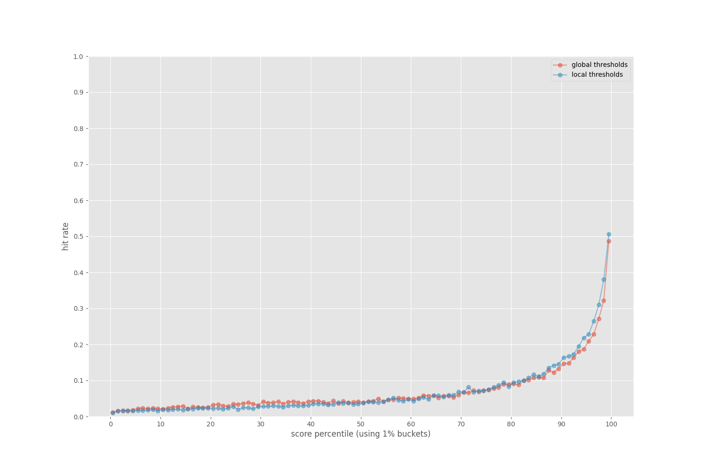
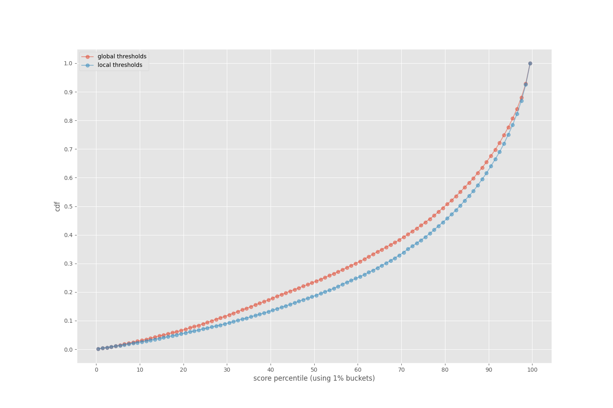
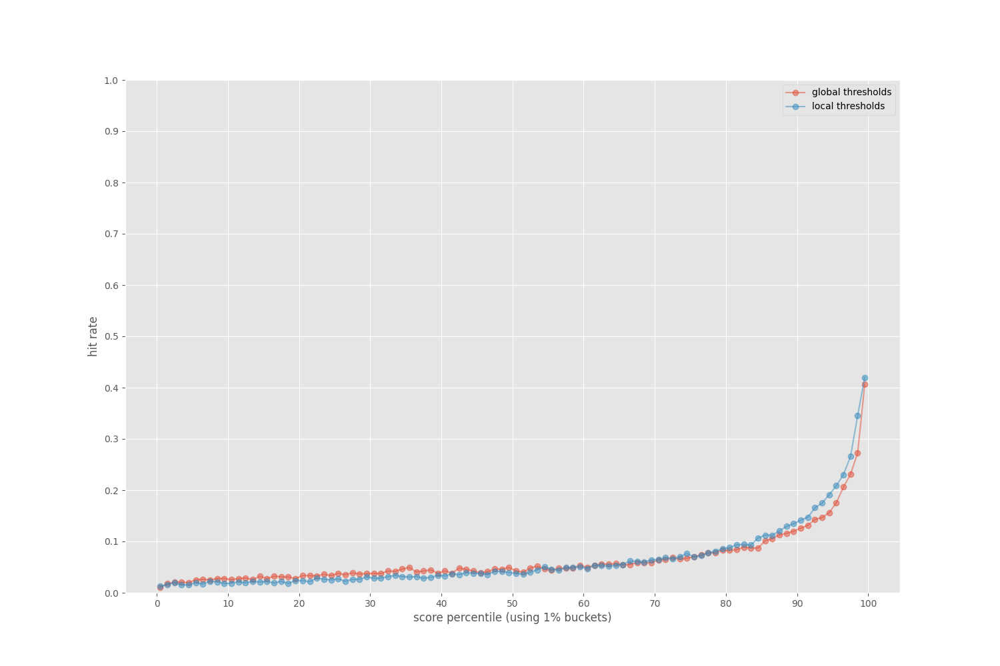
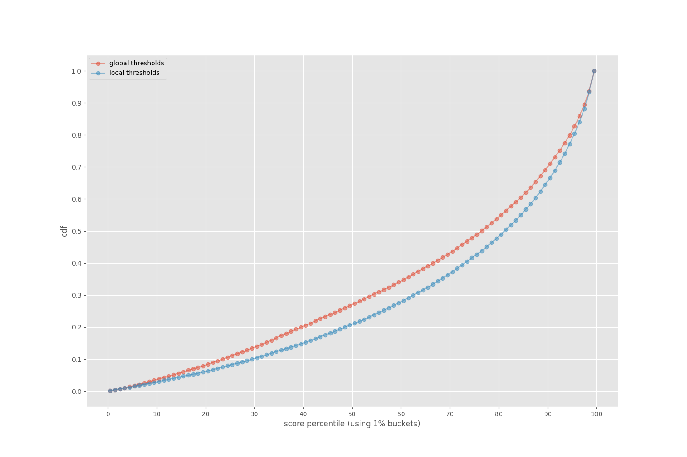

# Experiment description

## Goal

We want to see if we can use thresholding to increase precision of code nav recommendations.

## Data

We use the code nav validation data.
We reuse the usual validation code, but record logs instead of aggregated stats.
For each base file, we recommend files.
For each recommended file, we record:
- the repo label (e.g. "apache/airflow")
- the base file
- the recommended file
- the score for the recommend file
- a label indicating if the recommended file is considered relevant

## Analysis

We look at all the scores and compute percentiles.
Using the percentiles, we put the data into buckets.
Within each bucket we compute the hit rate.
Note there are some options:
- Computing percentiles:
	- We could compute percentiles globally, using data from all repos together.
	- We could compute percentiles local to a repo, getting different buckets for each repo.
- Using commits:
	- We could have the code nav recommender use commits as well as text.
	- We could have it use text only.

We consider all four combinations of choices.

We also compute a CDF for hits by bucket.

## Results

### Commits

#### Hit rate

#### CDF

### Text

#### Hit rate

#### CDF

# Instructions to run the experiment

Use `make all` to run the experiment.
